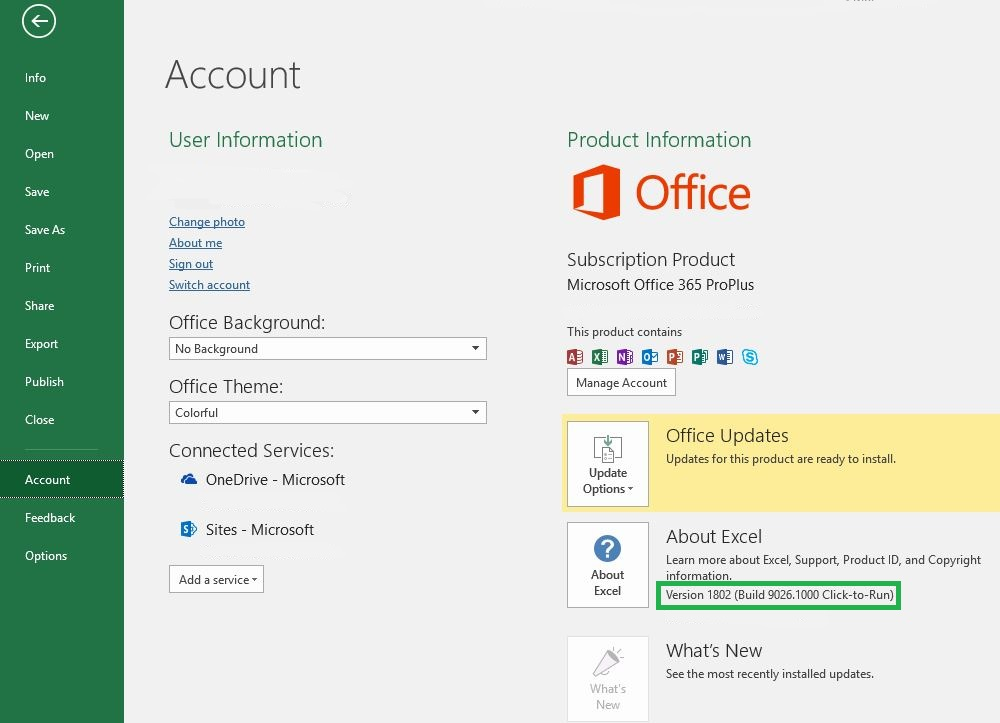

# Office versions and requirement sets

There are many versions of Office on several platforms, and they don't all support every API in Office JavaScript API (Office.js). You may not always have control over the version of Office your users have installed.  To handle this situation, we provide a system called requirement sets to help you determine whether an Office host supports the capabilities you need in your Office Add-in. 

> [!NOTE]
> - Office runs across multiple platforms, including Office for Windows, Office Online, Office for the Mac, and Office for the iPad.
> - Examples of Office hosts are Office Products: Excel, Word, PowerPoint, Outlook, OneNote, and so forth.  
> - A requirement set is a named group of API members e.g., `ExcelApi 1.5`, `WordApi 1.3`, and so on.  

## How to check your Office version

To identify the Office version that you're using, from within an Office application, select the **File** menu, and then choose **Account**. The version of Office will appear in the **Product Information** section. For example, the following screenshot indicates Office Version 1802 (Build 9026.1000):

## Office requirement sets availability

Office Add-ins can use API requirement sets to determine whether the Office host supports the API members that it need to use. Requirement set support varies by Office host and the Office host version (see previous section).

Some Office hosts have their own API requirement sets. For example, the first requirement set for the Excel API was `ExcelApi 1.1` and the first requirement set for the Word API was `WordApi 1.1`. Since then, multiple new ExcelApi requirement sets and WordApi requirement sets have been added to provide additional API functionality.

In addition, other functionality such as add-in commands (ribbon extensibility) and the ability to launch dialog boxes (Dialog API) were added to the Common API. Add-in commands and Dialog API requirement sets are examples of API sets that the various Office hosts share in common.

An add-in can only use APIs in requirement sets that are supported by the version of Office host where the add-in is running. To know exactly which requirement sets are available for a specific Office host version, refer to the following host-specific requirement set articles:

- [Excel JavaScript API requirement sets](/office/dev/add-ins/reference/requirement-sets/excel-api-requirement-sets) (ExcelApi)
- [Word JavaScript API requirement sets](/office/dev/add-ins/reference/requirement-sets/word-api-requirement-sets) (WordApi)
- [OneNote JavaScript API requirement sets](/office/dev/add-ins/reference/requirement-sets/onenote-api-requirement-sets) (OneNoteApi)
- [Understanding Outlook API requirement sets](/office/dev/add-ins/reference/requirement-sets/outlook-api-requirement-sets) (Mailbox)

Some requirement sets contain APIs that can be used by any Office host. For information about these requirement sets, refer to the following articles:

- [Office common requirement sets](/office/dev/add-ins/reference/requirement-sets/office-add-in-requirement-sets)
- [Add-in commands requirement sets](/office/dev/add-ins/reference/requirement-sets/add-in-commands-requirement-sets)
- [Dialog API requirement sets](/office/dev/add-ins/reference/requirement-sets/dialog-api-requirement-sets)
- [Identity API requirement sets](/office/dev/add-ins/reference/requirement-sets/identity-api-requirement-sets)

The version number of a requirement set, such as the "1.1" in `ExcelApi 1.1`, is relative to the Office host. The version number of a given requirement set (e.g., `ExcelApi 1.1`) does not correspond to the version number of Office.js or to requirement sets for other Office hosts (e.g., Word, Outlook, etc.).  Requirement sets for the different Office hosts are released at different speeds and times. For example, `ExcelApi 1.5` was released before the `WordApi 1.3` requirement set.

The JavaScript API for Office library (Office.js) includes all requirement sets that are currently available. While there is such a thing as requirement sets `ExcelApi 1.3` and `WordApi 1.3`, there is no `Office.js 1.3` requirement set. The latest release of Office.js is maintained as a single Office endpoint delivered via the content delivery network (CDN). For more details around the Office.js CDN, including how versioning and backward compatibility is handled, see [Understanding the JavaScript API for Office](/office/dev/add-ins/develop/understanding-the-javascript-api-for-office).

## Specify Office hosts and requirement sets

There are various ways to specify which Office hosts and requirement sets are required by an add-in.  For detailed information, see [Specify Office hosts and API requirements](/office/dev/add-ins/develop/specify-office-hosts-and-api-requirements)

## See also

- [Specify Office hosts and API requirements](/office/dev/add-ins/develop/specify-office-hosts-and-api-requirements)
- [Install the latest version of Office](/office/dev/add-ins/develop/install-latest-office-version)
- [Overview of update channels for Office 365 ProPlus](/deployoffice/overview-of-update-channels-for-office-365-proplus)
- [Get the most from Office with Office 365](https://products.office.com/compare-all-microsoft-office-products?tab=2)
