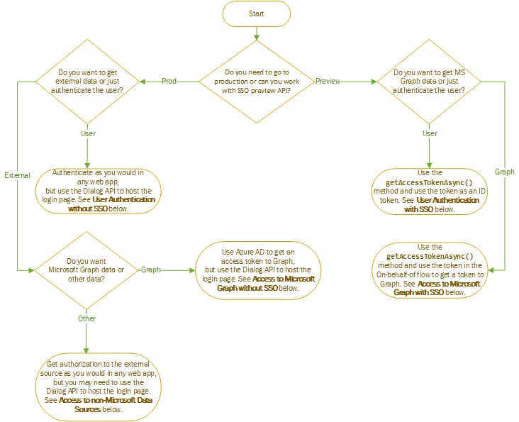

# Overview of authentication and authorization in Office Add-ins

Web applications and, hence, Office Add-ins allow anonymous access by default, but you can require users to authenticate with a login. In particular, you can require that your users be logged in with either a Microsoft Account or a Work or School (Office 365) account. This task is called user authentication because it enables the add-in to know who the user is.

Your add-in can also get the user's consent to access their Microsoft Graph data (such as their Office 365 profile, their OneDrive files, and their SharePoint data) or to data in other external sources such as Google, Facebook, LinkedIn, SalesForce, and GitHub. This task is called add-in (or app) authorization, because it is the *add-in* that is being authorized not the user, even though the user's permissions play a role in determining what the add-in is authorized to do.

You have a choice of two ways to accomplish these tasks.

- **Office Single Sign-on (SSO)**: A system, *currently in preview*, that enables the user's login to Office to function also as a login to the add-in. Optionally, the add-in can also use the user's Office credentials to authorize the add-in to Microsoft Graph. (Non-Microsoft sources are not accessible through this system.)
- **Web Application Authentication and Authorization with Azure Active Directory**: This isn't something new or special. It's just the way Office add-in (and other web apps) authenticated users and authorized apps before there was an Office SSO system and is still used in scenarios where Office SSO cannot be.

The following flowchart shows you the decisions that you need to make as an add-in developer. Details are later in this article.

## User authentication without SSO

You can authenticate a user in an Office Add-in with Azure Active Directory (AAD) just as you would any in any other web application with one exception: AAD does not allow its login page to open in an iFrame. When an Office Add-in is running on *Office on the web*, the task pane is an iFrame. This means that you will need to open the AAD login screen in a dialog opened with the Office Dialog API. This will effect how you use authentication helper libraries. For more information, see [Authentication with the Office Dialog API](auth-with-office-dialog-api.md).

For information about programming authentication with AAD, begin with [Microsoft identity platform (v2.0) overview](/azure/active-directory/develop/v2-overview). There are many tutorials and guides in that documentation set, as well as links to relevant samples and libraries. Once again a reminder: you may need to adjust the code in the samples to run in the Office Dialog.

## Access to Microsoft Graph without SSO

You can get authorization to Microsoft Graph data for your add-in by obtaining an access token to Graph from Azure Active Directory (AAD). You can do this without relying on Office SSO. For more information about how, see [Access to Microsoft Graph without SSO](authorize-to-microsoft-graph-without-sso.md) which has more details and links to samples.

## User authentication with SSO

To use SSO to authenticate the user, your code in a task pane or function file calls the [getAccessTokenAsync](/javascript/api/office/office.auth?view=office-js#getaccesstokenasync-options--callback-) method. If the user is not signed into Office, Office will open a dialog and navigate it to the Azure Active Directory login page. After the user is signed in, or if the user is already signed in, the method returns an access token. The token is structured to be used as a bootstrap token in the **On Behalf Of** flow. (See [Access to Microsoft Graph with SSO](#access-to-microsoft-graph-with-sso).) However, it can be used as an ID token as well, because it contains several claims that are unique to the current user, including `preferred_username`, `name`, `sub`, and `oid`. For guidance on which property to use as the ultimate user ID, see [Microsoft identity platform access tokens](https://docs.microsoft.com/en-us/azure/active-directory/develop/access-tokens#payload-claims). For an example of a one of these tokens, see [Example access token](sso-in-office-add-ins.md#example-access-token).

After your code has extracted the desired claim from the token, it uses that value to look up the user in a backend user table or user database that you maintain. Use the database to store user-relative information such as the user's preferences or the state of the user's account. You do not need to store a password for the user. Using Office SSO relieves you of this burden. 

Before you begin coding user authentication with SSO, be sure that you are thoroughly familiar with the article [Enable single sign-on for Office Add-ins](sso-in-office-add-ins.md). Note also these samples:

- [Office Add-in NodeJS SSO](https://github.com/OfficeDev/Office-Add-in-NodeJS-SSO), especially the file [auth.ts](https://github.com/OfficeDev/Office-Add-in-NodeJS-SSO/blob/master/Completed/src/auth.ts) which uses the library [jswebtoken](https://github.com/auth0/node-jsonwebtoken) to decode and parse the token. (This sample, however, does not use the token as an ID token, it uses it to get access to Microsoft Graph with the **On Behalf Of** flow.)
- [Office Add-in ASP.NET SSO](https://github.com/OfficeDev/Office-Add-in-ASPNET-SSO), especially the file [ValuesController.ts](https://github.com/OfficeDev/Office-Add-in-ASPNET-SSO/blob/master/Complete/Office-Add-in-ASPNET-SSO-WebAPI/Controllers/ValuesController.cs) which uses the library [System.Security.Claims.ClaimsPrincipal](https://docs.microsoft.com/dotnet/api/system.security.claims.claimsprincipal) class to extract claims from the token. (This sample, however, does not use the token as an ID token. It extracts a `scope` claim from the token and uses it to get access to Microsoft Graph with the **On Behalf Of** flow.)

## Access to Microsoft Graph with SSO

To use SSO to get access to Microsoft Graph, your code in a task pane or function file calls the [getAccessTokenAsync](/javascript/api/office/office.auth?view=office-js#getaccesstokenasync-options--callback-) method. If the user is not signed into Office, Office will open a dialog and navigate it to the Azure Active Directory login page. After the user is signed in, or if the user is already signed in, the method returns an access token. The token is structured to be used as a bootstrap token in the **On Behalf Of** flow. Specifically, it has a `scope` claim with the value `access_as_user`. For guidance about the claims in the token, see [Microsoft identity platform access tokens](https://docs.microsoft.com/en-us/azure/active-directory/develop/access-tokens#payload-claims). For an example of a one of these tokens, see [Example access token](sso-in-office-add-ins.md#example-access-token).

After your code has obtained the token, it uses it in the **On Behalf Of** flow to obtain a second token: an access token to Microsoft Graph.

Before you begin coding Office SSO, be sure that you are thoroughly familiar with these two articles:

- [Enable single sign-on for Office Add-ins](sso-in-office-add-ins.md)
- [Authorize to Microsoft Graph with SSO](authorize-to-microsoft-graph.md)

You should also read at least one of the walkthrough articles listed here. Even if you don't carry out the steps, these contain valuable information about how you implement Office SSO and the **On Behalf Of** flow. 

- [Create an ASP.NET Office Add-in that uses single sign-on](create-sso-office-add-ins-aspnet.md)
- [Create an Node.js Office Add-in that uses single sign-on](create-sso-office-add-ins-nodejs.md)

Note also these samples:

- [Office Add-in NodeJS SSO](https://github.com/OfficeDev/Office-Add-in-NodeJS-SSO)
- [Office Add-in ASP.NET SSO](https://github.com/OfficeDev/Office-Add-in-ASPNET-SSO)

## Access to non-Microsoft data sources

Popular online services, including Google, Facebook, LinkedIn, SalesForce, and GitHub, let developers give users access to their accounts in other applications. This gives you the ability to include these services in your Office Add-in. For an overview of the ways that your add-in can do this, see [Authorize external services in your Office Add-in](auth-external-add-ins.md).

> [!IMPORTANT]
> Before you begin coding, find out if the data source allows its login in screen to be opened in an iFrame. When an Office Add-in is running on *Office on the web*, the task pane is an iFrame. If the data source does not allow its login screen to be opened in an iFrame, then you will need to open the login screen in a dialog opened with the Office Dialog API. For more information, see [Authentication with the Office Dialog API](auth-with-office-dialog-api.md).

