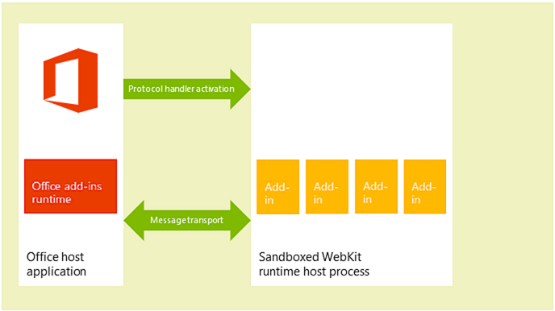

# Privacy and security for Office Add-ins


## Understanding the add-in runtime

Office Add-ins are secured by an add-in runtime environment, a multiple-tier permissions model, and performance governors. This framework protects the user's experience in the following ways: 


- Access to the host application's UI frame is managed.
    
- Only indirect access to the host application's UI thread is allowed.
    
- Modal interactions aren't allowed - for example, calls to JavaScript  **alert**,  **confirm**, and  **prompt** functions aren't allowed because they're modal.
    
Further, the runtime framework provides the following benefits to ensure that an Office Add-in can't damage the user's environment:


- Isolates the process the add-in runs in.
    
- Doesn't require .dll or .exe replacement or ActiveX components.
    
- Makes add-ins easy to install and uninstall.
    
Also, the use of memory, CPU, and network resources by Office Add-ins is governable to ensure that good performance and reliability are maintained. 

The following sections briefly describe how the runtime architecture supports running add-ins in Office clients on Windows-based devices, on OS X Mac devices, and in Office Online clients on the web.


### Clients for Windows and OS X devices

In supported clients for desktop and tablet devices, such as Excel, Outlook, and Outlook for Mac, Office Add-ins are supported by integrating an in-process component, the Office Add-ins runtime, which manages the add-in lifecycle and enables interoperability between the add-in and the client application. The add-in webpage itself is hosted out-of-process. As shown in figure 1, on a Windows desktop or tablet device, the add-in webpage is hosted inside an Internet Explorer control which, in turn, is hosted inside an add-in runtime process that provides security and performance isolation. 


**Figure 1. Office Add-ins runtime environment in Windows-based desktop and tablet clients**


As shown in figure 2, on an OS X Mac desktop, the add-in web page is hosted inside a sandboxed WebKit runtime host process which helps provide similar level of security and performance protection. 


**Figure 2. Office Add-ins runtime environment in OS X Mac clients**



The Office Add-ins runtime manages interprocess communication, the translation of JavaScript API calls and events into native ones, as well as UI remoting support to enable the add-in to be rendered inside the document, in a task pane, or adjacent to an email message, meeting request, or appointment.


### Web clients

In supported Web clients, such as Excel Online and Outlook Web App, Office Add-ins are hosted in an  **iframe** that runs using the HTML5 **sandbox** attribute. ActiveX components or navigating the main page of the web client are not allowed. Office Add-ins support is enabled in the web clients by the integration of the JavaScript API for Office. In a similar way to the desktop client applications, the JavaScript API manages the add-in lifecycle and interoperability between the add-in and the web client. This interoperability is implemented by using a special cross-frame post message communication infrastructure. The same JavaScript library (Office.js) that is used on desktop clients is available to interact with the web client. Figure 3 illustrates the infrastructure that supports Office Add-ins in the Office Online (running in the browser), and the relevant components (the web client, **iframe**, Office Add-ins runtime, and JavaScript API for Office) that are required to support them.


**Figure 3. Infrastructure that supports Office Add-ins in Office web clients**


## Add-in integrity in the Office Store

You can make your Office Add-ins available to the public by publishing them in the Office Store. The Office Store enforces the following measures to maintain the integrity of add-ins:


- Requires the host server of an Office Add-in to always use Secure Sockets Layer (SSL) to communicate.
    
- Requires a developer to provide proof of identity, a contractual agreement, and a compliant privacy policy to submit add-ins.
    
- Ensures that the source of add-ins is accessible in read-only mode.
    
- Supports a user-review system for available add-ins to promote a self-policing community.
    

## Addressing end users' privacy concerns

This section addresses end users' privacy concerns when using Office Add-ins. First, it describes the protection offered by the Office Add-ins platform from the customer's (end user's) perspective. Then, it provides you as the developer with guidelines about how to support users' expectations and how to securely handle users' personally identifiable information (PII). 


### End users' perspective

Office Add-ins are built using web technologies that run in a browser control or  **iframe**. Because of this, using add-ins is similar to browsing to web sites on the Internet or intranet. Add-ins can be external to an organization (if you acquire the add-in from the Office Store) or internal (if you acquire the add-in from an Exchange Server add-in catalog, SharePoint add-in catalog, or file share on an organization's network). Add-ins have limited access to the network and most add-ins can read or write to the active document or mail item. The add-in platform applies certain constraints before a user or administrator installs or starts an add-in. But as with any extensibility model, users should be cautious before starting an unknown add-in.

The add-in platform addresses end users' privacy concerns in the following ways:


- Data communicated with the web server that hosts a content, Outlook or task pane add-in as well as communication between the add-in and any web services it uses must be encrypted using the Secure Socket Layer (SSL) protocol.
    
- Before a user installs an add-in from the Office Store, the user can view the privacy policy and requirements of that add-in. In addition, Outlook add-ins that interact with users' mailboxes surface the specific permissions that they require; the user can review the terms of use, requested permissions and privacy policy before installing an Outlook add-in.
    
- When sharing a document, users also share add-ins that have been inserted in or associated with that document. If a user opens a document that contains an add-in that the user hasn't used before, the host application prompts the user to grant permission for the add-in to run in the document. In an organizational environment, the Office host application also prompts the user if the document comes from an external source.
    
- Users can enable or disable the access to the Office Store. For content and task pane add-ins, users manage access to trusted add-ins and catalogs from the  **Trust Center** on the host Office client (opened from **File** > **Options** > **Trust Center** > **Trust Center Settings** > **Trusted Add-in Catalogs**). For Outlook add-ins, uses can manage add-ins by choosing the  **Manage Add-ins** button: in Outlook for Windows, choose **File** > **Manage Add-ins**. In Outlook for Mac, choose the  **Manage Add-ins** button on the add-in bar. In Outlook Web App choose the **Settings** menu (gear icon) > **Manage add-ins**. Administrators can also manage this access [by using group policy](http://technet.microsoft.com/en-us/library/jj219429.aspx#BKMK_Managing).
    
- The design of the add-in platform provides security and performance for end users in the following ways:
    
      - An Office Add-in runs in a web browser control that is hosted in an add-in runtime environment separate from the Office host application. This design provides both security and performance isolation from the host application.
    
  - Running in a web browser control allows the add-in to do almost anything a regular web page running in a browser can do but, at the same time, restricts the add-in to observe the same-origin policy for domain isolation and security zones.
    
Outlook add-ins provide additional security and performance features through Outlook add-in specific resource usage monitoring. For more information, see [Privacy, permissions, and security for Outlook add-ins](../../docs/outlook/privacy-and-security.md).


### Developer guidelines to handle PII

You can read general PII protection guidelines for IT administrators and developers in [Protecting Privacy in the Development and Testing of Human Resources Applications](http://technet.microsoft.com/en-us/library/gg447064.aspx). The following lists some specific PII protection guidelines for you as a developer of Office Add-ins:


- The [Settings](../../reference/shared/document.settings.md) object is intended for persisting add-in settings and state data across sessions for a content or task pane add-in, but don't store passwords and other sensitive PII in the **Settings** object. The data in the **Settings** object isn't visible to end users, but it is stored as part of the document's file format which is readily accessible. You should limit your add-in's use of PII and store any PII required by your add-in on the server hosting your add-in as a user-secured resource.
    
- Using some applications can reveal PII. Make sure that you securely store data for your users' identity, location, access times, and any other credentials so that data won't become available to other users of the add-in.
    
- If your add-in is available in the Office Store, the Office Store requirement for HTTPS protects PII transmitted between your web server and the client computer or device. However, if you re-transmit that data to other servers, make sure you observe the same level of protection.
    
- If you store users' PII, make sure you reveal that fact, and provide a way for users to inspect and delete it. If you submit your add-in to the Office Store, you can outline the data you collect and how it's used in the privacy statement.
    

## Developers' permission choices and security practices

Follow these general guidelines to support the security model of Office Add-ins, and drill down on more details for each add-in type.


### Permissions choices

The add-in platform provides a permissions model that your add-in uses to declare the level of access to a user's data that it requires for its features. Each permission level corresponds to the subset of the JavaScript API for Office your add-in is allowed to use for its features. For example, the  **WriteDocument** permission for content and task pane add-ins allows access to the [Document.setSelectedDataAsync](../../reference/shared/document.setselecteddataasync.md) method that lets an add-in write to the user's document, but doesn't allow access to any of the methods for reading data from the document. This permission level makes sense for add-ins that only need to write to a document, such as an add-in where the user can query for data to insert into his or her document.

As a best practice, you should request permissions based on the principle of  _least privilege_. That is, you should request permission to access only the minimum subset of the API that your add-in requires to function correctly. For example, if your add-in needs only to read data in a user's document for its features, you should request no more than the **ReadDocument** permission. (But, keep in mind that requesting insufficient permissions will result in the add-in platform blocking your add-in's use of some APIs and will generate errors at run time.)

You specify permissions in the manifest of your add-in, as shown in the example in this section below, and end users can see the requested permission level of an add-in before they decide to install or activate the add-in for the first time. Additionally, Outlook add-ins that request the  **ReadWriteMailbox** permission require explicit administrator privilege to install.

The following example shows how a task pane add-in specifies the  **ReadDocument** permission in its manifest. To keep permissions as the focus, other elements in the manifest aren't displayed.


```XML
<?xml version="1.0" encoding="utf-8"?>
<OfficeApp xmlns="http://schemas.microsoft.com/office/appforoffice/1.0"
 xmlns:xsi="http://www.w3.org/2001/XMLSchema-instance" 
xmlns:ver="http://schemas.microsoft.com/office/appforoffice/1.0"
xsi:type="TaskPaneApp">
...<!-- To keep permissions as the focus, not displaying other elements. -->
  <Permissions>ReadDocument</Permissions>
...
</OfficeApp>

```

For more information about this for task pane and content add-ins , see [Requesting permissions for API use in content and task pane add-ins](requesting-permissions-for-api-use-in-content-and-task-pane-add-ins.md).

For more information about this for Outlook add-ins, see the following topics:


- [Privacy, permissions, and security for Outlook add-ins](../../docs/outlook/privacy-and-security.md)
    
- [Understanding Outlook add-in permissions](../../docs/outlook/understanding-outlook-add-in-permissions.md)
    

### Same origin policy

Because Office Add-ins are webpages that run in a web browser control, they must follow the same-origin policy enforced by the browser: by default, a webpage in one domain can't make [XmlHttpRequest](http://www.w3.org/TR/XMLHttpRequest/) web service calls to another domain other than the one where it is hosted.

One way to overcome this limitation is to use JSON/P -- provide a proxy for the web service by including a  **script** tag with a **src** attribute that points to some script hosted on another domain. You can programmatically create the **script** tags, dynamically creating the URL to which to point the **src** attribute, and passing parameters to the URL via URI query parameters. Web service providers create and host JavaScript code at specific URLs, and return different scripts depending on the URI query parameters. These scripts then execute where they are inserted and work as expected.

The following is an example of JSON/P in the Outlook add-in example. 


```
// Dynamically create an HTML SCRIPT element that obtains the details for the specified video.
function loadVideoDetails(videoIndex) {
    // Dynamically create a new HTML SCRIPT element in the webpage.
    var script = document.createElement("script");
    // Specify the URL to retrieve the indicated video from a feed of a current list of videos,
    // as the value of the src attribute of the SCRIPT element. 
    script.setAttribute("src", "https://gdata.youtube.com/feeds/api/videos/" + 
        videos[videoIndex].Id + "?alt=json-in-script&amp;callback=videoDetailsLoaded");
    // Insert the SCRIPT element at the end of the HEAD section.
    document.getElementsByTagName('head')[0].appendChild(script);
}

```

Exchange and SharePoint provide client-side proxies to enable cross-domain access. In general, same origin policy on an intranet isn't as strict as on the Internet. For more information, see [Same Origin Policy Part 1: No Peeking](http://blogs.msdn.com/b/ieinternals/archive/2009/08/28/explaining-same-origin-policy-part-1-deny-read.aspx) and [Addressing same-origin policy limitations in Office Add-ins](../../docs/develop/addressing-same-origin-policy-limitations.md).


### Tips to prevent malicious cross-site scripting

An ill-intentioned user could attack the origin of an add-in by entering malicious script through the document or fields in the add-in. A developer should process user input to avoid executing a malicious user's JavaScript within his or her domain. The following are some good practices to follow to handle user input from a document or mail message, or via fields in an add-in:


- Instead of the DOM property [innerHTML](http://msdn.microsoft.com/en-us/library/ie/ms533897.aspx), use the [innerText](https://msdn.microsoft.com/library/ms533899.aspx) and [textContent](https://developer.mozilla.org/en-US/docs/DOM/Node.textContent) properties where appropriate. Do the following for Internet Explorer and Firefox cross-browser support:
    
     ```
     var text = x.innerText || x.textContent
     ```


    For information about the differences between  **innerText** and **textContent**, see [Node.textContent](https://developer.mozilla.org/en-US/docs/DOM/Node.textContent). For more information about DOM compatibility across common browsers, see [W3C DOM Compatibility - HTML](http://www.quirksmode.org/dom/w3c_html.html#t07).
    
- If you must use  **innerHTML**, make sure the user's input doesn't contain malicious content before passing it to  **innerHTML**. For more information and an example of how to use  **innerHTML** safely, see [innerHTML](http://msdn.microsoft.com/en-us/library/ie/ms533897.aspx) property.
    
- If you are using jQuery, use the [.text()](http://api.jquery.com/text/) method instead of the [.html()](http://api.jquery.com/html/) method.
    
- Use the [toStaticHTML](http://msdn.microsoft.com/en-us/library/ie/cc848922.aspx) method to remove any dynamic HTML elements and attributes in users' input before passing it to **innerHTML**.
    
- Use the [encodeURIComponent](http://msdn.microsoft.com/en-us/library/8202bce6-1342-40dc-a5ef-ac6d210a7d15.aspx) or [encodeURI](http://msdn.microsoft.com/en-us/library/17bab5a2-bcd4-46c2-8b52-b2b5a0ed98a3.aspx) function to encode text that is intended to be a URL that comes from or contains user input.
    
- See [Developing secure add-ins](http://msdn.microsoft.com/en-us/library/windows/apps/hh849625.aspx) for more best practices to create more secure web solutions.
    

### Tips to prevent "Clickjacking"

Because Office Add-ins are rendered in an iframe when running in a browser with Office Online host applications, use the following tips to minimize the risk of [clickjacking](http://en.wikipedia.org/wiki/Clickjacking) -- a technique used by hackers to fool users into revealing confidential information.

First, identify sensitive actions that your add-in can perform. These include any actions that an unauthorized user could use with malicious intent, such as initiating a financial transaction or publishing sensitive data. For example, your add-in might let the user send a payment to a user-defined recipient.

Second, for sensitive actions, your add-in should confirm with the user before it executes the action. This confirmation should detail what effect the action will have. It should also detail how the user can prevent the action, if necessary, whether by choosing a specific button marked "Don't Allow" or by ignoring the confirmation.

Third, to ensure that no potential attacker can hide or mask the confirmation, you should display it outside the context of the add-in (that is, not in an HTML dialog box).

Here are some examples of how you could get confirmation:


- Send an email to the user that contains a confirmation link.
    
- Send a text message to the user that includes a confirmation code that the user can enter in the add-in.
    
- Open a new browser window that contains a confirmation prompt.
    
Also, ensure that the address you use for contacting the user couldn't have been provided by a potential attacker. For example, for payment confirmations use the address on file for the authorized user's account.


### Other security practices

Developers should also take note of the following security practices:


- Developers shouldn't use ActiveX controls in Office Add-ins as ActiveX controls don't support the cross-platform nature of the add-in platform.
    
- Content and task pane add-ins assume the same SSL settings that Internet Explorer uses by default, and allows most content to be delivered only by SSL. Outlook add-ins require all content to be delivered by SSL. Developers must specify in the  **SourceLocation** element of the add-in manifest a URL that uses HTTPS, to identify the location of the HTML file for the add-in.
    
    To make sure add-ins aren't delivering content by using HTTP, when testing add-ins, developers should make sure the following settings are selected in Internet Explorer and no security warnings appear in their test scenarios:
    
      - Make sure the security setting,  **Display mixed content**, for the  **Internet** zone is set to **Prompt**. You can do that by selecting the following in Internet Explorer: on the  **Security** tab of the **Internet Options** dialog box, select the **Internet** zone, select **Custom level**, scroll to look for  **Display mixed content**, and select  **Prompt** if it isn't already selected.
    
  - Make sure  **Warn if Changing between Secure and not secure mode** is selected in the **Advanced** tab of the **Internet Options** dialog box.
    
- To make sure that add-ins don't use excessive CPU core or memory resources and cause any denial of service on a client computer, the add-in platform establishes resource usage limits. As part of testing, developers should verify whether an add-in performs within the resource usage limits. 
    
- Before publishing an add-in, developers should make sure that any personal identifiable information that they expose in their add-in files is secure.
    
- Developers shouldn't embed keys that they use to access third-party APIs or services (such as Bing, Google, or Facebook) directly in the HTML pages of their add-in. Instead, they should create a custom web service or store the keys in some other form of secure web storage that they can then call to pass the key value to their add-in.
    
- Developers should do the following when submitting an add-in to the Office Store:
    
      - Host the add-in they are submitting on a web server that supports SSL.
    
  - Produce a statement outlining a compliant privacy policy.
    
  - Be ready to sign a contractual agreement upon submitting the add-in.
    
Other than resource usage rules, developers for Outlook add-ins should also make sure their add-ins observe limits for specifying activation rules and using the JavaScript API. For more information, see [Limits for activation and JavaScript API for Outlook add-ins](http://msdn.microsoft.com/library/e0c9e3d0-517e-4333-b8bd-e169c51a07f6.aspx).


## IT administrators' control

In a corporate setting, IT administrators have ultimate authority over enabling or disabling access to the Office Store and any private catalogs. 


## Additional resources


- [Requesting permissions for API use in content and task pane add-ins](http://msdn.microsoft.com/library/da2efadc-4ebf-45fe-be39-397ac1eb1dbd.aspx)
    
- [Privacy, permissions, and security for Outlook add-ins](http://msdn.microsoft.com/library/44208fc4-05d4-42d8-ab20-faa89624de1c.aspx)
    
- [Understanding Outlook add-in permissions](http://msdn.microsoft.com/library/5bca69f2-b287-4e19-8f0f-78d896b2a3d3.aspx)
    
- [Limits for activation and JavaScript API for Outlook add-ins](http://msdn.microsoft.com/library/e0c9e3d0-517e-4333-b8bd-e169c51a07f6.aspx)
    
- [Addressing same-origin policy limitations in Office Add-ins](http://msdn.microsoft.com/library/36c800ae-1dda-4ea8-a558-37c89ffb161b.aspx)
    
- [Same Origin Policy](http://www.w3.org/Security/wiki/Same_Origin_Policy)
    
- [Same Origin Policy Part 1: No Peeking](http://blogs.msdn.com/b/ieinternals/archive/2009/08/28/explaining-same-origin-policy-part-1-deny-read.aspx)
    
- [Same origin policy for JavaScript](https://developer.mozilla.org/En/Same_origin_policy_for_JavaScript)
    
- [Defining Safer JSON-P](http://json-p.org/)
    
