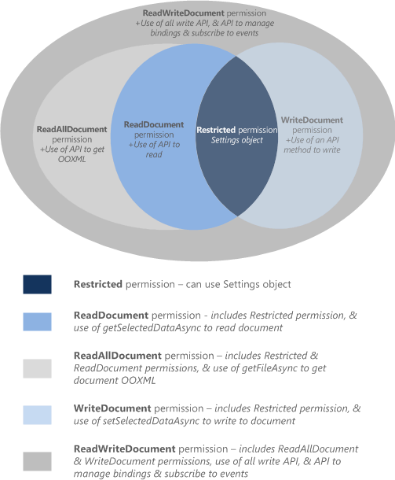

# Requesting permissions for API use in add-ins

This article describes the different permission levels that you declare in your add-in's manifest to specify the level of JavaScript API access your add-in requires for its features.

> [!IMPORTANT]
> This article applies to only non-Outlook add-ins. To learn about permission levels for Outlook add-ins, see [Understanding Outlook add-in permissions](../outlook/understanding-outlook-add-in-permissions.md).

## Permissions model

A five-level JavaScript API access-permissions model provides the basis for privacy and security for users of your add-ins. The following figure shows the five levels of API permissions you can declare in your add-in's manifest.



These permissions specify the subset of the API that the add-in [runtime](../testing/runtimes.md) allows your add-in to use when a user inserts, and then activates (trusts) your add-in. To declare the permission level your add-in requires, specify one of the permission values in the manifest. The markup varies depending on the type of manifest.

- **Unified manifest for Microsoft 365**: Use the [`"authorization.permissions.resourceSpecific"`](/microsoft-365/extensibility/schema/root-authorization-permissions#resourcespecific) property. The following example requests the **write document** permission, which allows only methods that can write to (but not read) the document.

   ```json
   "authorization": {
      "permissions": {
        "resourceSpecific": [
          ...
          {
            "name": "Document.Write.User",
            "type": "Delegated"
          },
        ]
      }  
   },
   ```

   [!include[Unified manifest host application support note](../includes/unified-manifest-support-note.md)]

- **Add-in only manifest**: Use the [Permissions](/javascript/api/manifest/permissions) element of the manifest. The following example requests the **write document** permission, which allows only methods that can write to (but not read) the document.

   ```XML
   <Permissions>WriteDocument</Permissions>
   ```

As a best practice, you should request permissions based on the principle of *least privilege*. That is, you should request permission to access only the minimum subset of the API that your add-in requires to function correctly. For example, if your add-in needs only to read data in a user's document for its features, you should request no more than the **read document** permission.

The following table describes the subsets of the [Common and Application-specific JavaScript APIs](understanding-the-javascript-api-for-office.md#api-models) that are enabled by each permission level.

|Permission canonical name|Add-in only manifest name|Unified manifest name|Enabled subset of the Application-specific APIs|Enabled subset of the Common APIs|
|:-----|:-----|:-----|:-----|:-----|
|**restricted**|Restricted|Document.Restricted.User|None|The methods of the [Settings](/javascript/api/office/office.settings) object, and the [Document.getActiveViewAsync](/javascript/api/office/office.document#office-office-document-getactiveviewasync-member(1)) method. This is the minimum permission level that can be requested by an add-in.|
|**read document**|ReadDocument|Document.Read.User|All and only APIs that read the document or its properties.|In addition to the API allowed by the **restricted** permission, adds access to the API members necessary to read the document and manage bindings. This includes the use of:<ul><li>The [Document.getSelectedDataAsync](/javascript/api/office/office.document#office-office-document-getselecteddataasync-member(1)) method to get the selected text, HTML (Word only), or tabular data, but not the underlying Open Office XML (OOXML) code that contains all of the data in the document.</li><li>The [Document.getFileAsync](/javascript/api/office/office.document#office-office-document-getfileasync-member(1)) method to get all of the text in the document, but not the underlying OOXML binary copy of the document</li><li>The [Binding.getDataAsync](/javascript/api/office/office.binding#office-office-binding-getdataasync-member(1)) method for reading bound data in the document.</li><li>The [addFromNamedItemAsync](/javascript/api/office/office.binding#office-office-bindings-addfromnameditemasync-member(1)), [addFromPromptAsync](/javascript/api/office/office.binding#office-office-bindings-addfrompromptasync-member(1)), and [addFromSelectionAsync](/javascript/api/office/office.binding#office-office-bindings-addfromselectionasync-member(1)) methods of the Bindings object for creating bindings in the document.</li><li>The [getAllAsync](/javascript/api/office/office.binding#office-office-bindings-getallasync-member(1)), [getByIdAsync](/javascript/api/office/office.binding#office-office-bindings-getbyidasync-member(1)), and [releaseByIdAsync](/javascript/api/office/office.binding#office-office-bindings-releasebyidasync-member(1)) methods of the Bindings object for accessing and removing bindings in the document.</li><li>The [Document.getFilePropertiesAsync](/javascript/api/office/office.document#office-office-document-getfilepropertiesasync-member(1)) method to access document file properties, such as the URL of the document.</li><li><p>The [Document.goToByIdAsync](/javascript/api/office/office.document#office-office-document-gotobyidasync-member(1)) method to navigate to named objects and locations in the document.</p></li><li>For task pane add-ins for Project, all of the "get" methods of the [ProjectDocument](/javascript/api/office/office.document) object.</li></ul>|
|**read all document**|ReadAllDocument|Document.ReadAll.User|Same as **read document**.|In addition to the API allowed by the **restricted** and **read document** permissions, allows the following additional access to document data.<ul><li><p>The [Document.getSelectedDataAsync](/javascript/api/office/office.document#office-office-document-getselecteddataasync-member(1)) and [Document.getFileAsync](/javascript/api/office/office.document#office-office-document-getfileasync-member(1)) methods can access the underlying OOXML code of the document (which in addition to the text may include formatting, links, embedded graphics, comments, revisions, and so forth).</li></ul>|
|**write document**|WriteDocument|Document.Write.User|All and only APIs that write to the document or its properties.|In addition to the API allowed by the **restricted** permission, adds access to the following API members.<ul><li>The [Document.setSelectedDataAsync](/javascript/api/office/office.document#office-office-document-setselecteddataasync-member(1)) method to write to the user's selection in the document.</li></ul>|
|**read/write document**|ReadWriteDocument|Document.ReadWrite.User|All Application-specfic APIs, including those that subscribe to events.|In addition to the API allowed by the **restricted**, **read document**, **read all document**, and **write document** permissions, includes access to all remaining API supported by add-ins, including methods for subscribing to events. You must declare the **read/write document** permission to access these additional API members:<ul><li><p>The [Binding.setDataAsync](/javascript/api/office/office.binding#office-office-binding-setdataasync-member(1)) method for writing to bound regions of the document</li><li>The [TableBinding.addRowsAsync](/javascript/api/office/office.tablebinding#office-office-tablebinding-addrowsasync-member(1)) method for adding rows to bound tables.</li><li>The [TableBinding.addColumnsAsync](/javascript/api/office/office.tablebinding#office-office-tablebinding-addcolumnsasync-member(1)) method for adding columns to bound tables.</li><li>The [TableBinding.deleteAllDataValuesAsync](/javascript/api/office/office.tablebinding#office-office-tablebinding-deletealldatavaluesasync-member(1)) method for deleting all data in a bound table.</li><li>The [setFormatsAsync](/javascript/api/office/office.tablebinding#office-office-tablebinding-setformatsasync-member(1)), [clearFormatsAsync](/javascript/api/office/office.tablebinding#office-office-tablebinding-clearformatsasync-member(1)), and [setTableOptionsAsync](/javascript/api/office/office.tablebinding#office-office-tablebinding-settableoptionsasync-member(1)) methods of the TableBinding object for setting formatting and options on bound tables.</li><li>All of the members of the [CustomXmlNode](/javascript/api/office/office.customxmlnode), [CustomXmlPart](/javascript/api/office/office.customxmlpart), [CustomXmlParts](/javascript/api/office/office.customxmlparts), and [CustomXmlPrefixMappings](/javascript/api/office/office.customxmlprefixmappings) objects</li><li>All of the methods for subscribing to the events supported by add-ins, specifically the `addHandlerAsync` and `removeHandlerAsync` methods of the [Binding](/javascript/api/office/office.binding), [CustomXmlPart](/javascript/api/office/office.customxmlpart), [Document](/javascript/api/office/office.document), [ProjectDocument](/javascript/api/office/office.document), and [Settings](/javascript/api/office/office.document#office-office-document-settings-member) objects.</li></ul>|

## See also

- [Privacy and security for Office Add-ins](../concepts/privacy-and-security.md)
