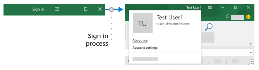

# Enable single sign-on (SSO) in an Office Add-in

Users sign in to Office using either their personal Microsoft account or their Microsoft 365 Education or work account. Take advantage of this and use single sign-on (SSO) to authenticate and authorize the user to your add-in without requiring them to sign in a second time.



## How SSO works at runtime

The following diagram shows how the SSO process works. The blue elements represent Office or the Microsoft identity platform. The gray elements represent the code you write and include the client-side code (task pane) and the server-side code for your add-in.

:::image type="content" source="../images/sso-overview-diagram.svg" alt-text="A diagram that shows the SSO process." border="false":::

1. In the add-in, your JavaScript code calls the Office.js API [getAccessToken](/javascript/api/office-runtime/officeruntime.auth#office-runtime-officeruntime-auth-getaccesstoken-member(1)). If the user is already signed in to Office, the Office host will return the access token with the claims of the signed in user.
2. If the user is not signed in, the Office host application opens a dialog box for the user to sign in. Office redirects to the Microsoft identity platform to complete the sign-in process.
3. If this is the first time the current user has used your add-in, they are prompted to consent.
4. The Office host application requests the **access token** from the Microsoft identity platform for the current user.
5. The Microsoft identity platform returns the access token to Office. Office will cache the token on your behalf so that future calls to **getAccessToken** simply return the cached token.
6. The Office host application returns the **access token** to the add-in as part of the result object returned by the `getAccessToken` call.
7. The token is both an **access token** and an **identity token**. You can use it as an identity token to parse and examine claims about the user, such as the user's name and email address.
8. Optionally, the add-in can use the token as an **access token** to make authenticated HTTPS requests to APIs on the server-side. Because the access token contains identity claims, the server can store information associated with the user's identity; such as the user's preferences.

## Requirements and Best Practices

### Don't cache the access token

Never cache or store the access token in your client-side code. Always call [getAccessToken](/javascript/api/office-runtime/officeruntime.auth#office-runtime-officeruntime-auth-getaccesstoken-member(1)) when you need an access token. Office will cache the access token (or request a new one if it expired.) This will help to avoid accidentally leaking the token from your add-in.

### Enable modern authentication for Outlook

If you're working with an Outlook add-in, be sure to enable Modern Authentication for the Microsoft 365 tenancy. For information about how to do this, see [Enable or disable modern authentication for Outlook in Exchange Online](/exchange/clients-and-mobile-in-exchange-online/enable-or-disable-modern-authentication-in-exchange-online).

### Implement a fallback authentication system

You should *not* rely on SSO as your add-in's only method of authentication. You should implement an alternate authentication system that your add-in can fall back to in certain error situations. For example, if your add-in is loaded on an older version of Office that does not support SSO, the `getAccessToken` call will fail.

For Excel, Word, and PowerPoint add-ins you will typically want to fall back to using the Microsoft identity platform. For more information, see [Authenticate with the Microsoft identity platform](overview-authn-authz.md#authenticate-with-the-microsoft-identity-platform).

For Outlook add-ins, there is a recommended fallback system. For more information, see [Scenario: Implement single sign-on to your service in an Outlook add-in](../outlook/implement-sso-in-outlook-add-in.md).

You can also use a system of user tables and authentication, or you can leverage one of the social login providers. For more information about how to do this with an Office Add-in, see [Authorize external services in your Office Add-in](auth-external-add-ins.md).

For code samples that use the Microsoft identity platform as the fallback system, see [Office Add-in NodeJS SSO](https://github.com/OfficeDev/PnP-OfficeAddins/tree/main/Samples/auth/Office-Add-in-NodeJS-SSO) and [Office Add-in ASP.NET SSO](https://github.com/OfficeDev/PnP-OfficeAddins/tree/main/Samples/auth/Office-Add-in-ASPNET-SSO).

## Develop an SSO add-in

This section describes the tasks involved in creating an Office Add-in that uses SSO. These tasks are described here independently of language or framework. For step-by-step instructions, see:

- [Create a Node.js Office Add-in that uses single sign-on](create-sso-office-add-ins-nodejs.md)
- [Create an ASP.NET Office Add-in that uses single sign-on](create-sso-office-add-ins-aspnet.md)

### Register your add-in with the Microsoft identity platform

To work with SSO you need to register your add-in with the Microsoft identity platform. This will enable the Microsoft identity platform to provide authentication and authorization services for your add-in. Creating the app registration includes the following tasks.

- Get an application (client) ID to identify your add-in to the Microsoft identity platform.
- Generate a client secret to act as a password for your add-in when requesting a token.
- Specify the permissions that your add-in requires. The Microsoft Graph "profile" and "openid" permissions are always required. You may need additional permissions depending on what your add-in needs to do.
- Grant the Office applications trust to the add-in.
- Pre-authorize the Office applications to the add-in with the default scope *access_as_user*.

For more details about this process, see [Register an Office Add-in that uses SSO with the Microsoft identity platform](register-sso-add-in-aad-v2.md).

### Configure the add-in

Your manifest must provide Office with certain information about how the add-in is registered in Microsoft Entra ID. The configuration depends on which type of manifest the add-in uses.

# [Unified manifest](#tab/jsonmanifest)

There should be a [`"webApplicationInfo"`](/microsoft-365/extensibility/schema/root#webApplicationInfo-property) property in the root of the manifest. It has a required child `"id"` property which must be set to the application ID (a GUID) of the add-in in the Microsoft identity platform. For SSO, it must also have a child `"resource"` property that is set to the URI of the add-in. This is the same **Application ID URI** (including the `api:` protocol) that you set when you registered the add-in with the Microsoft identity platform. The URI must end with the client ID specified in the `"webApplicationInfo.id"` property. The following is an example:

```json
"webApplicationInfo": {
    "id": "a661fed9-f33d-4e95-b6cf-624a34a2f51d",
    "resource": "api://addin.contoso.com/a661fed9-f33d-4e95-b6cf-624a34a2f51d"
},
```

> [!NOTE]
> Experienced add-in developers should note that, there is no unified manifest property corresponding to the **\<Scopes\>** element in the add-in only manifest. Microsoft Graph and other API permissions are requested at runtime in your code.

# [Add-in only manifest](#tab/xmlmanifest)

- **\<WebApplicationInfo\>** - The parent of the following elements.
- **\<Id\>** - The application (client) ID you received when you registered the add-in with the Microsoft identity platform. For more information, see [Register an Office Add-in that uses SSO with the Microsoft identity platform](register-sso-add-in-aad-v2.md).
- **\<Resource\>** - The URI of the add-in. This is the same URI (including the `api:` protocol) that you used when registering the add-in with the Microsoft identity platform. The domain part of this URI must match the domain, including any subdomains, used in the URLs in the **\<Resources\>** section of the add-in's manifest and the URI must end with the client ID specified in the **\<Id\>** element.
- **\<Scopes\>** - The parent of one or more **\<Scope\>** elements.
- **\<Scope\>** - Specifies a permission that the add-in needs. The `profile` and `openID` permissions are always needed and may be the only permissions needed. If your add-in needs access to Microsoft Graph or other Microsoft 365 resources, you'll need additional **\<Scope\>** elements. For example, for Microsoft Graph permissions you might request the `User.Read` and `Mail.Read` scopes. Libraries that you use in your code to access Microsoft Graph may need additional permissions. For more information, see [Authorize to Microsoft Graph from an Office Add-in](authorize-to-microsoft-graph.md).

For Word, Excel, and PowerPoint add-ins, add the markup to the end of the `<VersionOverrides ... xsi:type="VersionOverridesV1_0">` section. For Outlook add-ins, add the markup to the end of the `<VersionOverrides ... xsi:type="VersionOverridesV1_1">` section.

The following is an example of the markup.

```xml
<WebApplicationInfo>
    <Id>5661fed9-f33d-4e95-b6cf-624a34a2f51d</Id>
    <Resource>api://addin.contoso.com/5661fed9-f33d-4e95-b6cf-624a34a2f51d</Resource>
    <Scopes>
        <Scope>openid</Scope>
        <Scope>user.read</Scope>
        <Scope>files.read</Scope>
        <Scope>profile</Scope>
    </Scopes>
</WebApplicationInfo>
```

> [!IMPORTANT]
> If your add-in is deployed by one or more admins to their organizations, adding new scopes to the manifest will require the admin to consent to the updates. Users will be blocked from the add-in until consent is granted.

> [!NOTE]
> If you don't follow the format requirements in the manifest for SSO, your add-in will be rejected from AppSource until it meets the required format.

---

### Include the Identity API requirement set

To use SSO your add-in requires the Identity API 1.3 requirement set. For more information, see [IdentityAPI](/javascript/api/requirement-sets/common/identity-api-requirement-sets).

### Add client-side code

Add JavaScript to the add-in to:

- Call [getAccessToken](/javascript/api/office-runtime/officeruntime.auth#office-runtime-officeruntime-auth-getaccesstoken-member(1)).
- Parse the access token or pass it to the add-in’s server-side code.

The following code shows a simple example of calling `getAccessToken` and parsing the token for the user name and other credentials.

> [!NOTE]
> This example handles only one kind of error explicitly. For examples of more elaborate error handling, see [Office Add-in NodeJS SSO](https://github.com/OfficeDev/Office-Add-in-samples/tree/main/Samples/auth/Office-Add-in-NodeJS-SSO) and [Office Add-in ASP.NET SSO](https://github.com/OfficeDev/Office-Add-in-samples/tree/main/Samples/auth/Office-Add-in-ASPNET-SSO).

```js
async function getUserData() {
    try {
        let userTokenEncoded = await OfficeRuntime.auth.getAccessToken();
        let userToken = jwt_decode(userTokenEncoded); // Using the https://www.npmjs.com/package/jwt-decode library.
        console.log(userToken.name); // user name
        console.log(userToken.preferred_username); // email
        console.log(userToken.oid); // user id     
    }
    catch (exception) {
        if (exception.code === 13003) {
            // SSO is not supported for domain user accounts, only
            // Microsoft 365 Education or work account, or a Microsoft account.
        } else {
            // Handle error
        }
    }
}
```

#### When to call getAccessToken

If your add-in requires a signed in user, then you should call `getAccessToken` from inside `Office.initialize`. You should also pass `allowSignInPrompt: true` in the `options` parameter of `getAccessToken`. For example; `OfficeRuntime.auth.getAccessToken( { allowSignInPrompt: true });` This will ensure that if the user is not yet signed in, that Office prompts the user through the UI to sign in now.

If the add-in has some functionality that doesn't require a signed in user, then you can call `getAccessToken` *when the user takes an action that requires a signed in user*. There is no significant performance degradation with redundant calls of `getAccessToken` because Office caches the access token and will reuse it, until it expires, without making another call to the [Microsoft identity platform](/azure/active-directory/develop/) whenever `getAccessToken` is called. So you can add calls of `getAccessToken` to all functions and handlers that initiate an action where the token is needed.

> [!IMPORTANT]
> As a best security practice, always call `getAccessToken` when you need an access token. Office will cache it for you. Don't cache or store the access token using your own code.

### Pass the access token to server-side code

If you need to access web APIs on your server, or additional services such as Microsoft Graph, you'll need to pass the access token to your server-side code. The access token provides access (for the authenticated user) to your web APIs. Also the server-side code can parse the token for identity information if it needs it. (See **Use the access token as an identity token** below.) There are many libraries available for different languages and platforms that can help simplify the code you write. For more information, see [Overview of the Microsoft Authentication Library (MSAL)](/azure/active-directory/develop/msal-overview).

If you need to access Microsoft Graph data, your server-side code should do the following:

- Validate the access token (see **Validate the access token** below).
- Initiate the [OAuth 2.0 On-Behalf-Of flow](/azure/active-directory/develop/v2-oauth2-on-behalf-of-flow) with a call to the Microsoft identity platform that includes the access token, some metadata about the user, and the credentials of the add-in (its ID and secret). The Microsoft identity platform will return a new access token that can be used to access Microsoft Graph.
- Get data from Microsoft Graph by using the new token.
- If you need to cache the new access token for multiple calls, we recommend using [Token cache serialization in MSAL.NET](/azure/active-directory/develop/msal-net-token-cache-serialization?tabs=aspnet).

> [!IMPORTANT]
> As a best security practice, always use the server-side code to make Microsoft Graph calls, or other calls that require passing an access token. Never return the OBO token to the client to enable the client to make direct calls to Microsoft Graph. This helps protect the token from being intercepted or leaked. For more information on the proper protocol flow, see the [OAuth 2.0 protocol diagram](/azure/active-directory/develop/v2-oauth2-on-behalf-of-flow#protocol-diagram)

The following code shows an example of passing the access token to the server-side. The token is passed in an `Authorization` header when sending a request to a server-side web API. This example sends JSON data, so it uses the `POST` method, but `GET` is sufficient to send the access token when you are not writing to the server.

```js
$.ajax({
    type: "POST",
    url: "/api/DoSomething",
    headers: {
        "Authorization": "Bearer " + accessToken
    },
    data: { /* some JSON payload */ },
    contentType: "application/json; charset=utf-8"
}).done(function (data) {
    // Handle success
}).fail(function (error) {
    // Handle error
}).always(function () {
    // Cleanup
});
```

For more details about getting authorized access to the user's Microsoft Graph data, see [Authorize to Microsoft Graph in your Office Add-in](authorize-to-microsoft-graph.md).

#### Validate the access token

Web APIs on your server must validate the access token if it is sent from the client. The token is a JSON Web Token (JWT), which means that validation works just like token validation in most standard OAuth flows. There are a number of libraries available that can handle JWT validation, but the basics include:

- Checking that the token is well-formed
- Checking that the token was issued by the intended authority
- Checking that the token is targeted to the Web API

Keep in mind the following guidelines when validating the token.

- Valid SSO tokens will be issued by the Azure authority, `https://login.microsoftonline.com`. The `iss` claim in the token should start with this value.
- The token's `aud` parameter will be set to the application ID of the add-in's Azure app registration.
- The token's `scp` parameter will be set to `access_as_user`.

For more information on token validation, see [Microsoft identity platform access tokens](/azure/active-directory/develop/access-tokens#validating-tokens).

#### Use the access token as an identity token

If your add-in needs to verify the user's identity, the access token returned from `getAccessToken()` contains information that can be used to establish the identity. The following claims in the token relate to identity.

- `name` - The user's display name.
- `preferred_username` - The user's email address.
- `oid` - A GUID representing the ID of the user in the Microsoft identity system.
- `tid` - A GUID representing the tenant tha the user is signing in to.

For more details on these and other claims, see [Microsoft identity platform ID tokens](/azure/active-directory/develop/id-tokens). If you need to construct a unique ID to represent the user in your system, refer to [Using claims to reliably identify a user](/azure/active-directory/develop/id-tokens#using-claims-to-reliably-identify-a-user-subject-and-object-id) for more information.

### Example access token

The following is a typical decoded payload of an access token. For information about the properties, see [Microsoft identity platform access tokens](/azure/active-directory/develop/active-directory-v2-tokens).

```js
{
    aud: "2c3caa80-93f9-425e-8b85-0745f50c0d24",
    iss: "https://login.microsoftonline.com/fec4f964-8bc9-4fac-b972-1c1da35adbcd/v2.0",
    iat: 1521143967,
    nbf: 1521143967,
    exp: 1521147867,
    aio: "ATQAy/8GAAAA0agfnU4DTJUlEqGLisMtBk5q6z+6DB+sgiRjB/Ni73q83y0B86yBHU/WFJnlMQJ8",
    azp: "e4590ed6-62b3-5102-beff-bad2292ab01c",
    azpacr: "0",
    e_exp: 262800,
    name: "Mila Nikolova",
    oid: "6467882c-fdfd-4354-a1ed-4e13f064be25",
    preferred_username: "milan@contoso.com",
    scp: "access_as_user",
    sub: "XkjgWjdmaZ-_xDmhgN1BMP2vL2YOfeVxfPT_o8GRWaw",
    tid: "fec4f964-8bc9-4fac-b972-1c1da35adbcd",
    uti: "MICAQyhrH02ov54bCtIDAA",
    ver: "2.0"
}
```

## Using SSO with an Outlook add-in

There are some small, but important differences in using SSO in an Outlook add-in from using it in an Excel, PowerPoint, or Word add-in. Be sure to read [Authenticate a user with a single sign-on token in an Outlook add-in](../outlook/authenticate-a-user-with-an-sso-token.md) and [Scenario: Implement single sign-on to your service in an Outlook add-in](../outlook/implement-sso-in-outlook-add-in.md).

[!INCLUDE [chrome-tracking-prevention](../includes/chrome-tracking-prevention.md)]

## See also

- [Microsoft identity platform documentation](/azure/active-directory/develop/)
- [Requirement sets](specify-office-hosts-and-api-requirements.md)
- [IdentityAPI](/javascript/api/requirement-sets/common/identity-api-requirement-sets)
