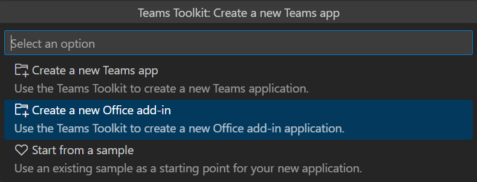
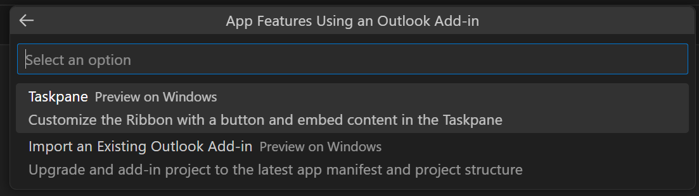

# Create Office Add-in projects with Teams Toolkit (preview)

Extensions to the Microsoft 365 Platform and known collectively as "Teams Apps", even if the extension is for a part of Microsoft 365 outside of the Teams application itself. A primary tool for developing Teams Apps is the Teams Toolkit. You can create Office Add-ins with the Teams Toolkit subject to the following restrictions:

- Only Outlook Add-ins can be created at this time. We're working hard to enable support in Teams Toolkit for add-ins to other Office applications.
- Add-ins created with Teams Toolkit use the unified Microsoft 365 manifest which is currently in preview. We encourage you to experiment with creating add-ins using the toolkit but don't use the unified manifest for production add-ins.

Install the prerelease version of Teams Toolkit into Visual Studio Code as described in [Install Teams Toolkit - Prerelease version](/microsoftteams/platform/toolkit/install-teams-toolkit?tabs=vscode&pivots=visual-studio-code#install-a-pre-release-version).

## Create an Outlook Add-in project

1. Open Visual Studio Code and select the Teams Toolkit icon in the **Activity Bar**.
1. Select **Create a new app**.
1. In the **Select an option** drop down, select **Start with an Outlook add-in**.

    

1. In the **Select a capability** drop down, select **Outlook Taskpane Add-in (preview)**.

    

1. In the **Workspace folder** dialog that opens, select the folder where you want to create the project.
1. Give a name to the project (with no spaces) when prompted. Teams Toolkit will create the project with basic files and scaffolding. It will then open the project *in a second Visual Studio Code window*. Close the original Visual Studio Code window.
1. In the Visual Studio Code **TERMINAL** navigate to the root of the project and run `npm install`.
1. Before you make changes to the project, verify that Outlook add-in sideloading from Visual Studio Code works. Use the following steps:

    <ol type="a">
      <li>Ensure that your account in your Microsoft 365 developer tenancy is also an email account in desktop Outlook. If it isn't, follow the guidance in [Add an email account to Outlook](https://support.microsoft.com/office/add-an-email-account-to-outlook-e9da47c4-9b89-4b49-b945-a204aeea6726)</li>
      <li><i>Close Outlook desktop.</i></li>
      <li>In Visual Studio Code, open the Teams Toolkit.</li>
      <li>In the <b>ACCOUNTS</b> section, verify that you're signed into Microsoft 365.</li>
      <li>Select <b>View</b> | <b>Run</b> in Visual Studio Code. In the <b>RUN AND DEBUG</b> drop down menu, select the option, <b>Outlook Desktop (Edge Chromium)</b>, and then press F5. The project builds and a Node dev-server window opens. This process may take a couple of minutes. Eventually, Outlook desktop will open.</li>
      <li>Open the <b>Inbox</b> <i>of your Microsoft 365 account identity</i> and open any message. A <b>Contoso Add-in</b> tab with two buttons will appear on the <b>Home</b> ribbon (or the <b>Message</b> ribbon, if you have opened the message in its own window).</li>
      <li>Click the <b>Show Taskpane</b> button and a task pane opens. Click the <b>Perform an action</b> button and a small notification appears near the top of the message.</li>
      <li>To stop debugging and uninstall the add-in, select <b>Run</b> | <b>Stop Debugging</b> in Visual Studio Code.</li>
    </ol>

Now you can change and develop the project. In places where the guidance in the Office Add-ins documentation branches depending on what type of manifest is being used, be sure to follow the guidance for the unified manifest.
