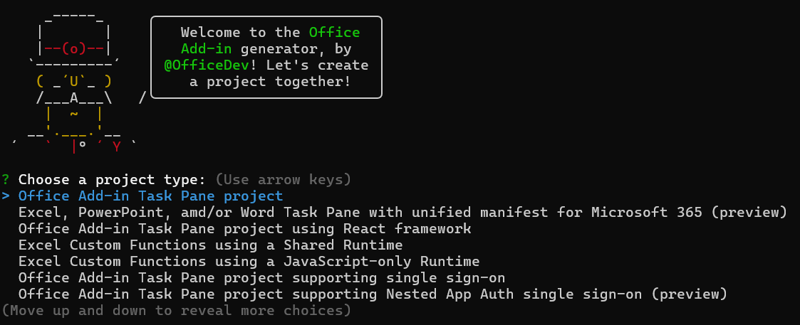

# Create Office Add-in projects using the Yeoman Generator

The [Yeoman Generator for Office Add-ins](https://github.com/OfficeDev/generator-office) (also called "Yo Office") is an interactive Node.js-based command line tool that creates Office Add-in development projects. We recommend that you use this tool to create add-in projects except when you want the server-side code of the add-in to be in a .NET-based language (such as C# or VB.Net) or you want the add-in hosted in Internet Information Server (IIS). In either of the latter two situations, [use Visual Studio to create the add-in](develop-add-ins-visual-studio.md).

The projects that the tool creates have the following characteristics.

- They have a standard [npm](https://www.npmjs.com/) configuration that includes a **package.json** file.
- They include several helpful scripts to build the project, start the server, sideload the add-in in Office, and other tasks.
- They use [webpack](https://webpack.js.org/) as a bundler and basic task runner.
- In development mode, they are hosted on localhost by webpack's Node.js-based webpack-dev-server, a development-oriented version of the [express](http://expressjs.com/) server that supports hot-reloading and recompile-on-change.
- By default, all dependencies are installed by the tool, but you can postpone the installation with a command line argument.
- They include a complete add-in manifest.
- They have a "Hello World"-level add-in that is ready run as soon as the tool has finished.
- They include a polyfill and a transpiler that is configured to transpile TypeScript, and recent versions of JavaScript, to ES5 JavaScript. These features ensure that the add-in is supported in all runtimes that Office Add-ins might run in, including Internet Explorer.

> [!TIP]
> If you want to deviate from these choices significantly, such as using a different task runner or a different server, we recommend that when you run the tool you choose the [Manifest-only option](#manifest-only-option).

## Install the generator

[!include[Set up requirements](../includes/set-up-dev-environment-beforehand.md)]
[!include[Yeoman generator prerequisites](../includes/quickstart-yo-prerequisites.md)]

## Use the tool

Start the tool with the following command in a system prompt (not a bash window).

```command&nbsp;line
yo office 
```

A lot needs to load, so it may take 20 seconds before the tool starts. The tool asks you a series of questions. For some, you just type an answer to the prompt. For others, you're given a list of possible answers. If given a list, select one and then select Enter.

The first question asks you to choose between six types of projects. The options are:

- **Office Add-in Task Pane project**
- **Office Add-in Task Pane project using Angular framework**
- **Office Add-in Task Pane project using React framework**
- **Office Add-in Task Pane project supporting single sign-on**
- **Office Add-in project containing the manifest only**
- **Excel Custom Functions Add-in project**



> [!NOTE]
> The **Office Add-in Task Pane project supporting single sign-on** option produces a project that can be used to see how single sign-on (SSO) works in an add-in. The project can't be used as the basis of a production add-in. To get an SSO-enabled project that can be a basis of a production add-in, see the "Complete" version of [one of the SSO samples in our samples repo](https://github.com/OfficeDev/Office-Add-in-samples/tree/main/Samples/auth).
>
> The **Office Add-in project containing the manifest only** option produces a project that contains a basic add-in manifest and minimal scaffolding. For more information about the option, see [Manifest-only option](#manifest-only-option).

The next question asks you to choose between **TypeScript** and **JavaScript**. (This question is skipped if you chose the manifest-only option in the preceding question.)


You're then prompted to give the add-in a name. The name you specify will be used in the add-in's manifest, but you can change it later.


You're then prompted to choose which Office application the add-in should run in. There are six possible applications to choose from: **Excel**, **OneNote**, **Outlook**, **PowerPoint**, **Project**, and **Word**. You must choose just one, but you can change the manifest later to support the additional Office applications. The exception is Outlook. A manifest that supports Outlook cannot support any other Office application.


After you've answered this question, the generator creates the project and installs the dependencies. You may see **WARN** messages in the npm output on screen. You can ignore these. You may also see messages that vulnerabilities were found. You can ignore these for now, but you'll eventually need to fix them before your add-in is released to production. For more information about fixing vulnerabilities, open your browser and search for "npm vulnerability".

If the creation is successful, you'll see a **Congratulations!** message in the command window, followed by some suggested next steps. (If you're using the generator as part of a quick start or tutorial, ignore the next steps in the command window and continue with the instructions in the article.)

> [!TIP]
> If you want to create the scaffolding of an Office Add-in project, but postpone the installation of the dependencies, add the `--skip-install` option to the `yo office` command. The following code is an example.
>
> ```command&nbsp;line
> yo office --skip-install
> ```
>
> When you're ready to install the dependencies, navigate to the root folder of the project in a command prompt and enter `npm install`.

## Manifest-only option

This option creates only a manifest for an add-in. The resulting project doesn't have a Hello World add-in, any of the scripts, or any of the dependencies. Use this option in the following scenarios.

- You want to use different tools from the ones a Yeoman generator project installs and configures by default. For example, you want to use a different bundler, transpiler, task runner, or development server.
- You want to use a web application development framework, other than Angular or React, such as Vue.

For an example of using the generator with the manifest-only option, see [Use Vue to build an Excel task pane add-in](../quickstarts/excel-quickstart-vue.md).

## Use command line parameters

You can also add parameters to the `yo office` command. The two most common are:

- `yo office --details`: This will output brief help about all of the other command line parameters.
- `yo office --skip-install`: This will prevent the generator from installing the dependencies.

For detailed reference about the command line parameters, see the readme for the generator at [Yeoman generator for Office Add-ins](https://github.com/officedev/generator-office).

## Troubleshooting

If you encounter problems using the tool, your first step should be to reinstall it to be sure that you have the latest version. (See [Install the generator](#install-the-generator) for details.) If doing so doesn't fix the problem, search the [issues of the GitHub repo for the tool](https://github.com/OfficeDev/generator-office/issues) to see if anyone else has encountered the same problem and found a solution. If no one has, [create a new issue](https://github.com/OfficeDev/generator-office/issues/new?assignees=&labels=needs+triage&template=bug_report.md&title=).
