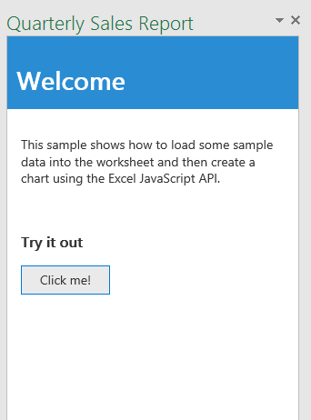

# Build your first Excel add-in

This article describes how to use the Excel JavaScript API to build an add-in for Excel 2016 or Excel Online. The following steps walk you through building a simple task pane add-in that loads some data into a worksheet and creates a basic chart in Excel 2016.


You’ll start by creating a web app using HTML and JQuery. Then you'll create an XML manifest file that specifies where you want to locate your web app, and how it should appear within Excel.


### Code it

#### Create the web app

1-  Create a folder on your local drive named QuarterlySalesReport (for example, C:\\QuarterlySalesReport). Then within that folder, create a folder named QuarterlySalesReportWeb (for example, C:\\QuarterlySalesReport\\QuarterlySalesReportWeb). Save all of the web app files created in the steps that follow into this folder.

2- Create the HTML page that will load into the task pane add-in. Name the file **Home.html** and paste the code below into the file.

```html

	<!DOCTYPE html>
    <html>
    <head>
        <meta charset="UTF-8" />
        <meta http-equiv="X-UA-Compatible" content="IE=Edge" />
        <title>Quarterly Sales Report</title>

        <script src="https://ajax.aspnetcdn.com/ajax/jQuery/jquery-2.1.4.min.js"></script>

        <link href="Office.css" rel="stylesheet" type="text/css" />

        <script src="https://appsforoffice.microsoft.com/lib/1/hosted/office.js" type="text/javascript"></script>

        <link href="Common.css" rel="stylesheet" type="text/css" />
        <script src="Notification.js" type="text/javascript"></script>

        <script src="Home.js" type="text/javascript"></script>

        <link rel="stylesheet" href="https://appsforoffice.microsoft.com/fabric/1.0/fabric.min.css">
        <link rel="stylesheet" href="https://appsforoffice.microsoft.com/fabric/1.0/fabric.components.min.css">

    </head>
    <body class="ms-font-m">
        <div id="content-header">
            <div class="padding">
                <h1>Welcome</h1>
            </div>
        </div>
        <div id="content-main">
            <div class="padding">
                <p>This sample shows how to load some sample data into the worksheet, and then create a chart using the Excel JavaScript API.</p>
                <br />
                <h3>Try it out</h3>
                <button class="ms-Button" id="load-data-and-create-chart">Click me!</button>
            </div>
        </div>
    </body>
    </html>

```

3- Create a file named **Common.css** to store your custom styles and paste the code below into the file.

```css
	/* Common app styling */

    #content-header {
        background: #2a8dd4;
        color: #fff;
        position: absolute;
        top: 0;
        left: 0;
        width: 100%;
        height: 80px; /* Fixed header height */
        overflow: hidden; /* Disable scrollbars for header */
    }

    #content-main {
        background: #fff;
        position: fixed;
        top: 80px; /* Same value as #content-header's height */
        left: 0;
        right: 0;
        bottom: 0;
        overflow: auto; /* Enable scrollbars within main content section */
    }

    .padding {
        padding: 15px;
    }

    #notification-message {
        background-color: #818285;
        color: #fff;
        position: absolute;
        width: 100%;
        min-height: 80px;
        right: 0;
        z-index: 100;
        bottom: 0;
        display: none; /* Hidden until invoked */
    }

        #notification-message #notification-message-header {
            font-size: medium;
            margin-bottom: 10px;
        }

        #notification-message #notification-message-close {
            background-image: url("../../images/Close.png");
            background-repeat: no-repeat;
            width: 24px;
            height: 24px;
            position: absolute;
            right: 5px;
            top: 5px;
            cursor: pointer;
        }


```

4- Create a file to contain the programming logic for the add-in in jQuery. Name the file **Home.js** and paste the following script into the file.

```js

    (function () {
        "use strict";

        // The initialize function must be run each time a new page is loaded
        Office.initialize = function (reason) {
            $(document).ready(function () {
                app.initialize();

                $('#load-data-and-create-chart').click(loadDataAndCreateChart);
            });
        };

        // Load some sample data into the worksheet and then create a chart
        function loadDataAndCreateChart() {
            // Run a batch operation against the Excel object model
            Excel.run(function (ctx) {

                // Create a proxy object for the active worksheet
                var sheet = ctx.workbook.worksheets.getActiveWorksheet();

                //Queue commands to set the report title in the worksheet
                sheet.getRange("A1").values = "Quarterly Sales Report";
                sheet.getRange("A1").format.font.name = "Century";
                sheet.getRange("A1").format.font.size = 26;

                //Create an array containing sample data
                var values = [["Product", "Qtr1", "Qtr2", "Qtr3", "Qtr4"],
                              ["Frames", 5000, 7000, 6544, 4377],
                              ["Saddles", 400, 323, 276, 651],
                              ["Brake levers", 12000, 8766, 8456, 9812],
                              ["Chains", 1550, 1088, 692, 853],
                              ["Mirrors", 225, 600, 923, 544],
                              ["Spokes", 6005, 7634, 4589, 8765]];

                //Queue a command to write the sample data to the specified range
                //in the worksheet and bold the header row
                var range = sheet.getRange("A2:E8");
                range.values = values;
                sheet.getRange("A2:E2").format.font.bold = true;

                //Queue a command to add a new chart
                var chart = sheet.charts.add("ColumnClustered", range, "auto");

                //Queue commands to set the properties and format the chart
                chart.setPosition("G1", "L10");
                chart.title.text = "Quarterly sales chart";
                chart.legend.position = "right"
                chart.legend.format.fill.setSolidColor("white");
                chart.dataLabels.format.font.size = 15;
                chart.dataLabels.format.font.color = "black";
                var points = chart.series.getItemAt(0).points;
                points.getItemAt(0).format.fill.setSolidColor("pink");
                points.getItemAt(1).format.fill.setSolidColor('indigo');

                //Run the queued commands, and return a promise to indicate task completion
                return ctx.sync();
            })
              .then(function () {
                  app.showNotification("Success");
                  console.log("Success!");
              })
            .catch(function (error) {
                // Always be sure to catch any accumulated errors that bubble up from the Excel.run execution
                app.showNotification("Error: " + error);
                console.log("Error: " + error);
                if (error instanceof OfficeExtension.Error) {
                    console.log("Debug info: " + JSON.stringify(error.debugInfo));
                }
            });
        }
    })();
```

5- Create a file to contain the programming logic for providing notifications in the add-in in case of errors. This is helpful while debugging. Name the file **Notification.js** and paste the following script into the file.

```js

    /* Notification functionality */

    var app = (function () {
        "use strict";

        var app = {};

        // Initialization function (to be called from each page that needs notification)
        app.initialize = function () {
            $('body').append(
                '<div id="notification-message">' +
                    '<div class="padding">' +
                        '<div id="notification-message-close"></div>' +
                        '<div id="notification-message-header"></div>' +
                        '<div id="notification-message-body"></div>' +
                    '</div>' +
                '</div>');

            $('#notification-message-close').click(function () {
                $('#notification-message').hide();
            });


            // After initialization, expose a common notification function
            app.showNotification = function (header, text) {
                $('#notification-message-header').text(header);
                $('#notification-message-body').text(text);
                $('#notification-message').slideDown('fast');
            };
        };

        return app;
    })();
```

6-	Save all of the web app files. 

#### Create the XML manifest file

1-  Within the QuarterlySalesReport folder on your local drive (for example, C:\\QuarterlySalesReport), create an XML manifest file to specify the settings and capabilities of the add-in. Name the file **QuarterlySalesReportManifest.xml** and paste the following XML into the file.

```xml
	<?xml version="1.0" encoding="UTF-8"?>
    <!--Created:cb85b80c-f585-40ff-8bfc-12ff4d0e34a9-->
    <OfficeApp xmlns="http://schemas.microsoft.com/office/appforoffice/1.0" xmlns:xsi="http://www.w3.org/2001/XMLSchema-instance" xsi:type="TaskPaneApp">
      <Id>ab2991e7-fe64-465b-a2f1-c865247ef434</Id>
      <Version>1.0.0.0</Version>
      <ProviderName>Microsoft</ProviderName>
      <DefaultLocale>en-US</DefaultLocale>
      <DisplayName DefaultValue="Quarterly Sales Report Sample" />
      <Description DefaultValue="Quarterly Sales Report Sample"/>
      <Capabilities>
        <Capability Name="Workbook" />
      </Capabilities>
      <DefaultSettings>
        <SourceLocation DefaultValue="~remoteAppUrl/QuarterlySalesReportWeb/Home.html" />
      </DefaultSettings>
      <Permissions>ReadWriteDocument</Permissions>
    </OfficeApp>
```

2-  Generate a GUID using an online generator of your choice. Then, replace the value of the **Id** element shown in the previous step with that GUID.

3-	Save the XML manifest file. 

Now that you've created the web app and the XML manifest file, you’ve officially written your first Excel add-in.

### Try it out

#### Deploy the web app and update the manifest

1-  Deploy the QuarterlySalesReportWeb folder to the web server of your choice.

2-  Edit the attribute value within the **SourceLocation** element of the XML manifest file (**QuarterlySalesReportManifest.xml**) to specify the location of the **Home.html** file on the web server.

#### Test the add-in

To test your add-in on Windows, complete the following steps to publish the XML manifest file to a network file share and [sideload the add-in](../testing/create-a-network-shared-folder-catalog-for-task-pane-and-content-add-ins.md) in Excel. 

> **Note:** For details about testing your add-in in either Office Online or on iPad or Mac, see [Sideload Office Add-ins in Office Online for testing](../testing/sideload-office-add-ins-for-testing.md) or [Sideload Office Add-ins on iPad and Mac for testing](../testing/sideload-an-office-add-in-on-ipad-and-mac.htm.md).

1-  Create a folder on a network share (for example, \\\MyShare\\MyManifests) and copy the XML manifest file to that folder.

2-  Now, let's add the share location that contains the manifest as a trusted app catalog in Excel. Launch Excel and open a blank workbook.

3-  Choose the **File** tab, and then choose **Options**.

4-  Choose **Trust Center**, and then choose the **Trust Center Settings** button.

5-  Choose **Trusted Add-in Catalogs**.

6-  In the **Catalog Url** box, enter the path to the network share you created in step 1, and then choose **Add Catalog**. Select the **Show in Menu** check box, and then choose **OK**. A message appears to inform you that your settings will be applied the next time you start Office.

7-  Restart Excel and open a blank workbook.

8-  Now, let's test and run the add-in. On the **Insert tab** in Excel 2016, choose **My Add-ins**.

9- In the **Office Add-ins** dialog box, choose **Shared Folder**.

10-  Choose **Quarterly Sales Report Sample** and click **Add**. The add-in opens in a task pane to the right of the current worksheet, as shown in the following figure.

 

11-  Click the **Click me!** button to render the data and the chart inside the worksheet, as shown in the following figure.  To see the chart update dynamically, just change the data in the range.


### Additional resources

*  [Excel add-ins programming overview](excel-add-ins-javascript-programming-overview.md)
*  [Explore snippets with Script Lab](https://store.office.com/en-001/app.aspx?assetid=WA104380862&ui=en-US&rs=en-001&ad=US&appredirect=false)
*  [Excel add-in code samples](http://dev.office.com/code-samples#?filters=excel,office%20add-ins)
*  [Excel add-ins JavaScript API reference](excel-add-ins-javascript-api-reference.md)
