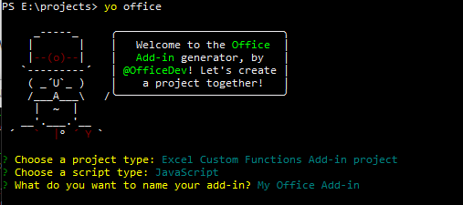

# Configure your Excel add-in to use a shared JavaScript runtime (preview)

[!include[Running custom functions in a shared runtime note](../includes/excel-shared-runtime-preview-note.md)]

When running Excel on Windows or Mac, your add-in will run code for ribbon buttons, custom functions, and the task pane in separate JavaScript runtime environments. This creates limitations such as not being able to easily share global data, and not being able to access all CORS functionality from a custom function.

However, you can configure your Excel add-in to share code in a shared JavaScript runtime. This enables better coordination across your add-in and access to the DOM and CORS from all parts of your add-in. It also enables you to run code when the document opens, or to run code while the task pane is closed. To configure your add-in to use a shared runtime, follow the instructions in this article.

## Create the add-in project

If you are starting a new project, follow these steps to use the Yeoman generator to create an Excel add-in project. Run the following command and then answer the prompts with the following answers:

```command&nbsp;line
yo office
```

- Choose a project type: **Excel Custom Functions Add-in project**
- Choose a script type: **JavaScript**
- What do you want to name your add-in? **My Office Add-in**



After you complete the wizard, the generator creates the project and installs supporting Node components.

## Configure the manifest

Follow these steps for a new or existing project to configure it to use a shared runtime.

1. Start Visual Studio Code and open the **My Office Add-in** project.
2. Open the **manifest.xml** file.
3. Change the `<Requirements>` section to use **SharedRuntime** version **1.1** as shown in the following code.
    
    ```xml
    <Requirements>
    <Sets DefaultMinVersion="1.1">
    <Set Name="SharedRuntime" MinVersion="1.1"/>
    </Sets>
    </Requirements>
    ```
    
4. Find the `<VersionOverrides>` section, and add the following `<Runtimes>` section. The lifetime needs to be **long** so that the custom functions can still work even when the task pane is closed. The resid is `ContosoAddin.Url` which references a string in the resources section later. You can use any resid value you want.
    
    ```xml
    <VersionOverrides xmlns="http://schemas.microsoft.com/office/taskpaneappversionoverrides" xsi:type="VersionOverridesV1_0">
      <Hosts>
        <Host xsi:type="Workbook">
        <Runtimes>
          <Runtime resid="ContosoAddin.Url" lifetime="long" />
        </Runtimes>
        <AllFormFactors>
    ```
    
5. In the `<Page>` element, change the source location from **Functions.Page.Url** to **ContosoAddin.Url**. Note that if you don't have custom functions, you will not have a **Page** entry and can skip this step.

    ```xml
    <AllFormFactors>
    ...
    <Page>
    <SourceLocation resid="ContosoAddin.Url"/>
    </Page>
    ...
    ```

6. In the `<DesktopFormFactor>` section, change the **FunctionFile** from **Commands.Url** to use **ContosoAddin.Url**. Note that if you don't have action commands, you won't have a **FunctionFile** entry, and can skip this step.
    
    ```xml
    <DesktopFormFactor>
    <GetStarted>
    ...
    </GetStarted>
    <FunctionFile resid="ContosoAddin.Url"/>
    ```
    
7. In the `<Action>` section, change the source location from **Taskpane.Url** to **ContosoAddin.Url**. Note that if you don't have a task pane, you won't have a **ShowTaskpane** action, and can skip this step.
    
    ```xml
    <Action xsi:type="ShowTaskpane">
    <TaskpaneId>ButtonId1</TaskpaneId>
    <SourceLocation resid="ContosoAddin.Url"/>
    </Action>
    ```
    
8. Add a new **Url id** for **ContosoAddin.Url** that points to **taskpane.html**.
     
    ```xml
    <bt:Urls>
    <bt:Url id="Functions.Script.Url" DefaultValue="https://localhost:3000/dist/functions.js"/>
    ...
    <bt:Url id="ContosoAddin.Url" DefaultValue="https://localhost:3000/taskpane.html"/>
    ...
    ```
    
9. Save your changes and rebuild the project.
    
    ```command&nbsp;line
    npm run build
    ```

## Runtime lifetime

When you add the `Runtime` element, you also specify a lifetime with a value of `long` or `short`. Set this value to `long` to take advantage of features such as starting your add-in when the document opens, continuing to run code after the task pane is closed, or using CORS and DOM from custom functions.

If you set this value to `short`, the add-in will behave similar to the default behavior. The add-in will start when one of your ribbon buttons is pressed, but it may shut down after your ribbon handler is done running. Similarly your add-in will start when the task pane is opened, but it may shut down when the task pane is closed.

```xml
<Runtimes>
  <Runtime resid="ContosoAddin.Url" lifetime="long" />
</Runtimes>
```


## Next steps

Now try out some features of the shared runtime by taking a look at the following articles.

- [Call Excel APIs from a custom function](call-excel-apis-from-custom-function.md)

## See also

- [Overview: Run your add-in code in a shared JavaScript runtime (preview)](custom-functions-shared-overview.md)