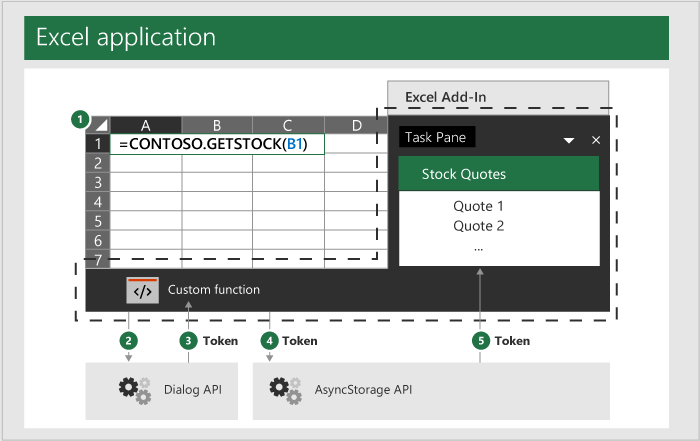

# Authentication for custom functions without a shared runtime

In some scenarios, a custom function that doesn't use a [shared runtime](../testing/runtimes.md#shared-runtime) will need to authenticate the user in order to access protected resources. Custom functions that don't use a shared runtime run in a [JavaScript-only runtime](../testing/runtimes.md#javascript-only-runtime). Because of this, if the add-in has a task pane, you'll need to pass data back and forth between the JavaScript-only runtime and the HTML-supporting runtime used by the task pane. You do this by using the [OfficeRuntime.storage](/javascript/api/office-runtime/officeruntime.storage) object and a special Dialog API.

[!include[Excel custom functions note](../includes/excel-custom-functions-note.md)]

[!include[Shared runtime note](../includes/shared-runtime-note.md)]

## OfficeRuntime.storage object

The JavaScript-only runtime doesn't have a `localStorage` object available on the global window, where you typically store data. Instead, your code should share data between custom functions and task panes by using `OfficeRuntime.storage` to set and get data.

### Suggested usage

When you need to authenticate from a custom function add-in that doesn't use a shared runtime, your code should check `OfficeRuntime.storage` to see if the access token was already acquired. If not, use [OfficeRuntime.displayWebDialog](/javascript/api/office-runtime#office-runtime-officeruntime-displaywebdialog-function(1)) to authenticate the user, retrieve the access token, and then store the token in `OfficeRuntime.storage` for future use.

## Dialog API

If a token doesn't exist, you should use the `OfficeRuntime.dialog` API to ask the user to sign in. After a user enters their credentials, the resulting access token can be stored as an item in `OfficeRuntime.storage`.

> [!NOTE]
> The JavaScript-only runtime uses a dialog object that is slightly different from the dialog object in the browser runtime used by task panes. They're both referred to as the "Dialog API", but use [OfficeRuntime.displayWebDialog](/javascript/api/office-runtime#office-runtime-officeruntime-displaywebdialog-function(1)) to authenticate users in the JavaScript-only runtime, *not* [Office.ui.displayDialogAsync](/javascript/api/office/office.ui#office-office-ui-displaydialogasync-member(1)).

The following diagram outlines this basic process. The dotted line indicates that custom functions and your add-in's task pane are both part of your add-in as a whole, though they use separate runtimes.

1. You issue a custom function call from a cell in an Excel workbook.
1. The custom function uses `OfficeRuntime.dialog` to pass your user credentials to a website.
1. This website then returns an access token to the page in the dialog.
1. Your JavaScript in the dialog calls the [Office.ui.messageParent](/javascript/api/office/office.ui#office-office-ui-messageparent-member(1)) function to send the access token to the custom function. For more information about this function, see [Send information from the dialog box to the host page](../develop/dialog-api-in-office-add-ins.md#send-information-from-the-dialog-box-to-the-host-page).
1. Your custom function then sets this access token to an item in the `OfficeRuntime.storage`.
1. Your add-in's task pane accesses the token from `OfficeRuntime.storage`.



## Storing the token

The following examples are from the [Using OfficeRuntime.storage in custom functions](https://github.com/OfficeDev/Office-Add-in-samples/tree/main/Excel-custom-functions/AsyncStorage) code sample. Refer to this code sample for a complete example of sharing data between custom functions and the task pane in add-ins that don't use a shared runtime.

If the custom function authenticates, then it receives the access token and will need to store it in `OfficeRuntime.storage`. The following code sample shows how to call the `storage.setItem` method to store a value. The `storeValue` function is a custom function that stores a value from the user. You can modify this to store any token value you need.

```js
/**
 * Stores a key-value pair into OfficeRuntime.storage.
 * @customfunction
 * @param {string} key Key of item to put into storage.
 * @param {*} value Value of item to put into storage.
 */
function storeValue(key, value) {
  return OfficeRuntime.storage.setItem(key, value).then(function (result) {
      return "Success: Item with key '" + key + "' saved to storage.";
  }, function (error) {
      return "Error: Unable to save item with key '" + key + "' to storage. " + error;
  });
}
```

When the task pane needs the access token, it can retrieve the token from the `OfficeRuntime.storage` item. The following code sample shows how to use the `storage.getItem` method to retrieve the token.

```js
/**
 * Read a token from storage.
 * @customfunction GETTOKEN
 */
function receiveTokenFromCustomFunction() {
  const key = "token";
  const tokenSendStatus = document.getElementById('tokenSendStatus');
  OfficeRuntime.storage.getItem(key).then(function (result) {
     tokenSendStatus.value = "Success: Item with key '" + key + "' read from storage.";
     document.getElementById('tokenTextBox2').value = result;
  }, function (error) {
     tokenSendStatus.value = "Error: Unable to read item with key '" + key + "' from storage. " + error;
  });
}
```

## General guidance

Office Add-ins are web-based and you can use any web authentication technique. There is no particular pattern or method you must follow to implement your own authentication with custom functions. You may wish to consult the documentation about various authentication patterns, starting with [this article about authorizing via external services](../develop/auth-external-add-ins.md).  

Avoid using the following locations to store data when developing custom functions:

- `localStorage`: custom functions that don't use a shared runtime don't have access to the global `window` object and therefore have no access to data stored in `localStorage`.
- `Office.context.document.settings`:  This location isn't secure and information can be extracted by anyone using the add-in.

## Dialog box API example

In the following code sample, the function `getTokenViaDialog` uses the `OfficeRuntime.displayWebDialog` function to display a dialog box. This sample is provided to show the capabilities of the method, not demonstrate how to authenticate.

```JavaScript
/**
 * Function retrieves a cached token or opens a dialog box if there is no saved token. Note that this isn't a sufficient example of authentication but is intended to show the capabilities of the displayWebDialog method.
 * @param {string} url URL for a stored token.
 */
function getTokenViaDialog(url) {
  return new Promise (function (resolve, reject) {
    if (_dialogOpen) {
      // Can only have one dialog box open at once. Wait for previous dialog box's token.
      let timeout = 5;
      let count = 0;
      const intervalId = setInterval(function () {
        count++;
        if(_cachedToken) {
          resolve(_cachedToken);
          clearInterval(intervalId);
        }
        if(count >= timeout) {
          reject("Timeout while waiting for token");
          clearInterval(intervalId);
        }
      }, 1000);
    } else {
      _dialogOpen = true;
      OfficeRuntime.displayWebDialog(url, {
        height: '50%',
        width: '50%',
        onMessage: function (message, dialog) {
          _cachedToken = message;
          resolve(message);
          dialog.close();
          return;
        },
        onRuntimeError: function(error, dialog) {
          reject(error);
        },
      }).catch(function (e) {
        reject(e);
      });
    }
  });
}
```

## Next steps

Learn how to [debug custom functions](custom-functions-debugging.md).

## See also

- [JavaScript-only runtime for custom functions](custom-functions-runtime.md)
- [Excel custom functions tutorial](../tutorials/excel-tutorial-create-custom-functions.md)
- [JavaScript-only runtime](../testing/runtimes.md#javascript-only-runtime)
