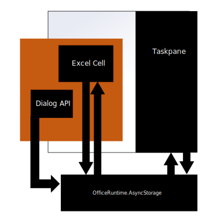

# Authentication

You may wish to verify that a user is authenticated before they access and use your custom function. While custom functions doesn't require a specific method of authentication, you should be aware that custom functions runs in a separate runtime from the task pane and other UI elements of your add-in. Because of this, you'll need to pass data back and forth between the two runtimes using `AsyncStorage` and the Dialog API.
  
## AsyncStorage

Custom functions' runtime doesn't have a `localStorage` object available on the global window, where you might typically store user information. Instead, custom functions and task panes both have access to another storage location, `OfficeRuntime.AsyncStorage`. It has a variety of [useful properties](https://docs.microsoft.com/en-us/javascript/api/office-runtime/officeruntime.asyncstorage?view=office-js) to set and store data. Essentially,`AsyncStorage` serves as a bridge between custom functions and your task pane (or other UI elements).

Suggested usage:

- Use `AsyncStorage` to set and store user tokens.
- From your custom function, read user tokens from `AsyncStorage` and use them to make your web request.
- For best performance, you should save a user token into a global variable within custom functions so you can access it from other functions without having to look it up in `AsyncStorage` again.

Additionally, there are some benefits to using `AsyncStorage`; it offers a sandbox environment on a user's device and cannot be accessed by other add-ins.  

## Dialog API

If a token doesn't exist, you should use the Dialog API to ask the user to sign in. Then, when a user enters their credentials into the dialog box, that information can be stored in `AsyncStorage`.

Keep in mind that both the task pane (and other UI elements of an add-in) and custom functions have their own separate Dialog APIs. They're both referred to as the "Dialog API", but use `Officeruntime.Dialog` to authenticate users in the custom functions runtime.

For information on how to use the `OfficeRuntime.Dialog`, see [Custom Functions runtime](https://docs.microsoft.com/en-us/office/dev/add-ins/excel/custom-functions-runtime?view=office-js#displaying-a-dialog-box).

When envisioning the entire authentication process as a whole, it might be helpful to think of `OfficeRuntime`, the task pane and UI elements of your add-in, and the custom functions portions of your add-in as separate entities which can communicate with each other. As shown in the following diagram, calls made from a cell in an Excel workbook and `OfficeRuntime.Dialog` exist in the custom functions runtime, indicated in orange. They communicate back and forth to the task pane through an intermediary, `OfficeRuntime.AsyncStorage`.

## General guidance

Use any authentication method you prefer. There is no particular pattern or method you must follow to implement your own authentication with custom functions. To get started with authentication patterns, a good start is [this article about authorizing via external services](https://docs.microsoft.com/en-us/office/dev/add-ins/develop/auth-external-add-ins?view=office-js).  

There are two locations which should not be used to store data if you're using custom functions:  

- `localStorage`: Custom functions do not have access to the global `window` object and therefore have no access to data stored in `localStorage`.
- `Office.context.document.settings`:  This location is not secure and information can be extracted by anyone using the add-in.

## See also

* [Custom functions metadata](custom-functions-json.md)
* [Runtime for Excel custom functions](custom-functions-runtime.md)
* [Custom functions best practices](custom-functions-best-practices.md)
* [Excel custom functions tutorial](excel-tutorial-custom-functions.md)
