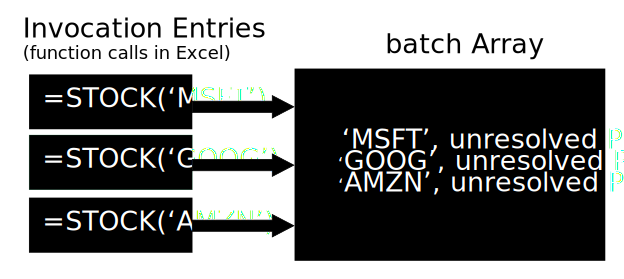
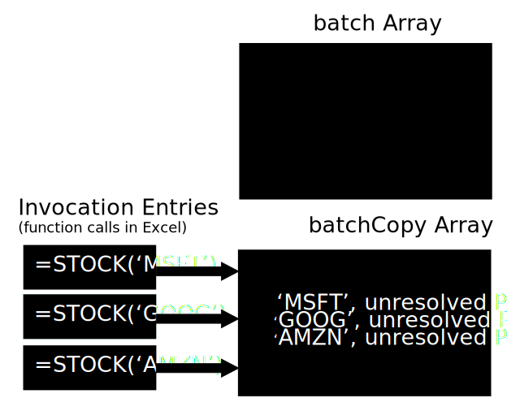
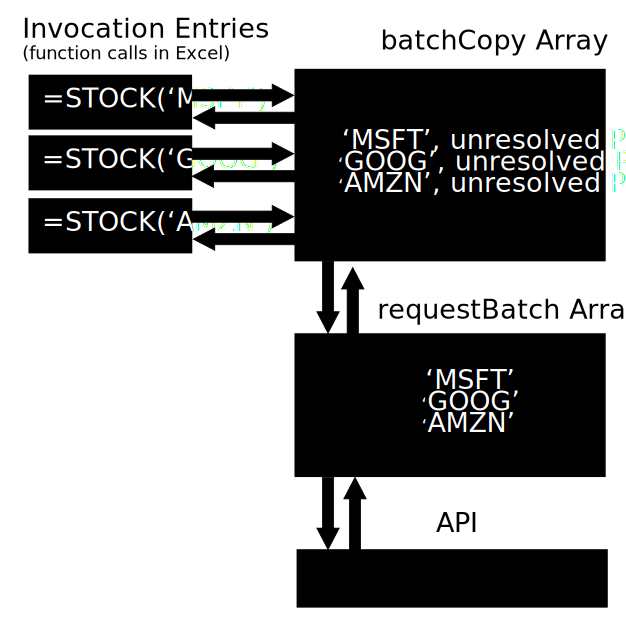

# Batching Web Requests

Custom functions allow you to make requests to resources on the web and this article will detail a pattern to batch these requests. When batching, you bundle individual requests together into a larger request, rather than executing each request one by one.

>[NOTE!]
> This article assumes you are familiar with JavaScript Promises and assumes you have created a custom function before. To learn how to create a custom function, see the [Custom Functions Tutorial](../tutorials/).

## Clone the batching code sample repository

This article is explained with a code sample, available in [this Github repository](https://github.com/OfficeDev/PnP-OfficeAddins/tree/master/Excel-custom-functions). Follow the listed steps to get started with the code sample.

1. Clone the repository to your local computer and open the repository’s root folder. You'll notice there are two files:

    * The file named fill-in.js is a set of code which you will fill in, given instructions in this tutorial.
    * The file named final-batching-sample.js gives a full code sample if you prefer to look at a whole code sample right away.

2. For now, open the file named fill-in.js in your favorite code editor.

3. Follow the steps in the next section to fill in the code at each point you come across a `TODO` in the code sample.

## Fill in the `TODO` sections of the code sample

* **TODO #1**

    The first `TODO` section you'll be creating two custom functions. One is called sum, which will take two numbers and add them together. The other is multiply, which multiplies two numbers.

    To simplify your code, you'll create a method which takes the name of the operation the function performs and its arguments, called `_pushOperation`. You'll note that many of the functions in this sample use of an underscore in front of the function name, indicating that the function is not publicly accessible.

    Fill in the functions according to the following:

    ```js
    function sum() {
        return _pushOperation("sum", arguments);
    }

    function mul() {
        return _pushOperation("mul", arguments);
    }
    ```

    Next, the sample details the `_pushOperation` function. The function creates an invocation entry each time the function is invoked in Excel by a user. For example, every time a user calls your multiply function in a cell, a new `invocationEntry` would be created. The invocation entry contains a description of what operation is being performed, the arguments (or numbers to be summed or multiplied, as well as properties for resolved and rejected results from the operation. These properties are filled in by the returned values from this invocation's JavaScript Promise.

    Next, you'll see that the function pushes this `invocationEntry` into a batch, which your code will later process.

* **TODO #2**

    Continuing in the `_pushOperation` function, you'll add some code to conditionally set a timeout event to occur if no batch is currently being processed. During this timeout, your function will send the batch to be remotely processed. Note that you should adjust this portion of code if you API requires longer processing time than two seconds or you wish to handle cases where the request does not complete in the allotted time (or at all).  

    Replace `TODO#2` with the following code:

    ```js
    if (!_isBatchedRequestScheduled) {
        setTimeout(_makeRemoteRequest, 2000);
        _isBatchedRequestScheduled = true;
    }
    ```

    Finally, the code sample returns the Promise for that invocationEntry.

* **TODO #3**

    Before the third `TODO` item, you'll notice that the `_isBatchedRequestScheduled` flag is set to false, because there is nothing to batch until an invocation of a function takes place.

    When an invocation happens, it will be passed to the `batch` array to await processing, as shown in the following diagram. In the following diagram, three invocations of the `=STOCK` function are issued in Excel, giving a stock ticker and expecting back a stock price. You'll note that the invocationEntries that are stored in the `batch` array contain both the raw information of the stock ticker string as well as the unresolved Promise.

    

    The third `TODO` item follows, with a new function `_makeRemoteRequest`.

    First, the `_makeRemoteRequest` function creates a copy of the original `batch` and clears out the `batch` array and flips the `_isBatchScheduled` flag back to false. This copy is called `batchCopy` and contains the unresolved Promises from your invocation entries. Creating the copy enables you to build up another batch while you are waiting for a response from your API.

    Next, the `_makeRemoteRequest` function creates the `requestBatch` array, which contains just the raw information from the invocationEntries that needs to be processed by the API.

    To give a visual example, the following diagram shows how the information from the `batch` array has been copied into the `batchCopy` array and the stock ticker string information separated out to the `requestBatch` array. The `batch` array has been emptied and could continue to fill with requests in the meantime while the `requestBatch` is processing.

    

    To fill in the third `TODO` item, add the following code.

    ```js
    function _makeRemoteRequest() {
        // Copy the shared batch and allow the building of a new batch while you are waiting for a response.

        var batchCopy = _batch.slice();
        _batch = [];
        _isBatchScheduled = false;
        // Build a simpler request batch that only contains the arguments for each invocation.

        var requestBatch = [];
        for (var i = 0; i < batchCopy.length; i++) {
            requestBatch[i] = {
                "operation": batchCopy[i].operation,
                "arguments": batchCopy[i].arguments
            };
    }
    ```

* **TODO #4**

    In the fourth `TODO`, you'll continue filling in the `_makeRemoteRequest` function.

    The invocation entries from your `batchCopy` array still have unresolved Promises that need to be fulfilled. When the API returns the information that you can use to fulfill these Promises, you'll match up each response from the API to the Promises in the `batchCopy` array.

    Fill in `TODO#4`with the following code:

    ```js
        // Make the remote request.

        _fetchFromRemoteService(requestBatch)
        .then(function (responseBatch) {
        // Match each value from the response batch to its corresponding invocation entry from the request batch,
        // and resolve the invocation Promise with its corresponding response value.

            for (var i = 0; i < responseBatch.length; i++) {
            batchCopy[i].resolve(responseBatch[i]);
            }
        });
    }
    ```

    Through this process, the Promise for each invocation is fulfilled and each _pushOperation can be returned in the cell where the function was originally called. You can see in the diagram that follows that the API returned information to the `requestBatch` array, which resolved the Promises in the `batchCopy` array, which then provides the information for the return values of the original custom function invocations. The `batch` array is still empty, but could also begin filling with additional requests for the next batch to be processed.

    

    With completion of this step, you're done filling in `TODO` items in this sample.

    The rest of this code sample simulates what a public API would be doing to resolve your API request, for your reference.

## Applying this pattern to your own project

For purposes of your own project, you can use much of the provided code as a boilerplate, changing only items in `TODO` #4 to suit your needs. As mentioned previously, depending on how you choose to handle errors and on the specifics of your API, you may also need to implement some additional code for `TODO` #2.

## See also

* [Create custom functions in Excel](custom-functions-overview.md)
* [Custom functions metadata](custom-functions-json.md)
* [Runtime for Excel custom functions](custom-functions-runtime.md)
* [Excel custom functions tutorial](excel-tutorial-custom-functions.md)
