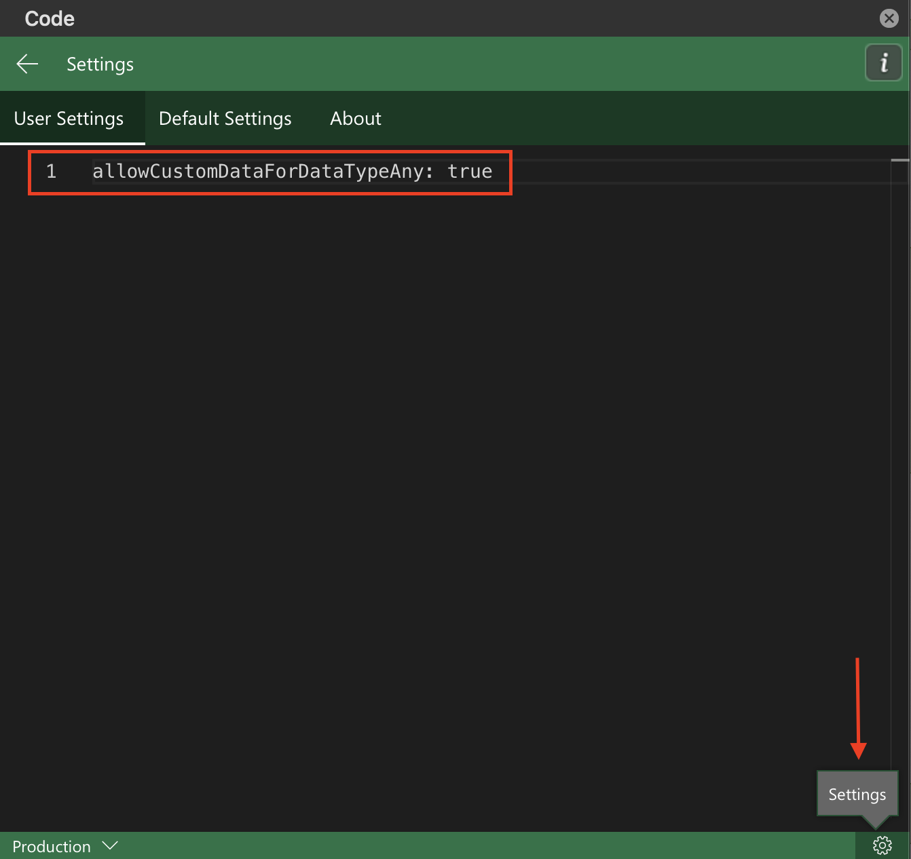

# Custom functions and data types core concepts (preview)

> [!NOTE]
> The custom functions integration with data types is currently only available in public preview and is only compatible with Windows devices. To use this feature, you need to join the [Office Insider program](https://insider.office.com/) and then choose the **Beta Channel** Insider level. See [Join the Office Insider Program](https://insider.office.com/join/windows) to learn more.

Data types enhance the Excel JavaScript API by expanding support for data types beyond the original four (string, number, boolean, and error). Data types include support for formatted number values, web images, and entity values. Custom functions accept data types as both input and output values, expanding the calculation power of custom functions.

To learn more about using data types with an Excel add-in, see the [Excel data types core concepts](/excel-data-types-concepts.md) article

## How custom functions handle data types

Custom functions can recognize data types and take them as both input and output values. A custom function can generate a new data type or accept an existing data type as an input parameter. Custom functions use the same JSON schema for data types as the Excel JavaScript API, and this JSON schema is maintained as custom functions calculate and evaluate.

> [!NOTE]
> Custom functions do not support the full functionality of the enhanced error objects offered by data types. Custom functions can accept data types error objects, but the data type error object may not be maintained throughout calculation. At this time, custom functions support the errors included in the [CustomFunctions.Error object](/custom-functions-errors.md).

## Enable data types for custom functions

The data types integration with custom functions is currently only available in public preview. To try out this new feature, you need to join the Office Insider program, adjust your Office update channel, and manually update your JSON metadata. For more temporary testing, you can customize your Script Lab settings instead of manually updating JSON metadata. The following sections outline these steps in more detail.

### Office Insider program

To try out the custom functions integration with data types, you first need to [join Office Insider](https://insider.office.com/join), and then choose the **Beta Channel** Insider level. You must use a Windows device, and your Excel desktop application must be using the **Beta Channel** to support this feature. To learn more about accessing the Beta Channel, see [Join the Office Insider Program](https://insider.office.com/join/windows).

### Manually update JSON metadata

After joining the Office Insider program, manually update your JSON metadata. The JSON metadata property required to use the data types integration with custom functions feature is `allowCustomDataForDataTypeAny`. Set this property to `true`.

For more information, see [Manually create JSON metadata: allowCustomDataForDataTypeAny](custom-functions-json.md#allowcustomdatafordatatypeany-preview).

### Script Lab option

The custom functions integration with data types is available for testing with Script Lab, in addition to the manual JSON metadata update described in the preceding section. To test this feature with Script Lab, update the settings using the following steps.

1. Open the Script Lab **Code** task pane.
1. In the lower right corner, select the **Settings** button.
1. Go to the **User Settings** tab and enter `allowCustomDataForDataTypeAny: true`.



## Output a formatted number value

The following code sample shows how to create a [FormattedNumberCellValue](/javascript/api/excel/excel.formattednumbercellvalue) data type with a custom function. The function takes a basic number and a format setting as the input parameters and returns a formatted number value data type as the output.

```js
/**
 * Take a number as the input value and return a formatted number value as the output.
 * @customfunction
 * @param {number} value
 * @param {string} format (e.g. "0.00%")
 * @returns A formatted number value.
 */
function createFormattedNumber(value, format) {
    return {
        type: "FormattedNumber",
        basicValue: value,
        numberFormat: format
    }
}
```

## Input an entity value

The following code sample shows a custom function that takes an entity value data type as an input. If the `attribute` parameter is set to `text`, then the function returns the `text` property of the entity value. Otherwise, the function returns the `basicValue` property of the entity value.

```js
/**
 * Accept an entity value data type as a function input.
 * @customfunction
 * @param {any} value
 * @param {string} attribute
 * @returns {any} The text value of the entity.
 */
function getEntityAttribute(value, attribute) {
    if (value.type == "Entity") {
        if (attribute == "text") {
            return value.text;
        } else {
            return value.properties[attribute].basicValue;
        }
    } else {
        return JSON.stringify(value);
    }
}
```

## See also

* [Custom functions and data types overview](/custom-functions-data-types-overview.md)
* [Excel data types overview](/excel-data-types-overview.md)
* [Excel data types core concepts](/excel-data-types-concepts.md)
* [Configure your Office Add-in to use a shared JavaScript runtime](../develop/configure-your-add-in-to-use-a-shared-runtime.md)
