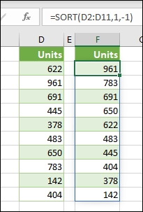

# Return multiple results from your custom function

You can return multiple results from your custom function which will be returned to neighboring cells. This behavior is called spilling. When your custom function returns an array of results, it is known as a dynamic array formula. For more information on dynamic array formulas in Excel, see [Dynamic arrays and spilled array behavior](https://support.office.com/article/dynamic-arrays-and-spilled-array-behavior-205c6b06-03ba-4151-89a1-87a7eb36e531).

The following image shows how the SORT function spills down into neighboring cells. Your custom function can also return multiple results like this.



To create a custom function that is a dynamic array formula, it must return a two-dimensional array of values. If the results spill into neighboring cells that already have values, the formula will display a **#SPILL!** error. 

The following example shows how to return a dynamic array that spills down.

```javascript
/**
 * Get text values that spill down.
 * @customfunction
 * @returns {string[][]} A dynamic array with multiple results.
 */
function spillDown() {
  return [['first'], ['second'], ['third']];
}
```

The following example shows how to return a dynamic array that spills right. 

```javascript
/**
 * Get text values that spill to the right.
 * @customfunction
 * @returns {string[][]} A dynamic array with multiple results.
 */
function spillRight() {
  return [['first', 'second', 'third']];
}
```

The following example shows how to return a dynamic array that spills both down and right.

```javascript
/**
 * Get text values that spill both right and down.
 * @customfunction
 * @returns {string[][]} A dynamic array with multiple results.
 */
function spillRectangle() {
  return [
    ['apples', 1, 'pounds'],
    ['oranges', 3, 'pounds'],
    ['pears', 5, 'crates']
  ];
}
```

## See also

- [Dynamic arrays and spilled array behavior](https://support.office.com/article/dynamic-arrays-and-spilled-array-behavior-205c6b06-03ba-4151-89a1-87a7eb36e531)
- [Options for Excel custom functions](custom-functions-parameter-options.md)