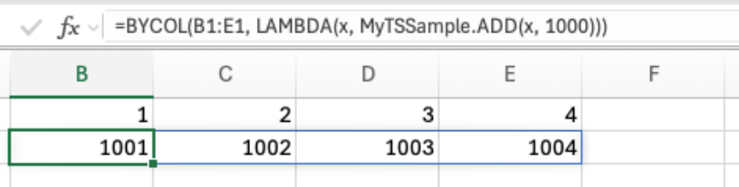

# Use custom functions with LAMBDA functions

[LAMBDA functions](https://support.microsoft.com/office/lambda-function-bd212d27-1cd1-4321-a34a-ccbf254b8b67) are custom, reusable Excel functions that users can create without JavaScript. Custom functions add-ins created with Office JavaScript APIs are compatible with the following LAMBDA functions.

- [BYCOL](https://support.microsoft.com/office/bycol-function-58463999-7de5-49ce-8f38-b7f7a2192bfb)
- [BYROW](https://support.microsoft.com/office/byrow-function-2e04c677-78c8-4e6b-8c10-a4602f2602bb)
- [MAKEARRAY](https://support.microsoft.com/office/makearray-function-b80da5ad-b338-4149-a523-5b221da09097)
- [MAP](https://support.microsoft.com/office/map-function-48006093-f97c-47c1-bfcc-749263bb1f01)

## See also
- [Custom functions overview](custom-functions-overview.md)
- [Create custom functions in Excel](custom-functions-create.md)
- [LAMBDA function documentation](https://support.microsoft.com/office/lambda-function-bd212d27-1cd1-4321-a34a-ccbf254b8b67)
