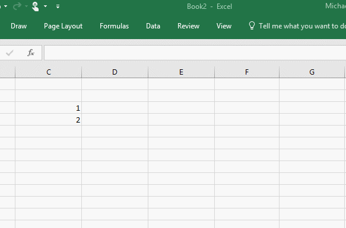

# Create custom functions in Excel (preview)

Custom functions enable developers to add new functions to Excel by defining those functions in JavaScript as part of an add-in. Users within Excel can access custom functions just as they would any native function in Excel, such as `SUM()`. This article describes how to create custom functions in Excel.

[!include[Excel custom functions note](../includes/excel-custom-functions-note.md)]

The following illustration shows an end user inserting a custom function into a cell of an Excel worksheet. The `CONTOSO.ADD42` custom function is designed to add 42 to the pair of numbers that the user specifies as input parameters to the function.



The following code defines the `ADD42` custom function.

```js
function add42(a, b) {
  return a + b + 42;
}
```

> [!NOTE]
> The [Known issues](#known-issues) section later in this article specifies current limitations of custom functions.

## Components of a custom functions add-in project

If you use the [Yo Office generator](https://github.com/OfficeDev/generator-office) to create an Excel custom functions add-in project, you'll see the following files in the project that the generator creates:

| File | File format | Description |
|------|-------------|-------------|
| **./src/functions/functions.js**<br/>or<br/>**./src/functions/functions.ts** | JavaScript<br/>or<br/>TypeScript | Contains the code that defines custom functions. |
| **./src/functions/functions.json** | JSON | Contains metadata that describes custom functions and enables Excel to register the custom functions and make them available to end users. |
| **./src/functions/functions.html** | HTML | Provides a &lt;script&gt; reference to the JavaScript file that defines custom functions. |
| **./manifest.xml** | XML | Specifies the namespace for all custom functions within the add-in and the location of the JavaScript, JSON, and HTML files that are listed previously in this table. |

The following sections provide more information about these files.

### Script file

The script file (**./src/functions/functions.js** or **./src/functions/functions.ts** in the project that the Yo Office generator creates) contains the code that defines custom functions and maps the names of the custom functions to objects in the [JSON metadata file](#json-metadata-file). 

For example, the following code defines the custom functions `add` and `increment` and then specifies mapping information for both functions. The `add` function is mapped to the object in the JSON metadata file where the value of the `id` property is **ADD**, and the `increment` function is mapped to the object in the metadata file where the value of the `id` property is **INCREMENT**. See [Custom functions best practices](custom-functions-best-practices.md#mapping-function-names-to-json-metadata) for more information about mapping function names in the script file to objects in the JSON metadata file.

```js
function add(first, second){
  return first + second;
}

function increment(incrementBy, callback) {
  var result = 0;
  var timer = setInterval(function() {
    result += incrementBy;
    callback.setResult(result);
  }, 1000);

  callback.onCanceled = function() {
    clearInterval(timer);
  };
}

// map `id` values in the JSON metadata file to the JavaScript function names
CustomFunctionMappings.ADD = add;
CustomFunctionMappings.INCREMENT = increment;
```

### JSON metadata file 

The custom functions metadata file (**./src/functions/functions.json** in the project that the Yo Office generator creates) provides the information that Excel requires to register custom functions and make them available to end users. Custom functions are registered when a user runs an add-in for the first time. After that, they are available to that same user in all workbooks (i.e., not only in the workbook where the add-in initially ran.)

> [!TIP]
> Server settings on the server that hosts the JSON file must have [CORS](https://developer.mozilla.org/docs/Web/HTTP/CORS) enabled in order for custom functions to work correctly in Excel Online.

The following code in **./src/functions/functions.json** specifies the metadata for the `add` function and the `increment` function that were described previously. The table that follows this code sample provides detailed information about the individual properties within this JSON object. See [Custom functions best practices](custom-functions-best-practices.md#mapping-function-names-to-json-metadata) for more information about specifying the value of `id` and `name` properties in the JSON metadata file.

```json
{
  "$schema": "https://developer.microsoft.com/en-us/json-schemas/office-js/custom-functions.schema.json",
  "functions": [
    {
      "id": "ADD",
      "name": "ADD",
      "description": "Add two numbers",
      "helpUrl": "http://www.contoso.com",
      "result": {
        "type": "number",
        "dimensionality": "scalar"
      },
      "parameters": [
        {
          "name": "first",
          "description": "first number to add",
          "type": "number",
          "dimensionality": "scalar"
        },
        {
          "name": "second",
          "description": "second number to add",
          "type": "number",
          "dimensionality": "scalar"
        }
      ]
    },
    {
      "id": "INCREMENT",
      "name": "INCREMENT",
      "description": "Periodically increment a value",
      "helpUrl": "http://www.contoso.com",
      "result": {
          "type": "number",
          "dimensionality": "scalar"
    },
    "parameters": [
        {
            "name": "increment",
            "description": "Amount to increment",
            "type": "number",
            "dimensionality": "scalar"
        }
    ],
    "options": {
        "cancelable": true,
        "stream": true
      }
    }
  ]
}
```

The following table lists the properties that are typically present in the JSON metadata file. For more detailed information about the JSON metadata file, see [Custom functions metadata](custom-functions-json.md).

| Property 	| Description |
|---------|---------|
| `id` | A unique ID for the function. This ID can only contain alphanumeric characters and periods and should not be changed after it is set. |
| `name` | Name of the function that the end user sees in Excel. In Excel, this function name will be prefixed by the custom functions namespace that's specified in the [XML manifest file](#manifest-file). |
| `helpUrl`	| URL for the page that is shown when a user requests help. |
| `description`	| Describes what the function does. This value appears as a tooltip when the function is the selected item in the autocomplete menu within Excel. |
| `result` 	| Object that defines the type of information that is returned by the function. For detailed information about this object, see [result](custom-functions-json.md#result). |
| `parameters` | Array that defines the input parameters for the function. For detailed information about this object, see [parameters](custom-functions-json.md#parameters). |
| `options`	| Enables you to customize some aspects of how and when Excel executes the function. For more information about how this property can be used, see [Streaming functions](#streaming-functions) and [Canceling a function](#canceling-a-function). |

### Manifest file

The XML manifest file for an add-in that defines custom functions (**./manifest.xml** in the project that the Yo Office generator creates) specifies the namespace for all custom functions within the add-in and the location of the JavaScript, JSON, and HTML files. The following XML markup shows an example of the `<ExtensionPoint>` and `<Resources>` elements that you must include in an add-in's manifest to enable custom functions.  

```xml
<VersionOverrides xmlns="http://schemas.microsoft.com/office/taskpaneappversionoverrides" xsi:type="VersionOverridesV1_0">
		<Hosts>
			<Host xsi:type="Workbook">
				<AllFormFactors>
					<ExtensionPoint xsi:type="CustomFunctions">
						<Script>
							<SourceLocation resid="Contoso.Functions.Script.Url" />
						</Script>
						<Page>
							<SourceLocation resid="Contoso.Functions.Page.Url"/>
						</Page>
						<Metadata>
							<SourceLocation resid="Contoso.Functions.Metadata.Url" />
						</Metadata>
						<Namespace resid="Contoso.Functions.Namespace" />
					</ExtensionPoint>
				</AllFormFactors>
			</Host>
		</Hosts>
		<Resources>
			<bt:Images>
				<bt:Image id="Contoso.tpicon_16x16" DefaultValue="https://localhost:3000/assets/icon-16.png" />
				<bt:Image id="Contoso.tpicon_32x32" DefaultValue="https://localhost:3000/assets/icon-32.png" />
				<bt:Image id="Contoso.tpicon_80x80" DefaultValue="https://localhost:3000/assets/icon-80.png" />
			</bt:Images>
			<bt:Urls>
				<bt:Url id="Contoso.Functions.Script.Url" DefaultValue="https://localhost:3000/dist/functions.js" />
				<bt:Url id="Contoso.Functions.Metadata.Url" DefaultValue="https://localhost:3000/dist/functions.json" />
				<bt:Url id="Contoso.Functions.Page.Url" DefaultValue="https://localhost:3000/dist/functions.html" />
				<bt:Url id="Contoso.Taskpane.Url" DefaultValue="https://localhost:3000/taskpane.html" />
			</bt:Urls>
			<bt:ShortStrings>
				<bt:String id="Contoso.Functions.Namespace" DefaultValue="CONTOSO" />
			</bt:ShortStrings>
		</Resources>
	</VersionOverrides>
```

> [!NOTE]
> Functions in Excel are prepended by the namespace specified in your XML manifest file. A function's namespace comes before the function name and they are separated by a period. For example, to call the function `ADD42` in the cell of an Excel worksheet, you would type `=CONTOSO.ADD42`, because `CONTOSO` is the namespace and `ADD42` is the name of the function specified in the JSON file. The namespace is intended to be used as an identifier for your company or the add-in. A namespace can only contain alphanumeric characters and periods.

## Functions that return data from external sources

If a custom function retrieves data from an external source such as the web, it must:

1. Return a JavaScript Promise to Excel.

2. Resolve the Promise with the final value using the callback function.

Custom functions display a `#GETTING_DATA` temporary result in the cell while Excel waits for the final result. Users can interact normally with the rest of the worksheet while they wait for the result.

In the following code sample, the `getTemperature()` custom function retrieves the current temperature of a thermometer. Note that `sendWebRequest` is a hypothetical function (not specified here) that uses [XHR](custom-functions-runtime.md#xhr-example) to call a temperature web service.

```js
function getTemperature(thermometerID){
    return new Promise(function(setResult){
        sendWebRequest(thermometerID, function(data){
            setResult(data.temperature);
        });
    });
}
```

## Streaming functions

Streaming custom functions enable you to output data to cells repeatedly over time, without requiring a user to explicitly request data refresh. The following code sample is a custom function that adds a number to the result every second. Note the following about this code:

- Excel displays each new value automatically using the `setResult` callback.

- The second input parameter, `handler`, is not displayed to end users in Excel when they select the function from the autocomplete menu.

- The `onCanceled` callback defines the function that executes when the function is canceled. You must implement a cancellation handler like this for any streaming function. For more information, see [Canceling a function](#canceling-a-function).

```js
function incrementValue(increment, handler){
  var result = 0;
  setInterval(function(){
    result += increment;
    handler.setResult(result);
  }, 1000);

  handler.onCanceled = function(){
    clearInterval(timer);
  }
}
```

When you specify metadata for a streaming function in the JSON metadata file, you must set the properties `"cancelable": true` and `"stream": true` within the `options` object, as shown in the following example.

```json
{
  "id": "INCREMENT",
  "name": "INCREMENT",
  "description": "Periodically increment a value",
  "helpUrl": "http://www.contoso.com",
  "result": {
    "type": "number",
    "dimensionality": "scalar"
  },
  "parameters": [
    {
      "name": "increment",
      "description": "Amount to increment",
      "type": "number",
      "dimensionality": "scalar"
    }
  ],
  "options": {
    "cancelable": true,
    "stream": true
  }
}
```

## Canceling a function

In some situations, you may need to cancel the execution of a streaming custom function to reduce its bandwidth consumption, working memory, and CPU load. Excel cancels the execution of a function in the following situations:

- When the user edits or deletes a cell that references the function.

- When one of the arguments (inputs) for the function changes. In this case, a new function call is triggered following the cancellation.

- When the user triggers recalculation manually. In this case, a new function call is triggered following the cancellation.

To enable the ability to cancel a function, you must implement a cancellation handler within the JavaScript function and specify the property `"cancelable": true` within the `options` object in the JSON metadata that describes the function. The code samples in the previous section of this article provide an example of these techniques.

## Saving and sharing state

Custom functions can save data in global JavaScript variables, which can be used in subsequent calls. Saved state is useful when users call the same custom function from more than one cell, because all instances of the function can access the state. For example, you may save the data returned from a call to a web resource to avoid making additional calls to the same web resource.

The following code sample shows an implementation of a temperature-streaming function that saves state globally. Note the following about this code:

- The `streamTemperature` function updates the temperature value that's displayed in the cell every second and it uses the `savedTemperatures` variable as its data source.

- Because `streamTemperature` is a streaming function, it implements a cancellation handler that will run when the function is canceled.

- If a user calls the `streamTemperature` function from multiple cells in Excel, the `streamTemperature` function reads data from the same `savedTemperatures` variable each time it runs. 

- The `refreshTemperature` function reads the temperature of a particular thermometer every second and stores the result in the `savedTemperatures` variable. Because the `refreshTemperature` function is not exposed to end users in Excel, it does not need to be registered in the JSON file.

```js
var savedTemperatures;

function streamTemperature(thermometerID, handler){
  if(!savedTemperatures[thermometerID]){
    refreshTemperature(thermometerID); // starts fetching temperatures if the thermometer hasn't been read yet
  }

  function getNextTemperature(){
    handler.setResult(savedTemperatures[thermometerID]); // setResult sends the saved temperature value to Excel.
    var delayTime = 1000; // Amount of milliseconds to delay a request by.
    setTimeout(getNextTemperature, delayTime); // Wait 1 second before updating Excel again.

    handler.onCancelled() = function {
      clearTimeout(delayTime);
    }
  }
  getNextTemperature();
}

function refreshTemperature(thermometerID){
  sendWebRequest(thermometerID, function(data){
    savedTemperatures[thermometerID] = data.temperature;
  });
  setTimeout(function(){
    refreshTemperature(thermometerID);
  }, 1000); // Wait 1 second before reading the thermometer again, and then update the saved temperature of thermometerID.
}
```

## Working with ranges of data

Your custom function may accept a range of data as an input parameter, or it may return a range of data. In JavaScript, a range of data is represented as a two-dimensional array.

For example, suppose that your function returns the second highest value from a range of numbers stored in Excel. The following function accepts the parameter `values`, which is of type `Excel.CustomFunctionDimensionality.matrix`. Note that in the JSON metadata for this function, you would set the parameter's `type` property to `matrix`.

```js
function secondHighest(values){
  let highest = values[0][0], secondHighest = values[0][0];
  for(var i = 0; i < values.length; i++){
    for(var j = 1; j < values[i].length; j++){
      if(values[i][j] >= highest){
        secondHighest = highest;
        highest = values[i][j];
      }
      else if(values[i][j] >= secondHighest){
        secondHighest = values[i][j];
      }
    }
  }
  return secondHighest;
}
```

## Discovering cells that invoke custom functions

Custom funtions also allows you to format ranges, display cached values, and reconcile values using the address of the cell which invokes a custom function. You might use this functionality in some of the following scenarios:

- Formatting ranges: Use the cell's address as the key to store information in [AsyncStorage](https://docs.microsoft.com/office/dev/add-ins/excel/custom-functions-runtime#storing-and-accessing-data). Then, use [onCalculated](https://docs.microsoft.com/javascript/api/excel/excel.worksheet#oncalculated) in Excel to load the key from `AsyncStorage`.
- Displaying cached values: If your function is used offline, display stored cached values from `AsyncStorage` using `onCalculated`.
- Reconciliation: Use the cell's address to discover an origin cell to help you reconcile where processing is occurring.

The information about a cell's address is exposed only if `requiresAddress` is marked as `true` in the function's JSON metadata file. The following sample gives an example of this:

```JSON
{
   "id": "ADDTIME",
   "name": "ADDTIME",
   "description": "Display current date and add the amount of hours to it designated by the parameter",
   "helpUrl": "http://www.contoso.com",
   "result": {
      "type": "number",
      "dimensionality": "scalar"
   },
   "parameters": [
      {
         "name": "Additional time",
         "description": "Amount of hours to increase current date by",
         "type": "number",
         "dimensionality": "scalar"
      }
   ],
   "options": {
      "requiresAddress": true
   }
}
```

In the script file (**./src/functions/customfunctions.js** or **./src/functions/customfunctions.ts**), you'll also need to add a `getAddress` function to find a cell's address. This function may take parameters, as shown in the following sample as `parameter1`. The last parameter will always be `invocationContext`, an object containing the cell's location that Excel passes down when `requiresAddress` is marked as `true` in your JSON metadata file.

```js
function getAddress(parameter1, invocationContext) {
    return invocationContext.address;
}
```

By default, values returned from a `getAddress` function follow the following format: `SheetName!CellNumber`. For example, if a function was called from a sheet called Expenses in cell B2, the returned value would be `Expenses!B2`.

## Handling errors

When you build an add-in that defines custom functions, be sure to include error handling logic to account for runtime errors. Error handling for custom functions is the same as [error handling for the Excel JavaScript API at large](excel-add-ins-error-handling.md). In the following code sample, `.catch` will handle any errors that occur previously in the code.

```js
function getComment(x) {
  let url = "https://www.contoso.com/comments/" + x;

  return fetch(url)
    .then(function (data) {
      return data.json();
    })
    .then((json) => {
      return json.body;
    })
    .catch(function (error) {
      throw error;
    })
}
```

## Known issues

- Help URLs and parameter descriptions are not yet used by Excel.
- Custom functions are not currently available on Excel for mobile clients.
- Volatile functions (those that recalculate automatically whenever unrelated data changes in the spreadsheet) are not yet supported.
- Deployment via the Office 365 Admin Portal and AppSource are not yet enabled.
- Custom functions in Excel Online may stop working during a session after a period of inactivity. Refresh the browser page (F5) and re-enter a custom function to restore the feature.
- You may see the **#GETTING_DATA** temporary result within the cell(s) of a worksheet if you have multiple add-ins running on Excel for Windows. Close all Excel windows and restart Excel.
- Debugging tools specifically for custom functions may be available in the future. In the meantime, you can debug on Excel Online using F12 developer tools. See more details in [Custom functions best practices](custom-functions-best-practices.md).
- In the 32 bit version of the Office 365 *December* Insiders Version 1901 (Build 11128.20000),  Custom Functions may not work properly. In some cases you can workaround this bug by downloading the file at https://github.com/OfficeDev/Excel-Custom-Functions/blob/december-insiders-workaround/excel-udf-host.win32.bundle. Then, copy it your "C:\Program Files (x86)\Microsoft Office\root\Office16" folder.

## Changelog

- **Nov 7, 2017**: Shipped* the custom functions preview and samples
- **Nov 20, 2017**: Fixed compatibility bug for those using builds 8801 and later
- **Nov 28, 2017**: Shipped* support for cancellation on asynchronous functions (requires change for streaming functions)
- **May 7, 2018**: Shipped* support for Mac, Excel Online, and synchronous functions running in-process
- **September 20, 2018**: Shipped support for custom functions JavaScript runtime. For more information, see [Runtime for Excel custom functions](custom-functions-runtime.md).
- **October 20, 2018**: With the [October Insiders build](https://support.office.com/en-us/article/what-s-new-for-office-insiders-c152d1e2-96ff-4ce9-8c14-e74e13847a24), Custom Functions now requires the 'id' parameter in your [custom functions metadata](custom-functions-json.md) for Windows Desktop and Online. On Mac, this parameter should be ignored.


\* to the [Office Insider](https://products.office.com/office-insider) channel (formerly called "Insider Fast")

## See also

* [Custom functions metadata](custom-functions-json.md)
* [Runtime for Excel custom functions](custom-functions-runtime.md)
* [Custom functions best practices](custom-functions-best-practices.md)
* [Excel custom functions tutorial](excel-tutorial-custom-functions.md)
