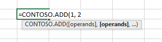

# Custom functions parameter options

Custom functions are configurable with many different parameter options.

[!include[Excel custom functions note](../includes/excel-custom-functions-note.md)]

## Optional parameters

When a user invokes a function in Excel, optional parameters appear in brackets. In the following sample, the add function can optionally add a third number. This function appears as `=CONTOSO.ADD(first, second, [third])` in Excel.

#### [JavaScript](#tab/javascript)

```js
/**
 * Calculates the sum of the specified numbers
 * @customfunction
 * @param {number} first First number.
 * @param {number} second Second number.
 * @param {number} [third] Third number to add. If omitted, third = 0.
 * @returns {number} The sum of the numbers.
 */
function add(first, second, third) {
  if (third === null) {
    third = 0;
  }
  return first + second + third;
}
```

#### [TypeScript](#tab/typescript)

```typescript
/**
 * Calculates the sum of the specified numbers
 * @customfunction
 * @param first First number.
 * @param second Second number.
 * @param [third] Third number to add. If omitted, third = 0.
 * @returns The sum of the numbers.
 */
function add(first: number, second: number, third?: number): number {
  if (third === null) {
    third = 0;
  }
  return first + second + third;
}
```

---

> [!NOTE]
> When no value is specified for an optional parameter, Excel assigns it the value `null`. This means default-initialized parameters in TypeScript will not work as expected. Don't use the syntax `function add(first:number, second:number, third=0):number` because it will not initialize `third` to 0. Instead use the TypeScript syntax as shown in the previous example.

When you define a function that contains one or more optional parameters, specify what happens when the optional parameters are null. In the following example, `zipCode` and `dayOfWeek` are both optional parameters for the `getWeatherReport` function. If the `zipCode` parameter is null, the default value is set to `98052`. If the `dayOfWeek` parameter is null, it's set to Wednesday.

#### [JavaScript](#tab/javascript)

```js
/**
 * Gets a weather report for a specified zipCode and dayOfWeek
 * @customfunction
 * @param {number} [zipCode] Zip code. If omitted, zipCode = 98052.
 * @param {string} [dayOfWeek] Day of the week. If omitted, dayOfWeek = Wednesday.
 * @returns {string} Weather report for the day of the week in that zip code.
 */
function getWeatherReport(zipCode, dayOfWeek) {
  if (zipCode === null) {
    zipCode = 98052;
  }

  if (dayOfWeek === null) {
    dayOfWeek = "Wednesday";
  }

  // Get weather report for specified zipCode and dayOfWeek.
  // ...
}
```

#### [TypeScript](#tab/typescript)

```typescript
/**
 * Gets a weather report for a specified zipCode and dayOfWeek
 * @customfunction
 * @param zipCode Zip code. If omitted, zipCode = 98052.
 * @param [dayOfWeek] Day of the week. If omitted, dayOfWeek = Wednesday.
 * @returns Weather report for the day of the week in that zip code.
 */
function getWeatherReport(zipCode?: number, dayOfWeek?: string): string {
  if (zipCode === null) {
    zipCode = 98052;
  }

  if (dayOfWeek === null) {
    dayOfWeek = "Wednesday";
  }

  // Get weather report for specified zipCode and dayOfWeek.
  // ...
}
```

---

## Range parameters

Your custom function may accept a range of cell data as an input parameter. A function can also return a range of data. Excel will pass a range of cell data as a two-dimensional array.

For example, suppose that your function returns the second highest value from a range of numbers stored in Excel. The following function accepts the parameter `values`, and the JSDOC syntax `number[][]` sets the parameter's `dimensionality` property to `matrix` in the JSON metadata for this function.

```js
/**
 * Returns the second highest value in a matrixed range of values.
 * @customfunction
 * @param {number[][]} values Multiple ranges of values.
 */
function secondHighest(values) {
  let highest = -Infinity,
    secondHighest = -Infinity;
  for (let i = 0; i < values.length; i++) {
    for (let j = 0; j < values[i].length; j++) {
      if (values[i][j] >= highest) {
        secondHighest = highest;
        highest = values[i][j];
      } else if (values[i][j] >= secondHighest) {
        secondHighest = values[i][j];
      }
    }
  }
  return secondHighest;
}
```

## Repeating parameters

A repeating parameter allows a user to enter a series of optional arguments to a function. When the function is called, the values are provided in an array for the parameter. If the parameter name ends with a number, each argument's number will increase incrementally, such as `ADD(number1, [number2], [number3],…)`. This matches the convention used for built-in Excel functions.

> [!NOTE]
> For a custom function that takes multiple parameters, a repeating parameter must be the last input parameter in the function. A repeating parameter cannot be followed by another parameter. Similarly, a function can only have one repeating parameter.

The following function sums the total of numbers, cell addresses, as well as ranges, if entered.

```TS
/**
* The sum of all of the numbers.
* @customfunction
* @param operands A number (such as 1 or 3.1415), a cell address (such as A1 or $E$11), or a range of cell addresses (such as B3:F12)
*/

function ADD(operands: number[][][]): number {
  let total: number = 0;

  operands.forEach(range => {
    range.forEach(row => {
      row.forEach(num => {
        total += num;
      });
    });
  });

  return total;
}
```

This function shows `=CONTOSO.ADD([operands], [operands]...)` in the Excel workbook.



### Repeating single value parameter

A repeating single value parameter allows multiple single values to be passed. For example, the user could enter **ADD(1,B2,3)**. The following sample shows how to declare a single value parameter.

```JS
/**
 * @customfunction
 * @param {number[]} singleValue An array of numbers that are repeating parameters.
 */
function addSingleValue(singleValue) {
  let total = 0;
  singleValue.forEach(value => {
    total += value;
  })

  return total;
}
```

### Single range parameter

A single range parameter isn't technically a repeating parameter, but it's included here because the declaration is very similar to repeating parameters. It would appear to the user as **ADD(A2:B3)**, where a single range is passed from Excel. The following sample shows how to declare a single range parameter.

```JS
/**
 * @customfunction
 * @param {number[][]} singleRange
 */
function addSingleRange(singleRange) {
  let total = 0;
  singleRange.forEach(setOfSingleValues => {
    setOfSingleValues.forEach(value => {
      total += value;
    })
  })
  return total;
}
```

### Repeating range parameter

A repeating range parameter allows multiple ranges or numbers to be passed. For example, the user could enter **ADD(5,B2,C3,8,E5:E8)**. Repeating ranges are usually specified with the type `number[][][]` as they are three-dimensional matrices. For a sample, see the main sample listed for [repeating parameters](#repeating-parameters).

### Declare repeating parameters

To declare a repeating parameter, indicate that the parameter is multi-dimensional. For example in TypeScript, `ADD(values: number[])` would indicate a one-dimensional array, `ADD(values:number[][])` would indicate a two-dimensional array, and so on. In JavaScript, use `@param values {number[]}` for one-dimensional arrays, `@param <name> {number[][]}` for two-dimensional arrays, and so on for more dimensions.

For [manually-created JSON metadata](custom-functions-json.md), ensure that the parameter is specified as `"repeating": true` and `"dimensionality": "matrix"` in your JSON file.

## Invocation parameter

Every custom function is automatically passed an `invocation` argument as the last input parameter, even if it's not explicitly declared. This `invocation` parameter corresponds to the [Invocation](/javascript/api/custom-functions-runtime/customfunctions.invocation) object. The `Invocation` object can be used to retrieve additional context, such as the address of the cell that invoked your custom function. To access the `Invocation` object, you must declare `invocation` as the last parameter in your custom function.

> [!NOTE]
> The `invocation` parameter doesn't appear as a custom function argument for users in Excel.

The following sample shows how to use the `invocation` parameter to return the address of the cell that invoked your custom function. This sample uses the [address](/javascript/api/custom-functions-runtime/customfunctions.invocation#custom-functions-runtime-customfunctions-invocation-address-member) property of the `Invocation` object. To access the `Invocation` object, first declare `CustomFunctions.Invocation` as a parameter in your JSDoc. Next, declare `@requiresAddress` in your JSDoc to access the `address` property of the `Invocation` object. Finally, within the function, retrieve and then return the `address` property.

```js
/**
 * Return the address of the cell that invoked the custom function. 
 * @customfunction
 * @param {number} first First parameter.
 * @param {number} second Second parameter.
 * @param {CustomFunctions.Invocation} invocation Invocation object. 
 * @requiresAddress 
 */
function getAddress(first, second, invocation) {
  const address = invocation.address;
  return address;
}
```

In Excel, a custom function calling the `address` property of the `Invocation` object will return the absolute address following the format `SheetName!RelativeCellAddress` in the cell that invoked the function.  For example, if the input parameter is located on a sheet called **Prices** in cell F6, the returned parameter address value will be `Prices!F6`.

[!INCLUDE [Special characters note for custom function worksheet names](../includes/custom-function-sheetname-note.md)]

The `invocation` parameter can also be used to send information to Excel. See [Make a streaming function](custom-functions-web-reqs.md#make-a-streaming-function) to learn more.

## Detect the address of a parameter

In combination with the [invocation parameter](#invocation-parameter), you can use the [Invocation](/javascript/api/custom-functions-runtime/customfunctions.invocation) object to retrieve the address of a custom function input parameter. When invoked, the [parameterAddresses](/javascript/api/custom-functions-runtime/customfunctions.invocation#custom-functions-runtime-customfunctions-invocation-parameteraddresses-member) property of the `Invocation` object allows a function to return the addresses of all input parameters.

This is useful in scenarios where input data types may vary. The address of an input parameter can be used to check the number format of the input value. The number format can then be adjusted prior to input, if necessary. The address of an input parameter can also be used to detect whether the input value has any related properties that may be relevant to subsequent calculations.

>[!NOTE]
> If you're working with [manually-created JSON metadata](custom-functions-json.md) to return parameter addresses instead of the [Yeoman generator for Office Add-ins](../develop/yeoman-generator-overview.md), the `options` object must have the `requiresParameterAddresses` property set to `true`, and the `result` object must have the `dimensionality` property set to `matrix`.

The following custom function takes in three input parameters, retrieves the `parameterAddresses` property of the `Invocation` object for each parameter, and then returns the addresses.

```js
/**
 * Return the addresses of three parameters. 
 * @customfunction
 * @param {string} firstParameter First parameter.
 * @param {string} secondParameter Second parameter.
 * @param {string} thirdParameter Third parameter.
 * @param {CustomFunctions.Invocation} invocation Invocation object. 
 * @returns {string[][]} The addresses of the parameters, as a 2-dimensional array. 
 * @requiresParameterAddresses
 */
function getParameterAddresses(firstParameter, secondParameter, thirdParameter, invocation) {
  const addresses = [
    [invocation.parameterAddresses[0]],
    [invocation.parameterAddresses[1]],
    [invocation.parameterAddresses[2]]
  ];
  return addresses;
}
```

When a custom function calling the `parameterAddresses` property runs, the parameter address is returned following the format `SheetName!RelativeCellAddress` in the cell that invoked the function. For example, if the input parameter is located on a sheet called **Costs** in cell D8, the returned parameter address value will be `Costs!D8`. If the custom function has multiple parameters and more than one parameter address is returned, the returned addresses will spill across multiple cells, descending vertically from the cell that invoked the function.

[!INCLUDE [Special characters note for custom function worksheet names](../includes/custom-function-sheetname-note.md)]

## Next steps

Learn how to use [volatile values in your custom functions](custom-functions-volatile.md).

## See also

- [Receive and handle data with custom functions](custom-functions-web-reqs.md)
- [Autogenerate JSON metadata for custom functions](custom-functions-json-autogeneration.md)
- [Manually create JSON metadata for custom functions](custom-functions-json.md)
- [Create custom functions in Excel](custom-functions-overview.md)
- [Excel custom functions tutorial](../tutorials/excel-tutorial-create-custom-functions.md)
