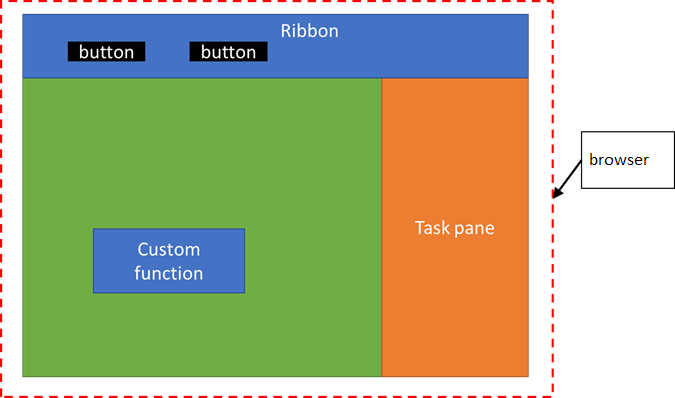

# Overview: run custom functions in the browser runtime (preview)

[!include[Running custom functions in browser runtime note](../includes/excel-shared-runtime-preview-note.md)]

Currently custom functions run in a JavaScript-only runtime that is separate from the browser runtime used by the task pane. Now you can configure custom functions to run with task pane code in the same browser runtime. This allows your custom functions to take full advantage of the browser runtime to get full CORS support, use the DOM, and enable additional web scenarios. You can also call Excel JS APIs from your custom functions to read spreadsheet document data, or modify it.

When you run custom functions in the same browser runtime as the task pane, it will run in a browser instance on different platforms as follows:

- Excel on Windows: Code for custom functions and the task pane run in an IE or Edge instance.
- Excel on Mac: Code for custom functions and the task pane run in a Safari instance.
- Excel online: Code for custom functions and the task pane run in the same browser instance (Chrome, Edge, Safari, FireFox, etc...)

Additionally, any buttons that your Excel add-in displays on the ribbon will run in the same browser runtime. The following image shows how custom functions, the ribbon UI, and the task pane code will all run in the same browser runtime.

## Differences when running custom functions in the browser runtime

When you configure your Excel add-in project to run custom functions in the browser runtime, there are a few differences from using the custom function runtime.

### Storage

You no longer need to use the **Storage** API to share data between the task pane, custom functions or ribbon UI. You can put global variables in the **window** object, or use your own preferred state management approach.

### Authentication

When you receive tokens as part of authentication, you don't need to use the **Storage** API to share them between the task pane, custom functions and ribbon UI. You can use your own preferred storage technique to share them.

### Dialog API

You no longer need to use the **OfficeRuntime.Dialog** API to display a dialog from a custom function. You can use the same **Dialog** API as the task pane.

### Debugging

Debugging custom functions in Excel on Windows from VS Code is not supported anymore. You'll need to attach a debugger.

## Get Started

To configure your Excel add-in project to run custom functions in the browser runtime, see [Tutorial: Share data and events between Excel custom functions and the task pane (preview)](../tutorials/share-data-and-events-between-custom-functions-and-the-task-pane-tutorial.md).

## Give us feedback

We'd love to hear your feedback on this feature. If you find any bugs, issues, or have requests on this feature, please let us know by creating a GitHub issue in the [office-js repo](https://github.com/OfficeDev/office-js).

## See also

List of related articles for shared runtime
- [Tutorial: Share data and events between Excel custom functions and the task pane (preview)](../tutorials/share-data-and-events-between-custom-functions-and-the-task-pane-tutorial.md)
- [Call Excel APIs from your custom function (preview)](custom-functions-call-excel-api.md)
- [Run code when the task pane is closed or not visible (preview)](run-code-when-the-task-pane-is-closed-or-not-visible.md)
- [Configure your task pane for display on document open (preview)](configure-your-task-pane-for-display-on-document-open.md)
- [Authenticate on document open (preview)](authenticate-on-document-open.md)
- [Manage UI state for your Excel add-in (preview)](manage-ui-state-for-your-excel-add-in.md)
- [Preload data before showing the task pane (preview)](preload-data-before-showing-the-task-pane.md)