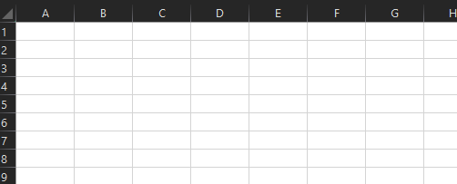

# Volatile values in functions

Volatile functions are functions in which the value changes each time the cell is calculated. The value can change even if none of the function's arguments change. These functions recalculate every time Excel recalculates. For example, imagine a cell that calls the function `NOW`. Every time `NOW` is called, it will automatically return the current date and time.

[!include[Excel custom functions note](../includes/excel-custom-functions-note.md)]

Excel contains several built-in volatile functions, such as `RAND` and `TODAY`. For a comprehensive list of Excel's volatile functions, see [Volatile and Non-Volatile Functions](/office/client-developer/excel/excel-recalculation#volatile-and-non-volatile-functions).

Custom functions allow you to create your own volatile functions, which may be useful when handling dates, times, random numbers, and modeling. For example, [Monte Carlo simulations](https://en.wikipedia.org/wiki/Monte_Carlo_method) require the generation of random inputs to determine an optimal solution.

If choosing to autogenerate your JSON file, declare a volatile function with the JSDoc comment tag `@volatile`. From more information on autogeneration, see [Create JSON metadata for custom functions](custom-functions-json-autogeneration.md).

An example of a volatile custom function follows, which simulates rolling a six-sided dice.



```JS
/**
 * Simulates rolling a 6-sided dice.
 * @customfunction
 * @volatile
 */
function roll6sided() {
  return Math.floor(Math.random() * 6) + 1;
}
```

## Next steps
Learn how to [save state in your custom functions](custom-functions-save-state.md).

## See also

* [Custom functions parameter options](custom-functions-parameter-options.md)
* [Custom functions metadata](custom-functions-json.md)
* [Create custom functions in Excel](custom-functions-overview.md)
