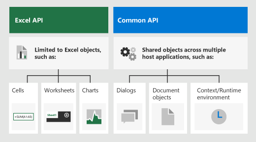

# Advanced programming concepts with the Excel JavaScript API

This article builds upon the information in [Fundamental programming concepts with the Excel JavaScript API](excel-add-ins-core-concepts.md) to describe some of the more advanced concepts that are essential to building complex add-ins for Excel 2016 or later.

## Office.js APIs for Excel

An Excel add-in interacts with objects in Excel by using the JavaScript API for Office, which includes two JavaScript object models:

* **Excel JavaScript API**: Introduced with Office 2016, the [Excel JavaScript API](/office/dev/add-ins/reference/overview/excel-add-ins-reference-overview) provides strongly-typed objects that you can use to access worksheets, ranges, tables, charts, and more.

* **Common APIs**: Introduced with Office 2013, the [Common API](/javascript/api/office) can be used to access features such as UI, dialogs, and client settings that are common across multiple types of Office applications.

While you'll likely use the Excel JavaScript API to develop the majority of functionality in add-ins that target Excel 2016 or later, you'll also use objects in the Common API. For example:

- [Context](/javascript/api/office/office.context): The **Context** object represents the runtime environment of the add-in and provides access to key objects of the API. It consists of workbook configuration details such as `contentLanguage` and `officeTheme` and also provides information about the add-in's runtime environment such as `host` and `platform`. Additionally, it provides the `requirements.isSetSupported()` method, which you can use to check whether the specified requirement set is supported by the Excel application where the add-in is running.

- [Document](/javascript/api/office/office.document): The **Document** object provides the `getFileAsync()` method, which you can use to download the Excel file where the add-in is running.

The following image illustrates when you might use the Excel JavaScript API or the Common APIs.



## Requirement sets

Requirement sets are named groups of API members. An Office Add-in can perform a runtime check or use requirement sets specified in the manifest to determine whether an Office host supports the APIs that the add-in needs. To identify the specific requirement sets that are available on each supported platform, see [Excel JavaScript API requirement sets](/office/dev/add-ins/reference/requirement-sets/excel-api-requirement-sets).

### Checking for requirement set support at runtime

The following code sample shows how to determine whether the host application where the add-in is running supports the specified API requirement set.

```js
if (Office.context.requirements.isSetSupported('ExcelApi', '1.3')) {
  /// perform actions
}
else {
  /// provide alternate flow/logic
}
```

### Defining requirement set support in the manifest

You can use the [Requirements element](/office/dev/add-ins/reference/manifest/requirements) in the add-in manifest to specify the minimal requirement sets and/or API methods that your add-in requires to activate. If the Office host or platform doesn't support the requirement sets or API methods that are specified in the **Requirements** element of the manifest, the add-in won't run in that host or platform, and won't display in the list of add-ins that are shown in **My Add-ins**.

The following code sample shows the **Requirements** element in an add-in manifest which specifies that the add-in should load in all Office host applications that support ExcelApi requirement set version 1.3 or greater.

```xml
<Requirements>
   <Sets DefaultMinVersion="1.3">
      <Set Name="ExcelApi" MinVersion="1.3"/>
   </Sets>
</Requirements>
```

> [!NOTE]
> To make your add-in available on all platforms of an Office host, such as Excel on the web, Windows, and iPad, we recommend that you check for requirement support at runtime instead of defining requirement set support in the manifest.

### Requirement sets for the Office.js Common API

For information about Common API requirement sets, see [Office Common API requirement sets](/office/dev/add-ins/reference/requirement-sets/office-add-in-requirement-sets).

## Loading the properties of an object

Calling the `load()` method on an Excel JavaScript object instructs the API to load the object into JavaScript memory when the `sync()` method runs. The `load()` method accepts a string that contains comma-delimited names of properties to load or an object that specifies properties to load, pagination options, etc.

> [!NOTE]
> If you call the `load()` method on an object (or collection) without specifying any parameters, all scalar properties of the object (or all scalar properties of all objects in the collection) will be loaded. To reduce the amount of data transfer between the Excel host application and the add-in, you should avoid calling the `load()` method without explicitly specifying which properties to load.

### Method details

#### load(param: object)

Fills the proxy object created in JavaScript layer with property and object values specified by the parameters.

#### Syntax

```js
object.load(param);
```

#### Parameters

|**Parameter**|**Type**|**Description**|
|:------------|:-------|:----------|
|`param`|object|Optional. Accepts property names as comma-delimited string or an array. An object can also be passed to set the selection and navigation properties (as shown in the example below).|

#### Returns

void

#### Example

The following code sample sets the properties of one Excel range by copying the properties of another range. Note that the source object must be loaded first, before its property values can be accessed and written to the target range. This example assumes that there is data the two ranges (**B2:E2** and **B7:E7**) and that the two ranges are initially formatted differently.

```js
Excel.run(function (ctx) {
    var sheet = ctx.workbook.worksheets.getItem("Sample");
    var sourceRange = sheet.getRange("B2:E2");
    sourceRange.load("format/fill/color, format/font/name, format/font/color");

    return ctx.sync()
        .then(function () {
            var targetRange = sheet.getRange("B7:E7");
            targetRange.set(sourceRange);
            targetRange.format.autofitColumns();

            return ctx.sync();
        });
}).catch(function(error) {
    console.log("Error: " + error);
    if (error instanceof OfficeExtension.Error) {
        console.log("Debug info: " + JSON.stringify(error.debugInfo));
    }
});
```

### Load option properties

As an alternative to passing a comma-delimited string or array when you call the `load()` method, you can pass an object that contains the following properties.

|**Property**|**Type**|**Description**|
|:-----------|:-------|:----------|
|`select`|object|Contains a comma-delimited list or an array of scalar property names. Optional.|
|`expand`|object|Contains a comma-delimited list or an array of navigational property names. Optional.|
|`top`|int| Specifies the maximum number of collection items that can be included in the result. Optional. You can only use this option when you use the object notation option.|
|`skip`|int|Specify the number of items in the collection that are to be skipped and not included in the result. If `top` is specified, the result set will start after skipping the specified number of items. Optional. You can only use this option when you use the object notation option.|

The following code sample loads a worksheet collection by selecting the `name` property and the `address` of the used range for each worksheet in the collection. It also specifies that only the top five worksheets in the collection should be loaded. You could process the next set of five worksheets by specifying `top: 10` and `skip: 5` as attribute values.

```js
myWorksheets.load({
    select: 'name, userRange/address',
    expand: 'tables',
    top: 5,
    skip: 0
});
```

## Scalar and navigation properties

There are two categories of properties: **scalar** and **navigational**. Scalar properties are assignable types such as strings, integers, and JSON structs. Navigation properties are readonly objects and collections of objects that have their fields assigned, instead of directly assigning the property. For example, `name` and `position` members on the [Worksheet](/javascript/api/excel/excel.worksheet) object are scalar properties, whereas `protection` and `tables` are navigation properties. `prompt` on the [DataValidation](/javascript/api/excel/excel.datavalidation) object is an example of a scalar property that must be set using a JSON object (`dv.prompt = { title: "MyPrompt"}`), instead of setting the sub-properties (`dv.prompt.title = "MyPrompt" // will not set the title`).

### Scalar properties and navigation properties with `object.load()`

Calling the `object.load()` method with no parameters specified will load all scalar properties of the object; navigation properties of the object will not be loaded. Additionally, navigation properties cannot be loaded directly. Instead, you should use the `load()` method to reference individual scalar properties within the desired navigation property. For example, to load the font name for a range, you must specify the **format** and **font** navigation properties as the path to the **name** property:

```js
someRange.load("format/font/name")
```

> [!NOTE]
> With the Excel JavaScript API, you can set scalar properties of a navigation property by traversing the path. For example, you could set the font size for a range by using `someRange.format.font.size = 10;`. You do not need to load the property before you set it. 

## Setting properties of an object

Setting properties on an object with nested navigation properties can be cumbersome. As an alternative to setting individual properties using navigation paths as described above, you can use the `object.set()` method that is available on all objects in the Excel JavaScript API. With this method, you can set multiple properties of an object at once by passing either another object of the same Office.js type or a JavaScript object with properties that are structured like the properties of the object on which the method is called.

> [!NOTE]
> The `set()` method is implemented only for objects within the host-specific Office JavaScript APIs, such as the Excel JavaScript API. The common (shared) APIs do not support this method. 

### set (properties: object, options: object)

Properties of the object on which the method is called are set to the values that are specified by the corresponding properties of the passed-in object. If the `properties` parameter is a JavaScript object, any property of the passed-in object that corresponds to a read-only property in the object on which the method is called will either be ignored or cause an exception to be thrown, depending on the value of the `options` parameter.

#### Syntax

```js
object.set(properties[, options]);
```

#### Parameters

|**Parameter**|**Type**|**Description**|
|:------------|:--------|:----------|
|`properties`|object|Either an object of the same Office.js type of the object on which the method is called, or a JavaScript object with property names and types that mirror the structure of the object on which the method is called.|
|`options`|object|Optional. Can only be passed when the first parameter is a JavaScript object. The object can contain the following property: `throwOnReadOnly?: boolean` (Default is `true`: throw an error if the passed in JavaScript object includes read-only properties.)|

#### Returns

void

#### Example

The following code sample sets several format properties of a range by calling the `set()` method and passing in a JavaScript object with property names and types that mirror the structure of properties in the **Range** object. This example assumes that there is data in range **B2:E2**.

```js
Excel.run(function (ctx) {
    var sheet = ctx.workbook.worksheets.getItem("Sample");
    var range = sheet.getRange("B2:E2");
    range.set({
        format: {
            fill: {
                color: '#4472C4'
            },
            font: {
                name: 'Verdana',
                color: 'white'
            }
        }
    });
    range.format.autofitColumns();

    return ctx.sync();
}).catch(function(error) {
    console.log("Error: " + error);
    if (error instanceof OfficeExtension.Error) {
        console.log("Debug info: " + JSON.stringify(error.debugInfo));
    }
});
```

## &#42;OrNullObject methods

Many Excel JavaScript API methods will return an exception when the condition of the API is not met. For example, if you attempt to get a worksheet by specifying a worksheet name that doesn't exist in the workbook, the `getItem()` method will return an `ItemNotFound` exception. 

Instead of implementing complex exception handling logic for scenarios like this, you can use the `*OrNullObject` method variant that's available for several methods in the Excel JavaScript API. An `*OrNullObject` method will return a null object (not the JavaScript `null`) rather than throwing an exception if the specified item doesn't exist. For example, you can call the `getItemOrNullObject()` method on a collection such as **Worksheets** to attempt to retrieve an item from the collection. The `getItemOrNullObject()` method returns the specified item if it exists; otherwise, it returns a null object. The null object that is returned contains the boolean property `isNullObject` that you can evaluate to determine whether the object exists.

The following code sample attempts to retrieve a worksheet named "Data" by using the `getItemOrNullObject()` method. If the method returns a null object, a new sheet needs to be created before actions can taken on the sheet.

```js
var dataSheet = context.workbook.worksheets.getItemOrNullObject("Data");

return context.sync()
  .then(function() {
    if (dataSheet.isNullObject) {
        // Create the sheet
    }

    dataSheet.position = 1;
    //...
  })
```

## See also

* [Fundamental programming concepts with the Excel JavaScript API](excel-add-ins-core-concepts.md)
* [Excel add-ins code samples](https://developer.microsoft.com/office/gallery/?filterBy=Samples,Excel)
* [Excel JavaScript API performance optimization](performance.md)
* [Excel JavaScript API reference](/office/dev/add-ins/reference/overview/excel-add-ins-reference-overview)
