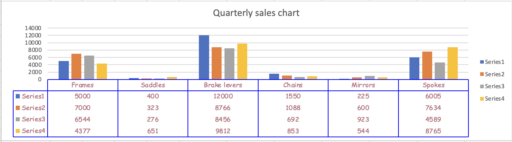

# Work with charts using the Excel JavaScript API

This article provides code samples that show how to perform common tasks with charts using the Excel JavaScript API.
For the complete list of properties and methods that the `Chart` and `ChartCollection` objects support, see [Chart Object (JavaScript API for Excel)](/javascript/api/excel/excel.chart) and [Chart Collection Object (JavaScript API for Excel)](/javascript/api/excel/excel.chartcollection).

## Create a chart

The following code sample creates a chart in the worksheet named **Sample**. The chart is a **Line** chart that is based upon data in the range **A1:B13**.

```js
await Excel.run(async (context) => {
    let sheet = context.workbook.worksheets.getItem("Sample");
    let dataRange = sheet.getRange("A1:B13");
    let chart = sheet.charts.add(
      Excel.ChartType.line, 
      dataRange, 
      Excel.ChartSeriesBy.auto);

    chart.title.text = "Sales Data";
    chart.legend.position = Excel.ChartLegendPosition.right;
    chart.legend.format.fill.setSolidColor("white");
    chart.dataLabels.format.font.size = 15;
    chart.dataLabels.format.font.color = "black";

    await context.sync();
});
```

### New line chart


## Add a data series to a chart

The following code sample adds a data series to the first chart in the worksheet. The new data series corresponds to the column named **2016** and is based upon data in the range **D2:D5**.

```js
await Excel.run(async (context) => {
    let sheet = context.workbook.worksheets.getItem("Sample");
    let chart = sheet.charts.getItemAt(0);
    let dataRange = sheet.getRange("D2:D5");

    let newSeries = chart.series.add("2016");
    newSeries.setValues(dataRange);

    await context.sync();
});
```

### Chart before the 2016 data series is added


### Chart after the 2016 data series is added


## Set chart title

The following code sample sets the title of the first chart in the worksheet to **Sales Data by Year**.

```js
await Excel.run(async (context) => {
    let sheet = context.workbook.worksheets.getItem("Sample");

    let chart = sheet.charts.getItemAt(0);
    chart.title.text = "Sales Data by Year";

    await context.sync();
});
```

### Chart after title is set


## Set properties of an axis in a chart

Charts that use the [Cartesian coordinate system](https://en.wikipedia.org/wiki/Cartesian_coordinate_system) such as column charts, bar charts, and scatter charts contain a category axis and a value axis. These examples show how to set the title and display unit of an axis in a chart.

### Set axis title

The following code sample sets the title of the category axis for the first chart in the worksheet to **Product**.

```js
await Excel.run(async (context) => {
    let sheet = context.workbook.worksheets.getItem("Sample");

    let chart = sheet.charts.getItemAt(0);
    chart.axes.categoryAxis.title.text = "Product";

    await context.sync();
});
```

### Chart after title of category axis is set


### Set axis display unit

The following code sample sets the display unit of the value axis for the first chart in the worksheet to **Hundreds**.

```js
await Excel.run(async (context) => {
    let sheet = context.workbook.worksheets.getItem("Sample");

    let chart = sheet.charts.getItemAt(0);
    chart.axes.valueAxis.displayUnit = "Hundreds";

    await context.sync();
});
```

### Chart after display unit of value axis is set


## Set visibility of gridlines in a chart

The following code sample hides the major gridlines for the value axis of the first chart in the worksheet. You can show the major gridlines for the value axis of the chart, by setting `chart.axes.valueAxis.majorGridlines.visible` to `true`.

```js
await Excel.run(async (context) => {
    let sheet = context.workbook.worksheets.getItem("Sample");

    let chart = sheet.charts.getItemAt(0);
    chart.axes.valueAxis.majorGridlines.visible = false;

    await context.sync();
});
```

### Chart with gridlines hidden


## Chart trendlines

### Add a trendline

The following code sample adds a moving average trendline to the first series in the first chart in the worksheet named **Sample**. The trendline shows a moving average over 5 periods.

```js
await Excel.run(async (context) => {
    let sheet = context.workbook.worksheets.getItem("Sample");

    let chart = sheet.charts.getItemAt(0);
    let seriesCollection = chart.series;
    seriesCollection.getItemAt(0).trendlines.add("MovingAverage").movingAveragePeriod = 5;

    await context.sync();
});
```

#### Chart with moving average trendline


### Update a trendline

The following code sample sets the trendline to type `Linear` for the first series in the first chart in the worksheet named **Sample**.

```js
await Excel.run(async (context) => {
    let sheet = context.workbook.worksheets.getItem("Sample");

    let chart = sheet.charts.getItemAt(0);
    let seriesCollection = chart.series;
    let series = seriesCollection.getItemAt(0);
    series.trendlines.getItem(0).type = "Linear";

    await context.sync();
});
```

#### Chart with linear trendline


## Add and format a chart data table

You can access the data table element of a chart with the [`Chart.getDataTableOrNullObject`](/javascript/api/excel/excel.chart#excel-excel-chart-getdatatableornullobject-member(1)) method. This method returns the [`ChartDataTable`](/javascript/api/excel/excel.chartdatatable) object. The `ChartDataTable` object has boolean formatting properties such as `visible`, `showLegendKey`, and `showHorizontalBorder`.

The `ChartDataTable.format` property returns the [`ChartDataTableFormat`](/javascript/api/excel/excel.chartdatatableformat) object, which allows you to further format and style the data table. The `ChartDataTableFormat` object offers `border`, `fill`, and `font` properties.

The following code sample shows how to add a data table to a chart and then format that data table using the `ChartDataTable` and `ChartDataTableFormat` objects.

```js
// This code sample adds a data table to a chart that already exists on the worksheet, 
// and then adjusts the display and format of that data table.
await Excel.run(async (context) => {
    // Retrieve the chart on the "Sample" worksheet.
    let chart = context.workbook.worksheets.getItem("Sample").charts.getItemAt(0);

    // Get the chart data table object and load its properties.
    let chartDataTable = chart.getDataTableOrNullObject();
    chartDataTable.load();

    // Set the display properties of the chart data table.
    chartDataTable.visible = true;
    chartDataTable.showLegendKey = true;
    chartDataTable.showHorizontalBorder = false;
    chartDataTable.showVerticalBorder = true;
    chartDataTable.showOutlineBorder = true;

    // Retrieve the chart data table format object and set font and border properties. 
    let chartDataTableFormat = chartDataTable.format;
    chartDataTableFormat.font.color = "#B76E79";
    chartDataTableFormat.font.name = "Comic Sans";
    chartDataTableFormat.border.color = "blue";

    await context.sync();
});
```

The following screenshot shows the data table that the preceding code sample creates.



## Export a chart as an image

Charts can be rendered as images outside of Excel. `Chart.getImage` returns the chart as a Base64-encoded string representing the chart as a JPEG image. The following code shows how to get the image string and log it to the console.

```js
await Excel.run(async (context) => {
    let chart = context.workbook.worksheets.getItem("Sheet1").charts.getItem("Chart1");
    let imageAsString = chart.getImage();
    await context.sync();
    
    console.log(imageAsString.value);
    // Instead of logging, your add-in may use the Base64-encoded string to save the image as a file or insert it in HTML.
});
```

`Chart.getImage` takes three optional parameters: width, height, and the fitting mode.

```typescript
getImage(width?: number, height?: number, fittingMode?: Excel.ImageFittingMode): OfficeExtension.ClientResult<string>;
```

These parameters determine the size of the image. Images are always proportionally scaled. The width and height parameters put upper or lower bounds on the scaled image. `ImageFittingMode` has three values with the following behaviors.

- `Fill`: The image's minimum height or width is the specified height or width (whichever is reached first when scaling the image). This is the default behavior when no fitting mode is specified.
- `Fit`: The image's maximum height or width is the specified height or width (whichever is reached first when scaling the image).
- `FitAndCenter`: The image's maximum height or width is the specified height or width (whichever is reached first when scaling the image). The resulting image is centered relative to the other dimension.

## See also

- [Excel JavaScript object model in Office Add-ins](excel-add-ins-core-concepts.md)
- [Work with data labels in charts using the Excel JavaScript API](excel-add-ins-charts-data-labels.md)
