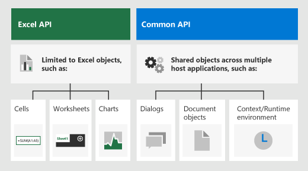
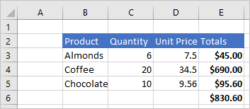
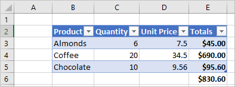
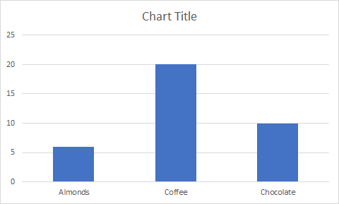

# Excel JavaScript object model in Office Add-ins

This article describes how to use the [Excel JavaScript API](../reference/overview/excel-add-ins-reference-overview.md) to build add-ins for Excel 2016 or later. It introduces core concepts that are fundamental to using the API and provides guidance for performing specific tasks such as reading or writing to a large range, updating all cells in range, and more.

> [!IMPORTANT]
> See [Using the application-specific API model](../develop/application-specific-api-model.md) to learn about the asynchronous nature of the Excel APIs and how they work with the workbook.  

## Office.js APIs for Excel

An Excel add-in interacts with objects in Excel by using the Office JavaScript API, which includes two JavaScript object models:

* **Excel JavaScript API**: Introduced with Office 2016, the [Excel JavaScript API](../reference/overview/excel-add-ins-reference-overview.md) provides strongly-typed objects that you can use to access worksheets, ranges, tables, charts, and more.

* **Common APIs**: Introduced with Office 2013, the [Common API](/javascript/api/office) can be used to access features such as UI, dialogs, and client settings that are common across multiple types of Office applications.

While you'll likely use the Excel JavaScript API to develop the majority of functionality in add-ins that target Excel 2016 or later, you'll also use objects in the Common API. For example:

* [Context](/javascript/api/office/office.context): The `Context` object represents the Configure your Office Add-in to use a shared runtime environment of the add-in and provides access to key objects of the API. It consists of workbook configuration details such as `contentLanguage` and `officeTheme` and also provides information about the add-in's Configure your Office Add-in to use a shared runtime environment such as `host` and `platform`. Additionally, it provides the `requirements.isSetSupported()` method, which you can use to check whether the specified requirement set is supported by the Excel application where the add-in is running.
* [Document](/javascript/api/office/office.document): The `Document` object provides the `getFileAsync()` method, which you can use to download the Excel file where the add-in is running.

The following image illustrates when you might use the Excel JavaScript API or the Common APIs.



## Excel-specific object model

To understand the Excel APIs, you must understand how the components of a workbook are related to one another.

* A **Workbook** contains one or more **Worksheets**.
* A **Worksheet** contains collections of those data objects that are present in the individual sheet, and gives access to cells through **Range** objects.
* A **Range** represents a group of contiguous cells.
* **Ranges** are used to create and place **Tables**, **Charts**, **Shapes**, and other data visualization or organization objects.
* **Workbooks** contain collections of some of those data objects (such as **Tables**) for the entire **Workbook**.

[!include[Excel cells and ranges note](../includes/note-excel-cells-and-ranges.md)]

### Ranges

A range is a group of contiguous cells in the workbook. Add-ins typically use A1-style notation (e.g. **B3** for the single cell in column **B** and row **3** or **C2:F4** for the cells from columns **C** through **F** and rows **2** through **4**) to define ranges.

Ranges have three core properties: `values`, `formulas`, and `format`. These properties get or set the cell values, formulas to be evaluated, and the visual formatting of the cells.

#### Range sample

The following sample shows how to create sales records. This function uses `Range` objects to set the values, formulas, and formats.

```js
await Excel.run(async (context) => {
    let sheet = context.workbook.worksheets.getActiveWorksheet();

    // Create the headers and format them to stand out.
    let headers = [
      ["Product", "Quantity", "Unit Price", "Totals"]
    ];
    let headerRange = sheet.getRange("B2:E2");
    headerRange.values = headers;
    headerRange.format.fill.color = "#4472C4";
    headerRange.format.font.color = "white";

    // Create the product data rows.
    let productData = [
      ["Almonds", 6, 7.5],
      ["Coffee", 20, 34.5],
      ["Chocolate", 10, 9.56],
    ];
    let dataRange = sheet.getRange("B3:D5");
    dataRange.values = productData;

    // Create the formulas to total the amounts sold.
    let totalFormulas = [
      ["=C3 * D3"],
      ["=C4 * D4"],
      ["=C5 * D5"],
      ["=SUM(E3:E5)"]
    ];
    let totalRange = sheet.getRange("E3:E6");
    totalRange.formulas = totalFormulas;
    totalRange.format.font.bold = true;

    // Display the totals as US dollar amounts.
    totalRange.numberFormat = [["$0.00"]];

    await context.sync();
});
```

This sample creates the following data in the current worksheet.



For more information, see [Set and get range values, text, or formulas using the Excel JavaScript API](excel-add-ins-ranges-set-get-values.md).

### Charts, tables, and other data objects

The Excel JavaScript APIs can create and manipulate the data structures and visualizations within Excel. Tables and charts are two of the more commonly used objects, but the APIs support PivotTables, shapes, images, and more.

#### Creating a table

Create tables by using data-filled ranges. Formatting and table controls (such as filters) are automatically applied to the range.

The following sample creates a table using the ranges from the previous sample.

```js
await Excel.run(async (context) => {
    let sheet = context.workbook.worksheets.getActiveWorksheet();
    sheet.tables.add("B2:E5", true);
    await context.sync();
});
```

Using this sample code on the worksheet with the previous data creates the following table.



For more information, see [Work with tables using the Excel JavaScript API](excel-add-ins-tables.md).

#### Creating a chart

Create charts to visualize the data in a range. The APIs support dozens of chart varieties, each of which can be customized to suit your needs.

The following sample creates a simple column chart for three items and places it 100 pixels below the top of the worksheet.

```js
await Excel.run(async (context) => {
    let sheet = context.workbook.worksheets.getActiveWorksheet();
    let chart = sheet.charts.add(Excel.ChartType.columnStacked, sheet.getRange("B3:C5"));
    chart.top = 100;
    await context.sync();
});
```

Running this sample on the worksheet with the previous table creates the following chart.



For more information, see [Work with charts using the Excel JavaScript API](excel-add-ins-charts.md).

## See also

* [Build your first Excel add-in](../quickstarts/excel-quickstart-jquery.md)
* [Excel add-ins code samples](https://developer.microsoft.com/office/gallery/?filterBy=Samples,Excel)
* [Excel JavaScript API performance optimization](../excel/performance.md)
* [Excel JavaScript API reference](../reference/overview/excel-add-ins-reference-overview.md)
