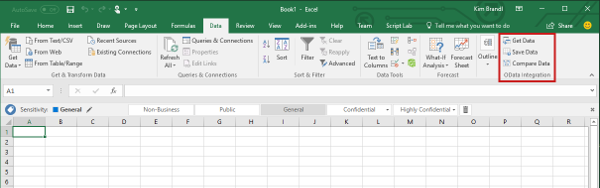
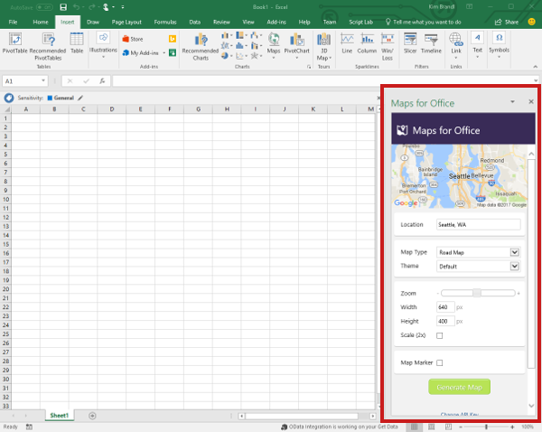
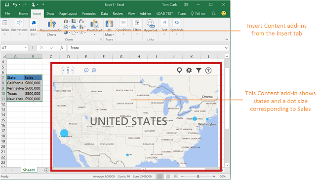

# Extend Excel functionality

In addition to interacting with the content in a workbook, an Excel add-in can add custom ribbon buttons or menu commands, insert task panes, open dialog boxes, and even embed rich, web-based content directly into a worksheet.

## Add-in commands

Add-in commands are UI elements that extend the Excel UI and start actions in your add-in. You can use add-in commands to add a button on the ribbon or an item to a context menu in Excel. When users select an add-in command, they initiate actions such as running JavaScript code, or showing a page of the add-in in a task pane. 

**Add-in commands**

For more information about command capabilities, supported platforms, and best practices for developing add-in commands, see [Add-in commands for Excel, Word, and PowerPoint](../design/add-in-commands.md).

## Task panes

Task panes are interface surfaces that typically appear on the right side of the window within Excel. Task panes give users access to interface controls that run code to modify the Excel document or display data from a data source. 

**Task pane**

For more information about task panes, see [Task panes in Office Add-ins](../design/task-pane-add-ins.md). For a sample that implements a task pane in Excel, see [Excel Add-in JS WoodGrove Expense Trends](https://github.com/OfficeDev/Excel-Add-in-WoodGrove-Expense-Trends).

## Dialog boxes

Dialog boxes are surfaces that float above the active Excel application window. You can use dialog boxes for tasks such as displaying sign-in pages that can't be opened directly in a task pane, requesting that the user confirm an action, or hosting videos that might be too small if confined to a task pane. To open dialog boxes in your Excel add-in, use the [Dialog API](../../reference/shared/officeui.md).

**Dialog box**

For more information about dialog boxes and the Dialog API, see [Dialog boxes in Office Add-ins](../design/dialog-boxes.md) and [Use the Dialog API in your Office Add-ins](../develop/dialog-api-in-office-add-ins.md).

## Content add-ins

Content add-ins are surfaces that you can embed directly into Excel documents. You can use content add-ins to embed rich, web-based objects such as charts, data visualizations, or media into a worksheet or to give users access to interface controls that run code to modify the Excel document or display data from a data source. Use content add-ins when you want to embed functionality directly into the document.

**Content add-in**

For more information about content add-ins, see [Content Office Add-ins](../design/content-add-ins.md). For a sample that implements a content add-in in Excel, see [Excel Content Add-in Humongous Insurance](https://github.com/OfficeDev/Excel-Content-Add-in-Humongous-Insurance) in GitHub.

## Additional resources

- [Add-in commands for Excel, Word, and PowerPoint](../design/add-in-commands.md)
- [Define add-in commands in your manifest](../develop/define-add-in-commands.md)
- [Office Add-in Commands Samples on Github](https://github.com/OfficeDev/Office-Add-in-Commands-Samples/)
- [Task panes in Office Add-ins](../design/task-pane-add-ins.md)
- [Excel add-in: JS WoodGrove Expense Trends](https://github.com/OfficeDev/Excel-Add-in-WoodGrove-Expense-Trends)
- [Dialog boxes in Office Add-ins](../design/dialog-boxes.md)
- [Use the Dialog API in your Office Add-ins](../develop/dialog-api-in-office-add-ins.md)
- [Office Add-in Dialog API Example](https://github.com/OfficeDev/Office-Add-in-Dialog-API-Simple-Example)
- [Content Office Add-ins](../design/content-add-ins.md)
- [Excel content add-in: Humongous Insurance](https://github.com/OfficeDev/Excel-Content-Add-in-Humongous-Insurance)
