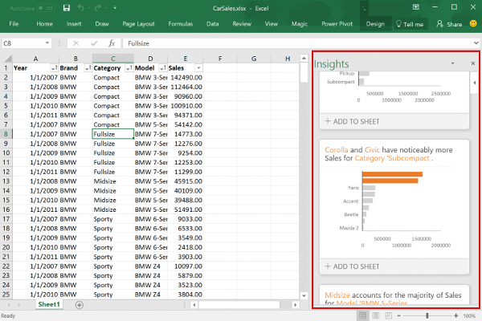
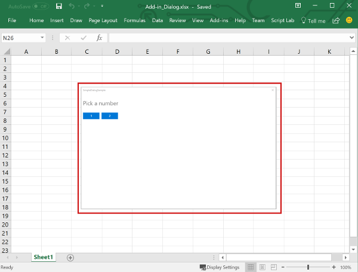

# Excel add-ins overview

An Excel add-in allows you to extend Excel application functionality across multiple platforms including Windows, Mac, iPad, and in a browser. Use Excel add-ins within a workbook to:

- Interact with Excel objects, read and write Excel data.
- Extend functionality using web based task pane or content pane
- Add custom ribbon buttons or contextual menu items
- Add custom functions
- Provide richer interaction using dialog window

The Office Add-ins platform provides the framework and Office.js JavaScript APIs that enable you to create and run Excel add-ins. By using the Office Add-ins platform to create your Excel add-in, you'll get the following benefits.

- **Cross-platform support**: Excel add-ins run in Office on the web, Windows, Mac, and iPad.
- **Centralized deployment**: Admins can quickly and easily deploy Excel add-ins to users throughout an organization.
- **Use of standard web technology**: Create your Excel add-in using familiar web technologies such as HTML, CSS, and JavaScript.
- **Distribution via AppSource**: Share your Excel add-in with a broad audience by publishing it to [AppSource](https://appsource.microsoft.com/marketplace/apps?product=office).

> [!NOTE]
> Excel add-ins are different from COM and VSTO add-ins, which are earlier Office integration solutions that run only in Office on Windows. Unlike COM add-ins, Excel add-ins don't require you to install any code on a user's device, or within Excel.

## Components of an Excel add-in

An Excel add-in includes two basic components: a web application and a configuration file, called a manifest file.

The web application uses the [Office JavaScript API](../reference/javascript-api-for-office.md) to interact with objects in Excel, and can also facilitate interaction with online resources. For example, an add-in can perform any of the following tasks.

- Create, read, update, and delete data in the workbook (worksheets, ranges, tables, charts, named items, and more).
- Perform user authorization with an online service by using the standard OAuth 2.0 flow.
- Issue API requests to Microsoft Graph or any other API.

The web application can be hosted on any web server, and can be built using client-side frameworks (such as Angular, React, jQuery) or server-side technologies (such as ASP.NET, Node.js, PHP).

The [manifest](../develop/add-in-manifests.md) is a configuration file that defines how the add-in integrates with Office clients by specifying settings and capabilities such as:

- The URL of the add-in's web application.
- The add-in's display name, description, ID, version, and default locale.
- How the add-in integrates with Excel, including any custom UI that the add-in creates (ribbon buttons, context menus, and so on).
- Permissions that the add-in requires, such as reading and writing to the document.

To enable end users to install and use an Excel add-in, you must publish its manifest either to AppSource or to an add-ins catalog. For details about publishing to AppSource, see [Make your solutions available in AppSource and within Office](/partner-center/marketplace-offers/submit-to-appsource-via-partner-center).

## Capabilities of an Excel add-in

In addition to interacting with the content in the workbook, Excel add-ins can add custom ribbon buttons or menu commands, insert task panes, add custom functions, open dialog boxes, and even embed rich, web-based objects such as charts or interactive visualizations within a worksheet.

### Add-in commands

Add-in commands are UI elements that extend the Excel UI and start actions in your add-in. You can use add-in commands to add a button on the ribbon or an item to a context menu in Excel. When users select an add-in command, they initiate actions such as running JavaScript code, or showing a page of the add-in in a task pane.

For more information about command capabilities, supported platforms, and best practices for developing add-in commands, see [Add-in commands for Excel, Word, and PowerPoint](../design/add-in-commands.md).

### Task panes

Task panes are interface surfaces that typically appear on the right side of the window within Excel. Task panes give users access to interface controls that run code to modify the Excel document or display data from a data source.

For more information about task panes, see [Task panes in Office Add-ins](../design/task-pane-add-ins.md). For a sample that implements a task pane in Excel, see [Excel Add-in JS WoodGrove Expense Trends](https://github.com/OfficeDev/Excel-Add-in-WoodGrove-Expense-Trends).

### Custom functions

Custom functions enable developers to add new functions to Excel by defining those functions in JavaScript as part of an add-in. Users within Excel can access custom functions just as they would any native function in Excel, such as `SUM()`.

For more information about custom functions, see [Create custom functions in Excel](custom-functions-overview.md).

### Dialog boxes

Dialog boxes are surfaces that float above the active Excel application window. You can use dialog boxes for tasks such as displaying sign-in pages that can't be opened directly in a task pane, requesting that the user confirm an action, or hosting videos that might be too small if confined to a task pane. To open dialog boxes in your Excel add-in, use the [Dialog API](/javascript/api/office/office.ui).

For more information about dialog boxes and the Dialog API, see [Use the Dialog API in your Office Add-ins](../develop/dialog-api-in-office-add-ins.md).

### Content add-ins

Content add-ins are surfaces that you can embed directly into Excel documents. You can use content add-ins to embed rich, web-based objects such as charts, data visualizations, or media into a worksheet or to give users access to interface controls that run code to modify the Excel document or display data from a data source. Use content add-ins when you want to embed functionality directly into the document.

For more information about content add-ins, see [Content Office Add-ins](../design/content-add-ins.md). For a sample that implements a content add-in in Excel, see [Excel content add-in: Humongous Insurance](https://github.com/OfficeDev/Office-Add-in-samples/tree/main/Samples/excel-content-add-in) in GitHub.

## JavaScript APIs to interact with workbook content

[!include[The roles of the Common and application-specific APIs](../includes/excel-api-models.md)]

## Next steps

Get started by [creating your first Excel add-in](../quickstarts/excel-quickstart-jquery.md). Then, learn about the [core concepts](excel-add-ins-core-concepts.md) of building Excel add-ins.

## See also

- [Office Add-ins platform overview](../overview/office-add-ins.md)
- [Learn about Microsoft 365 Developer Program](/office/developer-program/microsoft-365-developer-program-faq#who-qualifies-for-a-microsoft-365-e5-developer-subscription-)
- [Developing Office Add-ins](../develop/develop-overview.md)
- [Excel JavaScript object model in Office Add-ins](excel-add-ins-core-concepts.md)
- [Excel JavaScript API reference](../reference/overview/excel-add-ins-reference-overview.md)
