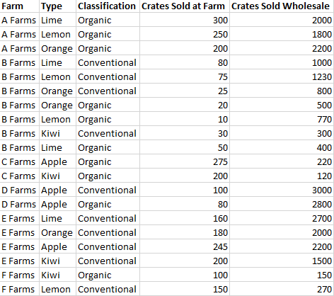
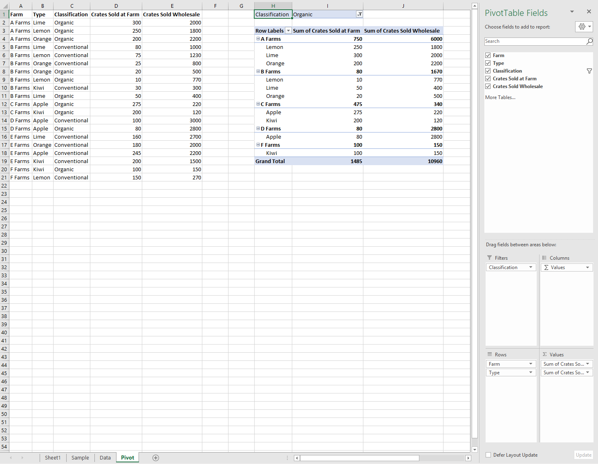
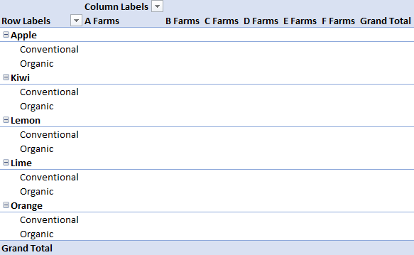
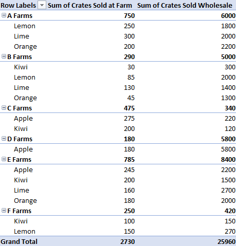
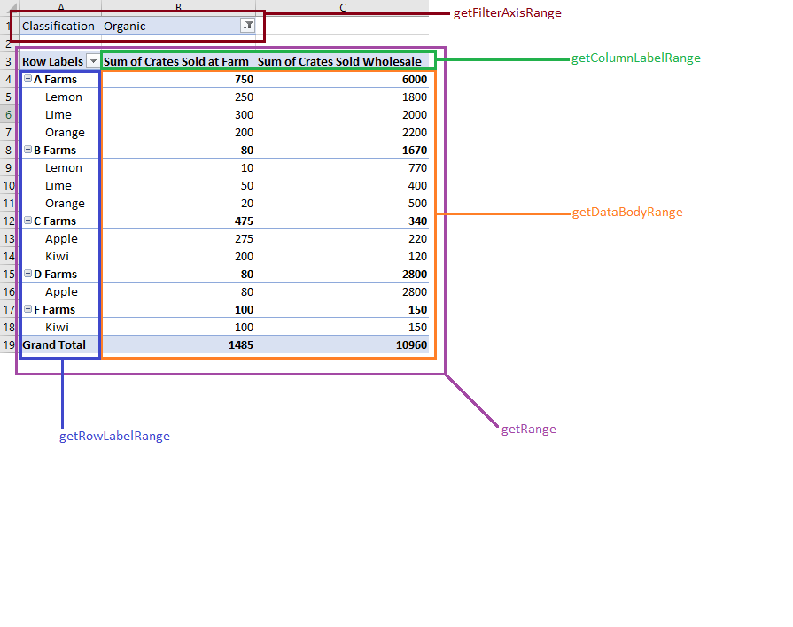
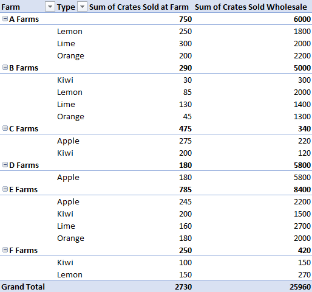
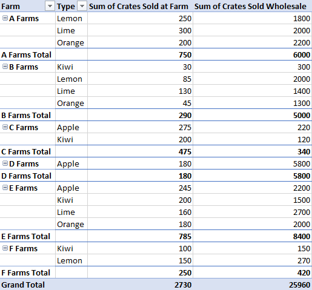
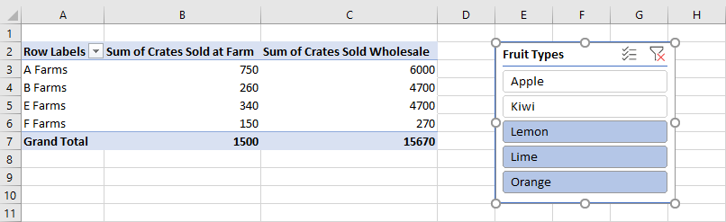
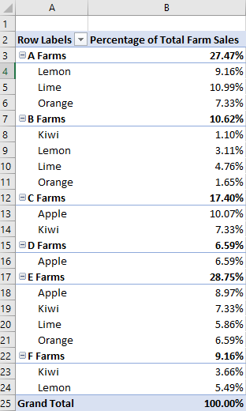

# Work with PivotTables using the Excel JavaScript API

PivotTables streamline larger data sets. They allow the quick manipulation of grouped data. The Excel JavaScript API lets your add-in create PivotTables and interact with their components. This article describes how PivotTables are represented by the Office JavaScript API and provides code samples for key scenarios.

If you are unfamiliar with the functionality of PivotTables, consider exploring them as an end user.
See [Create a PivotTable to analyze worksheet data](https://support.microsoft.com/office/ccd3c4a6-272f-4c97-afbb-d3f27407fcde#ID0EBBD=PivotTables) for a good primer on these tools.

> [!IMPORTANT]
> PivotTables created with OLAP are not currently supported. There is also no support for Power Pivot.

## Object model

:::image type="content" source="../images/pivottable-object-model.png" alt-text="A diagram showing the relationship between object types for PivotTables, as described in the subsequent list and associated reference documentation.":::

The [PivotTable](/javascript/api/excel/excel.pivottable) is the central object for PivotTables in the Office JavaScript API.

- `Workbook.pivotTables` and `Worksheet.pivotTables` are [PivotTableCollections](/javascript/api/excel/excel.pivottablecollection) that contain the [PivotTables](/javascript/api/excel/excel.pivottable) in the workbook and worksheet, respectively.
- A [PivotTable](/javascript/api/excel/excel.pivottable) contains a [PivotHierarchyCollection](/javascript/api/excel/excel.pivothierarchycollection) that has multiple [PivotHierarchies](/javascript/api/excel/excel.pivothierarchy).
- These [PivotHierarchies](/javascript/api/excel/excel.pivothierarchy) can be added to specific hierarchy collections to define how the PivotTable pivots data (as explained in the [following section](#hierarchies)).
- A [PivotHierarchy](/javascript/api/excel/excel.pivothierarchy) contains a [PivotFieldCollection](/javascript/api/excel/excel.pivotfieldcollection) that has exactly one [PivotField](/javascript/api/excel/excel.pivotfield). If the design expands to include OLAP PivotTables, this may change.
- A [PivotField](/javascript/api/excel/excel.pivotfield) can have one or more [PivotFilters](/javascript/api/excel/excel.pivotfilters) applied, as long as the field's [PivotHierarchy](/javascript/api/excel/excel.pivothierarchy) is assigned to a hierarchy category.
- A [PivotField](/javascript/api/excel/excel.pivotfield) contains a [PivotItemCollection](/javascript/api/excel/excel.pivotitemcollection) that has multiple [PivotItems](/javascript/api/excel/excel.pivotitem).
- A [PivotTable](/javascript/api/excel/excel.pivottable) contains a [PivotLayout](/javascript/api/excel/excel.pivotlayout) that defines where the [PivotFields](/javascript/api/excel/excel.pivotfield) and [PivotItems](/javascript/api/excel/excel.pivotitem) are displayed in the worksheet. The layout also controls some display settings for the PivotTable.

Let's look at how these relationships apply to some example data. The following data describes fruit sales from various farms. It will be the example throughout this article.



This fruit farm sales data will be used to make a PivotTable. Each column, such as **Types**, is a `PivotHierarchy`. The **Types** hierarchy contains the **Types** field. The **Types** field contains the items **Apple**, **Kiwi**, **Lemon**, **Lime**, and **Orange**.

### Hierarchies

PivotTables are organized based on four hierarchy categories: [row](/javascript/api/excel/excel.rowcolumnpivothierarchy), [column](/javascript/api/excel/excel.rowcolumnpivothierarchy), [data](/javascript/api/excel/excel.datapivothierarchy), and [filter](/javascript/api/excel/excel.filterpivothierarchy).

The farm data shown earlier has five hierarchies: **Farms**, **Type**, **Classification**, **Crates Sold at Farm**, and **Crates Sold Wholesale**. Each hierarchy can only exist in one of the four categories. If **Type** is added to column hierarchies, it cannot also be in the row, data, or filter hierarchies. If **Type** is subsequently added to row hierarchies, it is removed from the column hierarchies. This behavior is the same whether hierarchy assignment is done through the Excel UI or the Excel JavaScript APIs.

Row and column hierarchies define how data will be grouped. For example, a row hierarchy of **Farms** will group together all the data sets from the same farm. The choice between row and column hierarchy defines the orientation of the PivotTable.

Data hierarchies are the values to be aggregated based on the row and column hierarchies. A PivotTable with a row hierarchy of **Farms** and a data hierarchy of **Crates Sold Wholesale** shows the sum total (by default) of all the different fruits for each farm.

Filter hierarchies include or exclude data from the pivot based on values within that filtered type. A filter hierarchy of **Classification** with the type **Organic** selected only shows data for organic fruit.

Here is the farm data again, alongside a PivotTable. The PivotTable is using **Farm** and **Type** as the row hierarchies, **Crates Sold at Farm** and **Crates Sold Wholesale** as the data hierarchies (with the default aggregation function of sum), and **Classification** as a filter hierarchy (with **Organic** selected).



This PivotTable could be generated through the JavaScript API or through the Excel UI. Both options allow for further manipulation through add-ins.

## Create a PivotTable

PivotTables need a name, source, and destination. The source can be a range address or table name (passed as a `Range`, `string`, or `Table` type). The destination is a range address (given as either a `Range` or `string`).
The following samples show various PivotTable creation techniques.

### Create a PivotTable with range addresses

```js
await Excel.run(async (context) => {
    // Create a PivotTable named "Farm Sales" on the current worksheet at cell
    // A22 with data from the range A1:E21.
    context.workbook.worksheets.getActiveWorksheet().pivotTables.add(
      "Farm Sales", "A1:E21", "A22");

    await context.sync();
});
```

### Create a PivotTable with Range objects

```js
await Excel.run(async (context) => {
    // Create a PivotTable named "Farm Sales" on a worksheet called "PivotWorksheet" at cell A2
    // the data comes from the worksheet "DataWorksheet" across the range A1:E21.
    let rangeToAnalyze = context.workbook.worksheets.getItem("DataWorksheet").getRange("A1:E21");
    let rangeToPlacePivot = context.workbook.worksheets.getItem("PivotWorksheet").getRange("A2");
    context.workbook.worksheets.getItem("PivotWorksheet").pivotTables.add(
      "Farm Sales", rangeToAnalyze, rangeToPlacePivot);

    await context.sync();
});
```

### Create a PivotTable at the workbook level

```js
await Excel.run(async (context) => {
    // Create a PivotTable named "Farm Sales" on a worksheet called "PivotWorksheet" at cell A2
    // the data is from the worksheet "DataWorksheet" across the range A1:E21.
    context.workbook.pivotTables.add(
        "Farm Sales", "DataWorksheet!A1:E21", "PivotWorksheet!A2");

    await context.sync();
});
```

## Use an existing PivotTable

Manually created PivotTables are also accessible through the PivotTable collection of the workbook or of individual worksheets. The following code gets a PivotTable named **My Pivot** from the workbook.

```js
await Excel.run(async (context) => {
    let pivotTable = context.workbook.pivotTables.getItem("My Pivot");
    await context.sync();
});
```

## Add rows and columns to a PivotTable

Rows and columns pivot the data around those fields' values.

Adding the **Farm** column pivots all the sales around each farm. Adding the **Type** and **Classification** rows further breaks down the data based on what fruit was sold and whether it was organic or not.



```js
await Excel.run(async (context) => {
    let pivotTable = context.workbook.worksheets.getActiveWorksheet().pivotTables.getItem("Farm Sales");

    pivotTable.rowHierarchies.add(pivotTable.hierarchies.getItem("Type"));
    pivotTable.rowHierarchies.add(pivotTable.hierarchies.getItem("Classification"));

    pivotTable.columnHierarchies.add(pivotTable.hierarchies.getItem("Farm"));

    await context.sync();
});
```

You can also have a PivotTable with only rows or columns.

```js
await Excel.run(async (context) => {
    let pivotTable = context.workbook.worksheets.getActiveWorksheet().pivotTables.getItem("Farm Sales");
    pivotTable.rowHierarchies.add(pivotTable.hierarchies.getItem("Farm"));
    pivotTable.rowHierarchies.add(pivotTable.hierarchies.getItem("Type"));
    pivotTable.rowHierarchies.add(pivotTable.hierarchies.getItem("Classification"));

    await context.sync();
});
```

## Add data hierarchies to the PivotTable

Data hierarchies fill the PivotTable with information to combine based on the rows and columns. Adding the data hierarchies of **Crates Sold at Farm** and **Crates Sold Wholesale** gives sums of those figures for each row and column.

In the example, both **Farm** and **Type** are rows, with the crate sales as the data.



```js
await Excel.run(async (context) => {
    let pivotTable = context.workbook.worksheets.getActiveWorksheet().pivotTables.getItem("Farm Sales");

    // "Farm" and "Type" are the hierarchies on which the aggregation is based.
    pivotTable.rowHierarchies.add(pivotTable.hierarchies.getItem("Farm"));
    pivotTable.rowHierarchies.add(pivotTable.hierarchies.getItem("Type"));

    // "Crates Sold at Farm" and "Crates Sold Wholesale" are the hierarchies
    // that will have their data aggregated (summed in this case).
    pivotTable.dataHierarchies.add(pivotTable.hierarchies.getItem("Crates Sold at Farm"));
    pivotTable.dataHierarchies.add(pivotTable.hierarchies.getItem("Crates Sold Wholesale"));

    await context.sync();
});
```

## PivotTable layouts and getting pivoted data

A [PivotLayout](/javascript/api/excel/excel.pivotlayout) defines the placement of hierarchies and their data. You access the layout to determine the ranges where data is stored.

The following diagram shows which layout function calls correspond to which ranges of the PivotTable.



### Get data from the PivotTable

The layout defines how the PivotTable is displayed in the worksheet. This means the `PivotLayout` object controls the ranges used for PivotTable elements. Use the ranges provided by the layout to get data collected and aggregated by the PivotTable. In particular, use `PivotLayout.getDataBodyRange` to access the data produced by the PivotTable.

The following code demonstrates how to get the last row of the PivotTable data by going through the layout (the **Grand Total** of both the **Sum of Crates Sold at Farm** and **Sum of Crates Sold Wholesale** columns in the earlier example). Those values are then summed together for a final total, which is displayed in cell **E30** (outside of the PivotTable).

```js
await Excel.run(async (context) => {
    let pivotTable = context.workbook.worksheets.getActiveWorksheet().pivotTables.getItem("Farm Sales");

    // Get the totals for each data hierarchy from the layout.
    let range = pivotTable.layout.getDataBodyRange();
    let grandTotalRange = range.getLastRow();
    grandTotalRange.load("address");
    await context.sync();

    // Sum the totals from the PivotTable data hierarchies and place them in a new range, outside of the PivotTable.
    let masterTotalRange = context.workbook.worksheets.getActiveWorksheet().getRange("E30");
    masterTotalRange.formulas = [["=SUM(" + grandTotalRange.address + ")"]];
    await context.sync();
});
```

### Layout types

PivotTables have three layout styles: Compact, Outline, and Tabular. We've seen the compact style in the previous examples.

The following examples use the outline and tabular styles, respectively. The code sample shows how to cycle between the different layouts.

#### Outline layout



#### Tabular layout



#### PivotLayout type switch code sample

```js
await Excel.run(async (context) => {
    // Change the PivotLayout.type to a new type.
    let pivotTable = context.workbook.worksheets.getActiveWorksheet().pivotTables.getItem("Farm Sales");
    pivotTable.layout.load("layoutType");
    await context.sync();

    // Cycle between the three layout types.
    if (pivotTable.layout.layoutType === "Compact") {
        pivotTable.layout.layoutType = "Outline";
    } else if (pivotTable.layout.layoutType === "Outline") {
        pivotTable.layout.layoutType = "Tabular";
    } else {
        pivotTable.layout.layoutType = "Compact";
    }

    await context.sync();
});
```

### Other PivotLayout functions

By default, PivotTables adjust row and column sizes as needed. This is done when the PivotTable is refreshed. `PivotLayout.autoFormat` specifies that behavior. Any row or column size changes made by your add-in persist when `autoFormat` is `false`. Additionally, the default settings of a PivotTable keep any custom formatting in the PivotTable (such as fills and font changes). Set `PivotLayout.preserveFormatting` to `false` to apply the default format when refreshed.

A `PivotLayout` also controls header and total row settings, how empty data cells are displayed, and [alt text](https://support.microsoft.com/topic/44989b2a-903c-4d9a-b742-6a75b451c669) options. The [PivotLayout](/javascript/api/excel/excel.pivotlayout) reference provides a complete list of these features.

The following code sample makes empty data cells display the string `"--"`, formats the body range to a consistent horizontal alignment, and ensures that the formatting changes remain even after the PivotTable is refreshed.

```js
await Excel.run(async (context) => {
    let pivotTable = context.workbook.pivotTables.getItem("Farm Sales");
    let pivotLayout = pivotTable.layout;

    // Set a default value for an empty cell in the PivotTable. This doesn't include cells left blank by the layout.
    pivotLayout.emptyCellText = "--";

    // Set the text alignment to match the rest of the PivotTable.
    pivotLayout.getDataBodyRange().format.horizontalAlignment = Excel.HorizontalAlignment.right;

    // Ensure empty cells are filled with a default value.
    pivotLayout.fillEmptyCells = true;

    // Ensure that the format settings persist, even after the PivotTable is refreshed and recalculated.
    pivotLayout.preserveFormatting = true;
    await context.sync();
});
```

## Delete a PivotTable

PivotTables are deleted by using their name.

```js
await Excel.run(async (context) => {
    context.workbook.worksheets.getItem("Pivot").pivotTables.getItem("Farm Sales").delete();
    await context.sync();
});
```

## Filter a PivotTable

The primary method for filtering PivotTable data is with PivotFilters. Slicers offer an alternate, less flexible filtering method.

[PivotFilters](/javascript/api/excel/excel.pivotfilters) filter data based on a PivotTable's four [hierarchy categories](#hierarchies) (filters, columns, rows, and values). There are four types of PivotFilters, allowing calendar date-based filtering, string parsing, number comparison, and filtering based on a custom input.

[Slicers](/javascript/api/excel/excel.slicer) can be applied to both PivotTables and regular Excel tables. When applied to a PivotTable, slicers function like a [PivotManualFilter](#pivotmanualfilter) and allow filtering based on a custom input. Unlike PivotFilters, slicers have an [Excel UI component](https://support.microsoft.com/office/249f966b-a9d5-4b0f-b31a-12651785d29d). With the `Slicer` class, you create this UI component, manage filtering, and control its visual appearance.

### Filter with PivotFilters

[PivotFilters](/javascript/api/excel/excel.pivotfilters) allow you to filter PivotTable data based on the four [hierarchy categories](#hierarchies) (filters, columns, rows, and values). In the PivotTable object model, `PivotFilters` are applied to a [PivotField](/javascript/api/excel/excel.pivotfield), and each `PivotField` can have one or more assigned `PivotFilters`. To apply PivotFilters to a PivotField, the field's corresponding [PivotHierarchy](/javascript/api/excel/excel.pivothierarchy) must be assigned to a hierarchy category.

#### Types of PivotFilters

| Filter type | Filter purpose | Excel JavaScript API reference |
|:--- |:--- |:--- |
| DateFilter | Calendar date-based filtering. | [PivotDateFilter](/javascript/api/excel/excel.pivotdatefilter) |
| LabelFilter | Text comparison filtering. | [PivotLabelFilter](/javascript/api/excel/excel.pivotlabelfilter) |
| ManualFilter | Custom input filtering. | [PivotManualFilter](/javascript/api/excel/excel.pivotmanualfilter) |
| ValueFilter | Number comparison filtering. | [PivotValueFilter](/javascript/api/excel/excel.pivotvaluefilter) |

#### Create a PivotFilter

To filter PivotTable data with a `Pivot*Filter` (such as a `PivotDateFilter`), apply the filter to a [PivotField](/javascript/api/excel/excel.pivotfield). The following four code samples show how to use each of the four types of PivotFilters.

##### PivotDateFilter

The first code sample applies a [PivotDateFilter](/javascript/api/excel/excel.pivotdatefilter) to the **Date Updated** PivotField, hiding any data prior to **2020-08-01**.

> [!IMPORTANT]
> A `Pivot*Filter` can't be applied to a PivotField unless that field's PivotHierarchy is assigned to a hierarchy category. In the following code sample, the `dateHierarchy` must be added to the PivotTable's `rowHierarchies` category before it can be used for filtering.

```js
await Excel.run(async (context) => {
    // Get the PivotTable and the date hierarchy.
    let pivotTable = context.workbook.worksheets.getActiveWorksheet().pivotTables.getItem("Farm Sales");
    let dateHierarchy = pivotTable.rowHierarchies.getItemOrNullObject("Date Updated");
    await context.sync();

    // PivotFilters can only be applied to PivotHierarchies that are being used for pivoting.
    // If it's not already there, add "Date Updated" to the hierarchies.
    if (dateHierarchy.isNullObject) {
        dateHierarchy = pivotTable.rowHierarchies.add(pivotTable.hierarchies.getItem("Date Updated"));
    }

    // Apply a date filter to filter out anything logged before August.
    let filterField = dateHierarchy.fields.getItem("Date Updated");
    let dateFilter = {
        condition: Excel.DateFilterCondition.afterOrEqualTo,
        comparator: {
        date: "2020-08-01",
        specificity: Excel.FilterDatetimeSpecificity.month
        }
    };
    filterField.applyFilter({ dateFilter: dateFilter });
    
    await context.sync();
});
```

> [!NOTE]
> The following three code snippets only display filter-specific excerpts, instead of full `Excel.run` calls.

##### PivotLabelFilter

The second code snippet demonstrates how to apply a [PivotLabelFilter](/javascript/api/excel/excel.pivotlabelfilter) to the **Type** PivotField, using the `LabelFilterCondition.beginsWith` property to exclude labels that start with the letter **L**.

```js
    // Get the "Type" field.
    let filterField = pivotTable.hierarchies.getItem("Type").fields.getItem("Type");

    // Filter out any types that start with "L" ("Lemons" and "Limes" in this case).
    let filter: Excel.PivotLabelFilter = {
      condition: Excel.LabelFilterCondition.beginsWith,
      substring: "L",
      exclusive: true
    };

    // Apply the label filter to the field.
    filterField.applyFilter({ labelFilter: filter });
```

##### PivotManualFilter

The third code snippet applies a manual filter with [PivotManualFilter](/javascript/api/excel/excel.pivotmanualfilter) to the the **Classification** field, filtering out data that doesn't include the classification **Organic**.

```js
    // Apply a manual filter to include only a specific PivotItem (the string "Organic").
    let filterField = classHierarchy.fields.getItem("Classification");
    let manualFilter = { selectedItems: ["Organic"] };
    filterField.applyFilter({ manualFilter: manualFilter });
```

##### PivotValueFilter

To compare numbers, use a value filter with [PivotValueFilter](/javascript/api/excel/excel.pivotvaluefilter), as shown in the final code snippet. The `PivotValueFilter` compares the data in the **Farm** PivotField to the data in the **Crates Sold Wholesale** PivotField, including only farms whose sum of crates sold exceeds the value **500**.

```js
    // Get the "Farm" field.
    let filterField = pivotTable.hierarchies.getItem("Farm").fields.getItem("Farm");
    
    // Filter to only include rows with more than 500 wholesale crates sold.
    let filter: Excel.PivotValueFilter = {
      condition: Excel.ValueFilterCondition.greaterThan,
      comparator: 500,
      value: "Sum of Crates Sold Wholesale"
    };
    
    // Apply the value filter to the field.
    filterField.applyFilter({ valueFilter: filter });
```

#### Remove PivotFilters

To remove all PivotFilters, apply the `clearAllFilters` method to each PivotField, as shown in the following code sample.

```js
await Excel.run(async (context) => {
    // Get the PivotTable.
    let pivotTable = context.workbook.worksheets.getActiveWorksheet().pivotTables.getItem("Farm Sales");
    pivotTable.hierarchies.load("name");
    await context.sync();

    // Clear the filters on each PivotField.
    pivotTable.hierarchies.items.forEach(function (hierarchy) {
        hierarchy.fields.getItem(hierarchy.name).clearAllFilters();
    });
    await context.sync();
});
```

### Filter with slicers

[Slicers](/javascript/api/excel/excel.slicer) allow data to be filtered from an Excel PivotTable or table. A slicer uses values from a specified column or PivotField to filter corresponding rows. These values are stored as [SlicerItem](/javascript/api/excel/excel.sliceritem) objects in the `Slicer`. Your add-in can adjust these filters, as can users ([through the Excel UI](https://support.microsoft.com/office/249f966b-a9d5-4b0f-b31a-12651785d29d)). The slicer sits on top of the worksheet in the drawing layer, as shown in the following screenshot.



> [!NOTE]
> The techniques described in this section focus on how to use slicers connected to PivotTables. The same techniques also apply to using slicers connected to tables.

#### Create a slicer

You can create a slicer in a workbook or worksheet by using the `Workbook.slicers.add` method or `Worksheet.slicers.add` method. Doing so adds a slicer to the [SlicerCollection](/javascript/api/excel/excel.slicercollection) of the specified `Workbook` or `Worksheet` object. The `SlicerCollection.add` method has three parameters:

- `slicerSource`: The data source on which the new slicer is based. It can be a `PivotTable`, `Table`, or string representing the name or ID of a `PivotTable` or `Table`.
- `sourceField`: The field in the data source by which to filter. It can be a `PivotField`, `TableColumn`, or string representing the name or ID of a `PivotField` or `TableColumn`.
- `slicerDestination`: The worksheet where the new slicer will be created. It can be a `Worksheet` object or the name or ID of a `Worksheet`. This parameter is unnecessary when the `SlicerCollection` is accessed through `Worksheet.slicers`. In this case, the collection's worksheet is used as the destination.

The following code sample adds a new slicer to the **Pivot** worksheet. The slicer's source is the **Farm Sales** PivotTable and filters using the **Type** data. The slicer is also named **Fruit Slicer** for future reference.

```js
await Excel.run(async (context) => {
    let sheet = context.workbook.worksheets.getItem("Pivot");
    let slicer = sheet.slicers.add(
        "Farm Sales" /* The slicer data source. For PivotTables, this can be the PivotTable object reference or name. */,
        "Type" /* The field in the data to filter by. For PivotTables, this can be a PivotField object reference or ID. */
    );
    slicer.name = "Fruit Slicer";
    await context.sync();
});
```

#### Filter items with a slicer

The slicer filters the PivotTable with items from the `sourceField`. The `Slicer.selectItems` method sets the items that remain in the slicer. These items are passed to the method as a `string[]`, representing the keys of the items. Any rows containing those items remain in the PivotTable's aggregation. Subsequent calls to `selectItems` set the list to the keys specified in those calls.

> [!NOTE]
> If `Slicer.selectItems` is passed an item that's not in the data source, an `InvalidArgument` error is thrown. The contents can be verified through the `Slicer.slicerItems` property, which is a [SlicerItemCollection](/javascript/api/excel/excel.sliceritemcollection).

The following code sample shows three items being selected for the slicer: **Lemon**, **Lime**, and **Orange**.

```js
await Excel.run(async (context) => {
    let slicer = context.workbook.slicers.getItem("Fruit Slicer");
    // Anything other than the following three values will be filtered out of the PivotTable for display and aggregation.
    slicer.selectItems(["Lemon", "Lime", "Orange"]);
    await context.sync();
});
```

To remove all filters from the slicer, use the `Slicer.clearFilters` method, as shown in the following sample.

```js
await Excel.run(async (context) => {
    let slicer = context.workbook.slicers.getItem("Fruit Slicer");
    slicer.clearFilters();
    await context.sync();
});
```

#### Style and format a slicer

You add-in can adjust a slicer's display settings through `Slicer` properties. The following code sample sets the style to **SlicerStyleLight6**, sets the text at the top of the slicer to **Fruit Types**, places the slicer at the position **(395, 15)** on the drawing layer, and sets the slicer's size to **135x150** pixels.

```js
await Excel.run(async (context) => {
    let slicer = context.workbook.slicers.getItem("Fruit Slicer");
    slicer.caption = "Fruit Types";
    slicer.left = 395;
    slicer.top = 15;
    slicer.height = 135;
    slicer.width = 150;
    slicer.style = "SlicerStyleLight6";
    await context.sync();
});
```

#### Delete a slicer

To delete a slicer, call the `Slicer.delete` method. The following code sample deletes the first slicer from the current worksheet.

```js
await Excel.run(async (context) => {
    let sheet = context.workbook.worksheets.getActiveWorksheet();
    sheet.slicers.getItemAt(0).delete();
    await context.sync();
});
```

## Change aggregation function

Data hierarchies have their values aggregated. For datasets of numbers, this is a sum by default. The `summarizeBy` property defines this behavior based on an [AggregationFunction](/javascript/api/excel/excel.aggregationfunction) type.

The currently supported aggregation function types are `Sum`, `Count`, `Average`, `Max`, `Min`, `Product`, `CountNumbers`, `StandardDeviation`, `StandardDeviationP`, `Variance`, `VarianceP`, and `Automatic` (the default).

The following code samples changes the aggregation to be averages of the data.

```js
await Excel.run(async (context) => {
    let pivotTable = context.workbook.worksheets.getActiveWorksheet().pivotTables.getItem("Farm Sales");
    pivotTable.dataHierarchies.load("no-properties-needed");
    await context.sync();

    // Change the aggregation from the default sum to an average of all the values in the hierarchy.
    pivotTable.dataHierarchies.items[0].summarizeBy = Excel.AggregationFunction.average;
    pivotTable.dataHierarchies.items[1].summarizeBy = Excel.AggregationFunction.average;
    await context.sync();
});
```

## Change calculations with a ShowAsRule

PivotTables, by default, aggregate the data of their row and column hierarchies independently. A [ShowAsRule](/javascript/api/excel/excel.showasrule) changes the data hierarchy to output values based on other items in the PivotTable.

The `ShowAsRule` object has three properties:

- `calculation`: The type of relative calculation to apply to the data hierarchy (the default is `none`).
- `baseField`: The [PivotField](/javascript/api/excel/excel.pivotfield) in the hierarchy containing the base data before the calculation is applied. Since Excel PivotTables have a one-to-one mapping of hierarchy to field, you'll use the same name to access both the hierarchy and the field.
- `baseItem`: The individual [PivotItem](/javascript/api/excel/excel.pivotitem) compared against the values of the base fields based on the calculation type. Not all calculations require this field.

The following example sets the calculation on the **Sum of Crates Sold at Farm** data hierarchy to be a percentage of the column total.
We still want the granularity to extend to the fruit type level, so we'll use the **Type** row hierarchy and its underlying field.
The example also has **Farm** as the first row hierarchy, so the farm total entries display the percentage each farm is responsible for producing as well.



```js
await Excel.run(async (context) => {
    let pivotTable = context.workbook.worksheets.getActiveWorksheet().pivotTables.getItem("Farm Sales");
    let farmDataHierarchy = pivotTable.dataHierarchies.getItem("Sum of Crates Sold at Farm");

    farmDataHierarchy.load("showAs");
    await context.sync();

    // Show the crates of each fruit type sold at the farm as a percentage of the column's total.
    let farmShowAs = farmDataHierarchy.showAs;
    farmShowAs.calculation = Excel.ShowAsCalculation.percentOfColumnTotal;
    farmShowAs.baseField = pivotTable.rowHierarchies.getItem("Type").fields.getItem("Type");
    farmDataHierarchy.showAs = farmShowAs;
    farmDataHierarchy.name = "Percentage of Total Farm Sales";
});
```

The previous example set the calculation to the column, relative to the field of an individual row hierarchy. When the calculation relates to an individual item, use the `baseItem` property.

The following example shows the `differenceFrom` calculation. It displays the difference of the farm crate sales data hierarchy entries relative to those of **A Farms**.
The `baseField` is **Farm**, so we see the differences between the other farms, as well as breakdowns for each type of like fruit (**Type** is also a row hierarchy in this example).


```js
await Excel.run(async (context) => {
    let pivotTable = context.workbook.worksheets.getActiveWorksheet().pivotTables.getItem("Farm Sales");
    let farmDataHierarchy = pivotTable.dataHierarchies.getItem("Sum of Crates Sold at Farm");

    farmDataHierarchy.load("showAs");
    await context.sync();
        
    // Show the difference between crate sales of the "A Farms" and the other farms.
    // This difference is both aggregated and shown for individual fruit types (where applicable).
    let farmShowAs = farmDataHierarchy.showAs;
    farmShowAs.calculation = Excel.ShowAsCalculation.differenceFrom;
    farmShowAs.baseField = pivotTable.rowHierarchies.getItem("Farm").fields.getItem("Farm");
    farmShowAs.baseItem = pivotTable.rowHierarchies.getItem("Farm").fields.getItem("Farm").items.getItem("A Farms");
    farmDataHierarchy.showAs = farmShowAs;
    farmDataHierarchy.name = "Difference from A Farms";
});
```

## Change hierarchy names

Hierarchy fields are editable. The following code demonstrates how to change the displayed names of two data hierarchies.

```js
await Excel.run(async (context) => {
    let dataHierarchies = context.workbook.worksheets.getActiveWorksheet()
        .pivotTables.getItem("Farm Sales").dataHierarchies;
    dataHierarchies.load("no-properties-needed");
    await context.sync();

    // Changing the displayed names of these entries.
    dataHierarchies.items[0].name = "Farm Sales";
    dataHierarchies.items[1].name = "Wholesale";
});
```

## See also

- [Excel JavaScript object model in Office Add-ins](excel-add-ins-core-concepts.md)
- [Excel JavaScript API Reference](/javascript/api/excel)
