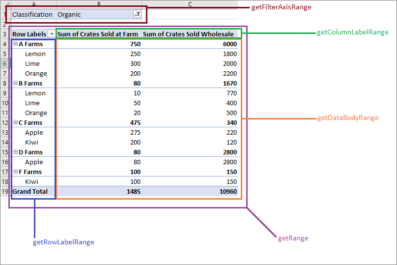

# Work with PivotTables using the Excel JavaScript API

PivotTables streamline larger data sets. They allow the quick manipulation of grouped data. The Excel JavaScript API lets your add-in create PivotTables and interact with their components. 

If you are unfamiliar with the functionality of PivotTables, consider exploring them as an end-user. 
See [Create a PivotTable to analyze worksheet data](https://support.office.com/en-us/article/Import-and-analyze-data-ccd3c4a6-272f-4c97-afbb-d3f27407fcde#ID0EAABAAA=PivotTables) for a good primer on these tools. 

This article provides code samples for common scenarios. To further your understanding of the PivotTable API, see [**PivotTable**](https://docs.microsoft.com/javascript/api/excel/excel.pivottable) and [**PivotTableCollection**](https://docs.microsoft.com/javascript/api/excel/excel.pivottable).

> [!IMPORTANT]
> PivotTables created with OLAP are not currently supported.

## Hierarchies

PivotTables are organized based on four hierarchy categories: row, column, data, and filter. The following data describing fruit sales from various farms will be used throughout this article.


This data has five hierarchies: **Farms**, **Type**, **Classification**, **Crates Sold at Farm**, and **Crates Sold Wholesale**. Each hierarchy can only exist in one of the four categories. If **Type** is added to column hierarchies and then added to row hierarchies, it only remains in the latter.

Row and column hierarchies define how data will be grouped. For example, a row hierarchy of **Farms** will group together all the data sets from the same farm. The choice between row and column hierarchy defines the orientation of the PivotTable.

Data hierarchies are the values to be aggregated based on the row and column hierarchies. A PivotTable with a row hierarchy of **Farms** and a data hierarchy of **Crates Sold Wholesale** shows the sum total (by default) of all the different fruits for each farm.

Filter hierarchies include or exclude data from the pivot based on values within that filtered type. A filter hierarchy of **Classification** with the type **Organic** selected only shows data for organic fruit.

Here is the farm data again, alongside a PivotTable. The PivotTable is using **Farm** and **Type** as the row hierarchies, **Crates Sold at Farm** and **Crates Sold Wholesale** as the data hierarchies (with the default aggregation function of sum), and **Classification** as a filter hierarchy (with **Organic** selected). 


This PivotTable could be generated through the JavaScript API or through the Excel UI. Both options allow for further manipulation through add-ins.

## Create a PivotTable

PivotTables need a name, source, and destination. The source can be a range address or table name (passed as a `Range`, `string`, or `Table` type). The destination is a range address (given as either a `Range` or `string`). 
The following samples show various PivotTable creation techniques.

### Create a PivotTable with range addresses

```typescript
await Excel.run(async (context) => {
    // creating a PivotTable named "Farm Sales" on the current worksheet at cell A22 with data from the range A1:E21
	context.workbook.worksheets.getActiveWorksheet().pivotTables.add("Farm Sales", "A1:E21", "A22");

	await context.sync();
});
```

### Create a PivotTable with Range objects

```typescript
await Excel.run(async (context) => {	
    // creating a PivotTable named "Farm Sales" on a worksheet called "PivotWorksheet" at cell A2
    // the data comes from the worksheet "DataWorksheet" across the range A1:E21
	const rangeToAnalyze = context.workbook.worksheets.getItem("DataWorksheet").getRange("A1:E21");
	const rangeToPlacePivot = context.workbook.worksheets.getItem("PivotWorksheet").getRange("A2");
	context.workbook.worksheets.getItem("PivotWorksheet").pivotTables.add(
	    "Farm Sales", rangeToAnalyze, rangeToPlacePivot);
	
	await context.sync();
});
```

### Create a PivotTable at the workbook level

```typescript
await Excel.run(async (context) => {
    // creating a PivotTable named "Farm Sales" on a worksheet called "PivotWorksheet" at cell A2
    // the data is from the worksheet "DataWorksheet" across the range A1:E21
	context.workbook.pivotTables.add("Farm Sales", "DataWorksheet!A1:E21", "PivotWorksheet!A2");

	await context.sync();
});
```

## Use an existing PivotTable

Manually created PivotTables are also accessible through the PivotTable collection of the workbook or of individual worksheets. 

The following code gets the first PivotTable in the workbook. It then gives the table a name for easy future reference.

```typescript
await Excel.run(async (context) => {
	const pivotTable = context.workbook.pivotTables.getItem("My Pivot");
	await context.sync();
});
```

## Add rows and columns to a PivotTable

Rows and columns pivot the data around those fields’ values.

Adding the **Farm** column pivots all the sales around each farm. Adding the **Type** and **Classification** rows further breaks down the data based on what fruit was sold and whether it was organic or not.


```typescript
await Excel.run(async (context) => {
	const pivotTable = context.workbook.worksheets.getActiveWorksheet().pivotTables.getItem("Farm Sales");

	pivotTable.rowHierarchies.add(pivotTable.hierarchies.getItem("Type"));
	pivotTable.rowHierarchies.add(pivotTable.hierarchies.getItem("Classification"));
	
	pivotTable.columnHierarchies.add(pivotTable.hierarchies.getItem("Farm"));

	await context.sync();
});
```

You can also have a PivotTable with only rows or columns.

```typescript
await Excel.run(async (context) => {
	const pivotTable = context.workbook.worksheets.getActiveWorksheet().pivotTables.getItem("Farm Sales");
	pivotTable.rowHierarchies.add(pivotTable.hierarchies.getItem("Farm"));
	pivotTable.rowHierarchies.add(pivotTable.hierarchies.getItem("Type"));
	pivotTable.rowHierarchies.add(pivotTable.hierarchies.getItem("Classification"));
	
	await context.sync();
});
```

## Add data hierarchies to the PivotTable

Data hierarchies fill the PivotTable with information to combine based on the rows and columns. Adding the data hierarchies of **Crates Sold at Farm** and **Crates Sold Wholesale** gives sums of those figures for each row and column. 

In the example, both **Farm** and **Type** are rows, with the crate sales as the data. 


```typescript
await Excel.run(async (context) => {
	const pivotTable = context.workbook.worksheets.getActiveWorksheet().pivotTables.getItem("Farm Sales");

	// "Farm" and "Type" are the hierarchies on which the aggregation is based
	pivotTable.rowHierarchies.add(pivotTable.hierarchies.getItem("Farm"));
	pivotTable.rowHierarchies.add(pivotTable.hierarchies.getItem("Type"));

	// "Crates Sold at Farm" and "Crates Sold Wholesale" are the hierarchies
    // that will have their data aggregated (summed in this case)
	pivotTable.dataHierarchies.add(pivotTable.hierarchies.getItem("Crates Sold at Farm"));
	pivotTable.dataHierarchies.add(pivotTable.hierarchies.getItem("Crates Sold Wholesale"));

	await context.sync();
});
```

## Change aggregation function

Data hierarchies have their values aggregated. For datasets of numbers, this is a sum by default. The `summarizeBy` property defines this behavior based on an `AggregrationFunction` type. 

The currently supported aggregation function types are `Sum`, `Count`, `Average`, `Max`, `Min`, `Product`, `CountNumbers`, `StandardDeviation`, `StandardDeviationP`, `Variance`, `VarianceP`, and `Automatic` (the default).

The following code samples changes the aggregation to be averages of the data.

```typescript
await Excel.run(async (context) => {
    const pivotTable = context.workbook.worksheets.getActiveWorksheet().pivotTables.getItem("Farm Sales");
    pivotTable.dataHierarchies.load("no-properties-needed");
    await context.sync();

    // changing the aggregation from the default sum to an average of all the values in the hierarchy
    pivotTable.dataHierarchies.items[0].summarizeBy = Excel.AggregationFunction.average;
    pivotTable.dataHierarchies.items[1].summarizeBy = Excel.AggregationFunction.average;
    await context.sync();
});
```

## Change calculations with a ShowAsRule

PivotTables, by default, aggregate the data of their row and column hierarchies independently. A `ShowAsRule` changes the data hierarchy to output values based on other items in the PivotTable.

The `ShowAsRule` object has three properties:
-	`calculation`: The type of relative calculation to apply to the data hierarchy (the default is `none`).
-	`baseField`: The field within the hierarchy containing the base data before the calculation is applied. The `PivotField` usually has the same name as its parent hierarchy.
-	`baseItem`: The individual item compared against the values of the base fields based on the calculation type. Not all calculations require this field.

The following example sets the calculation on the **Sum of Crates Sold at Farm** data hierarchy to be a percentage of the column total. 
We still want the granularity to extend to the fruit type level, so we’ll use the **Type** row hierarchy and its underlying field. 
The example also has **Farm** as the first row hierarchy, so the farm total entries display the percentage each farm is responsible for producing as well.


``` TypeScript
await Excel.run(async (context) => {
    const pivotTable = context.workbook.worksheets.getActiveWorksheet().pivotTables.getItem("Farm Sales");
    const farmDataHierarchy = pivotTable.dataHierarchies.getItem("Sum of Crates Sold at Farm");

    farmDataHierarchy.load("showAs");
    await context.sync();

    // show the crates of each fruit type sold at the farm as a percentage of the column's total
    let farmShowAs = farmDataHierarchy.showAs;
    farmShowAs.calculation = Excel.ShowAsCalculation.percentOfColumnTotal;
    farmShowAs.baseField = pivotTable.rowHierarchies.getItem("Type").fields.getItem("Type");
    farmDataHierarchy.showAs = farmShowAs; 
    farmDataHierarchy.name = "Percentage of Total Farm Sales";

    await context.sync();
});
```

The previous example set the calculation to the column, relative to an individual row hierarchy. When the calculation relates to an individual item, use the `baseItem` property. 

The following example shows the `differenceFrom` calculation. It displays the difference of the farm crate sales data hierarchy entries relative to those of “A Farms”. 
The `baseField` is **Farm**, so we see the differences between the other farms, as well as breakdowns for each type of like fruit (**Type** is also a row hierarchy in this example).


``` TypeScript
await Excel.run(async (context) => {
    const pivotTable = context.workbook.worksheets.getActiveWorksheet().pivotTables.getItem("Farm Sales");
    const farmDataHierarchy = pivotTable.dataHierarchies.getItem("Sum of Crates Sold at Farm");

    farmDataHierarchy.load("showAs");
    await context.sync();

    // show the difference between crate sales of the "A Farms" and the other farms
    // this difference is both aggregated and shown for individual fruit types (where applicable)
    let farmShowAs = farmDataHierarchy.showAs;
    farmShowAs.calculation = Excel.ShowAsCalculation.differenceFrom;
    farmShowAs.baseField = pivotTable.rowHierarchies.getItem("Farm").fields.getItem("Farm");
    farmShowAs.baseItem = pivotTable.rowHierarchies.getItem("Farm").fields.getItem("Farm").items.getItem("A Farms");
    farmDataHierarchy.showAs = farmShowAs;
    farmDataHierarchy.name = "Difference from A Farms";
    await context.sync();
});
```

## PivotTable layouts

A PivotTable layout defines the placement of hierarchies and their data. You access the layout to determine the ranges where data is stored. 

The following diagram shows which layout function calls correspond to which ranges of the PivotTable.



The following code demonstrates how to get the last row of the PivotTable data by going through the layout. Those values are then summed together for a grand total.

```typescript
await Excel.run(async (context) => {
    const pivotTable = context.workbook.worksheets.getActiveWorksheet().pivotTables.getItem("Farm Sales");

    // get the totals for each data hierarchy from the layout
    const range = pivotTable.layout.getDataBodyRange();
    const grandTotalRange = range.getLastRow();
    grandTotalRange.load("address");
    await context.sync();

    // sum the totals from the PivotTable data hierarchies and place them in a new range
    const masterTotalRange = context.workbook.worksheets.getActiveWorksheet().getRange("B27:C27");
    masterTotalRange.formulas = [["All Crates", "=SUM(" + grandTotalRange.address + ")"]];
    await context.sync();
});
```

PivotTables have three layout styles: Compact, Outline, and Tabular. We’ve seen the compact style in the previous examples. 

The following examples use the outline and tabular styles, respectively. The code sample shows how to cycle between the different layouts.

### Outline layout


### Tabular layout


## Change hierarchy names

Hierarchy fields are editable. The following code demonstrates how to change the displayed names of two data hierarchies.

```typescript
await Excel.run(async (context) => {
	const dataHierarchies = context.workbook.worksheets.getActiveWorksheet()
		.pivotTables.getItem("Farm Sales").dataHierarchies;
	dataHierarchies.load("no-properties-needed");
	await context.sync();
	
	// changing the displayed names of these entries
	dataHierarchies.items[0].name = "Farm Sales";
	dataHierarchies.items[1].name = "Wholesale";
	await context.sync();
});
```

## Delete a PivotTable

PivotTables are deleted by using their name.

```typescript
await Excel.run(async (context) => {
	context.workbook.worksheets.getItem("Pivot").pivotTables.getItem("Farm Sales").delete();

	await context.sync();
});
```

## See also

- [Excel JavaScript API core concepts](excel-add-ins-core-concepts.md)
- [Excel JavaScript API Reference](https://docs.microsoft.com/javascript/api/excel)
