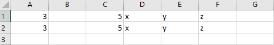
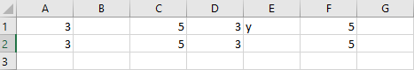

# Cut, copy, and paste ranges using the Excel JavaScript API

This article provides code samples that cut, copy, and paste ranges using the Excel JavaScript API. For the complete list of properties and methods that the `Range` object supports, see [Excel.Range class](/javascript/api/excel/excel.range).

[!include[Excel cells and ranges note](../includes/note-excel-cells-and-ranges.md)]

> [!TIP]
> To experiment with the cut, copy, and paste APIs from this article in a complete sample, open [Script Lab](../overview/explore-with-script-lab.md) in Excel and select [Copy and paste ranges](https://github.com/OfficeDev/office-js-snippets/blob/prod/samples/excel/20-data-types/data-types-entity-values.yaml) in our **Samples** library.

## Copy and paste

The [Range.copyFrom](/javascript/api/excel/excel.range#excel-excel-range-copyfrom-member(1)) method replicates the **Copy** and **Paste** actions of the Excel UI. The destination is the `Range` object that `copyFrom` is called on. The source to be copied is passed as a range or a string address representing a range.

The following code sample copies the data from **A1:E1** into the range starting at **G1** (which ends up pasting into **G1:K1**).

```js
await Excel.run(async (context) => {
    let sheet = context.workbook.worksheets.getItem("Sample");
    // Copy everything from "A1:E1" into "G1" and the cells afterwards ("G1:K1").
    sheet.getRange("G1").copyFrom("A1:E1");
    await context.sync();
});
```

`Range.copyFrom` has three optional parameters.

```TypeScript
copyFrom(sourceRange: Range | RangeAreas | string, copyType?: Excel.RangeCopyType, skipBlanks?: boolean, transpose?: boolean): void;
```

`copyType` specifies what data gets copied from the source to the destination.

- `Excel.RangeCopyType.formulas` transfers the formulas in the source cells and preserves the relative positioning of those formulas' ranges. Any non-formula entries are copied as-is.
- `Excel.RangeCopyType.values` copies the data values and, in the case of formulas, the result of the formula.
- `Excel.RangeCopyType.formats` copies the formatting of the range, including font, color, and other format settings, but no values.
- `Excel.RangeCopyType.all` (the default option) copies both data and formatting, preserving cells' formulas if found.

`skipBlanks` sets whether blank cells are copied into the destination. When true, `copyFrom` skips blank cells in the source range.
Skipped cells will not overwrite the existing data of their corresponding cells in the destination range. The default is false.

`transpose` determines whether or not the data is transposed, meaning its rows and columns are switched, into the source location.
A transposed range is flipped along the main diagonal, so rows **1**, **2**, and **3** will become columns **A**, **B**, and **C**.

The following code sample and images demonstrate this behavior in a simple scenario.

```js
await Excel.run(async (context) => {
    let sheet = context.workbook.worksheets.getItem("Sample");
    // Copy a range, omitting the blank cells so existing data is not overwritten in those cells.
    sheet.getRange("D1").copyFrom("A1:C1",
        Excel.RangeCopyType.all,
        true, // skipBlanks
        false); // transpose
    // Copy a range, including the blank cells which will overwrite existing data in the target cells.
    sheet.getRange("D2").copyFrom("A2:C2",
        Excel.RangeCopyType.all,
        false, // skipBlanks
        false); // transpose
    await context.sync();
});
```

### Data before range is copied and pasted



### Data after range is copied and pasted



## Cut and paste (move) cells

The [Range.moveTo](/javascript/api/excel/excel.range#excel-excel-range-moveto-member(1)) method moves cells to a new location in the workbook. This cell movement behavior works the same as when cells are moved by [dragging the range border](https://support.microsoft.com/office/803d65eb-6a3e-4534-8c6f-ff12d1c4139e) or when taking the **Cut** and **Paste** actions. Both the formatting and values of the range are moved to the location specified as the `destinationRange` parameter.

The following code sample moves a range with the `Range.moveTo` method. Note that if the destination range is smaller than the source, it will be expanded to encompass the source content.

```js
await Excel.run(async (context) => {
    let sheet = context.workbook.worksheets.getActiveWorksheet();
    sheet.getRange("F1").values = [["Moved Range"]];

    // Move the cells "A1:E1" to "G1" (which fills the range "G1:K1").
    sheet.getRange("A1:E1").moveTo("G1");
    await context.sync();
});
```

## See also

- [Excel JavaScript object model in Office Add-ins](excel-add-ins-core-concepts.md)
- [Work with cells using the Excel JavaScript API](excel-add-ins-cells.md)
- [Remove duplicates using the Excel JavaScript API](excel-add-ins-ranges-remove-duplicates.md)
- [Work with multiple ranges simultaneously in Excel add-ins](excel-add-ins-multiple-ranges.md)
