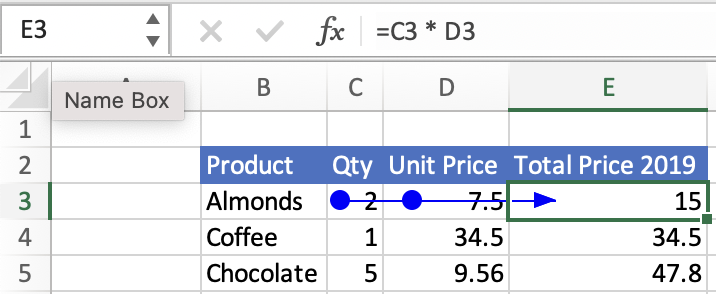
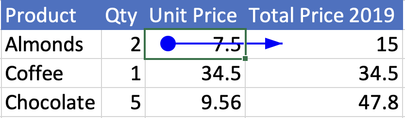

# Get formula precedents and dependents using the Excel JavaScript API

Excel formulas often refer to other cells. Those input cells are the formula's "precedents". Any formula cell that depends on other cells is a "dependent" of those cells. To learn more about the related Excel UI features, see [Display the relationships between formulas and cells](https://support.microsoft.com/office/a59bef2b-3701-46bf-8ff1-d3518771d507).

Chains of precedents and dependents can form. A precedent can itself have precedents, and so on. The same idea applies to dependents. A "direct precedent" or "direct dependent" is only the first level: the cells a formula points to, or the cells that point straight to a formula.

This article provides code samples that retrieve the precedents and dependents of formulas using the Excel JavaScript API. For the complete list of properties and methods that the `Range` object supports, see [Range Object (JavaScript API for Excel)](/javascript/api/excel/excel.range).

## Key points

- Use `getPrecedents` or `getDependents` to get all related cells. Use `getDirectPrecedents` or `getDirectDependents` to get only the first level.
- Both APIs return a `WorkbookRangeAreas` object. It groups addresses by worksheet. Look in each `areas.items` list for the individual `Range` objects.
- Very large sets, such as thousands of cells, can be slow. Start with the direct methods or narrow the selection first.
- These APIs do not cross workbook boundaries.
- If there are no related cells, an `ItemNotFound` error is thrown. Catch it and show a friendly message.
- If you highlight cells, give users a way to clear the formatting.

## Get the precedents of a formula

Locate a formula's precedent cells with [Range.getPrecedents](/javascript/api/excel/excel.range#excel-excel-range-getprecedents-member(1)). `Range.getPrecedents` returns a `WorkbookRangeAreas` object. This object contains the addresses of all the precedents in the workbook. It has a separate `RangeAreas` object for each worksheet containing at least one formula precedent. To learn more about the `RangeAreas` object, see [Work with multiple ranges simultaneously in Excel add-ins](excel-add-ins-multiple-ranges.md).

To locate only the direct precedent cells of a formula, use [Range.getDirectPrecedents](/javascript/api/excel/excel.range#excel-excel-range-getdirectprecedents-member(1)). `Range.getDirectPrecedents` works like `Range.getPrecedents` and returns a `WorkbookRangeAreas` object containing the addresses of direct precedents.

The following screenshot shows the result of selecting the **Trace Precedents** button in the Excel UI. This button draws an arrow from precedent cells to the selected cell. The selected cell, **E3**, contains the formula "=C3 * D3", so both **C3** and **D3** are precedent cells. Unlike the Excel UI button, the `getPrecedents` and `getDirectPrecedents` methods don't draw arrows.



> [!IMPORTANT]
> The `getPrecedents` and `getDirectPrecedents` methods don't retrieve precedent cells across workbooks.

The following code sample shows how to work with the `Range.getPrecedents` and `Range.getDirectPrecedents` methods. The sample gets the precedents for the active range and then changes the background color of those precedent cells. The background color of the direct precedent cells is set to yellow and the background color of the other precedent cells is set to orange.

```js
// This code sample shows how to find and highlight the precedents 
// and direct precedents of the currently selected cell.
await Excel.run(async (context) => {
  let range = context.workbook.getActiveCell();
  // Precedents are all cells that provide data to the selected formula.
  let precedents = range.getPrecedents();
  // Direct precedents are the parent cells, or the first preceding group of cells that provide data to the selected formula.    
  let directPrecedents = range.getDirectPrecedents();

  range.load("address");
  precedents.areas.load("address");
  directPrecedents.areas.load("address");
  
  await context.sync();

  console.log(`All precedent cells of ${range.address}:`);
  
  // Use the precedents API to loop through all precedents of the active cell.
  for (let i = 0; i < precedents.areas.items.length; i++) {
    // Highlight and print out the address of all precedent cells.
    precedents.areas.items[i].format.fill.color = "Orange";
    console.log(`  ${precedents.areas.items[i].address}`);
  }

  console.log(`Direct precedent cells of ${range.address}:`);

  // Use the direct precedents API to loop through direct precedents of the active cell.
  for (let i = 0; i < directPrecedents.areas.items.length; i++) {
    // Highlight and print out the address of each direct precedent cell.
    directPrecedents.areas.items[i].format.fill.color = "Yellow";
    console.log(`  ${directPrecedents.areas.items[i].address}`);
  }
});
```

> [!NOTE]
> The `Range.getPrecedents` and `Range.getDirectPrecedents` methods return an `ItemNotFound` error if no precedent cells are found. Catch this and provide a user-friendly message.

## Get the dependents of a formula

Locate a formula's dependent cells with [Range.getDependents](/javascript/api/excel/excel.range#excel-excel-range-getdependents-member(1)). Like `Range.getPrecedents`, `Range.getDependents` also returns a `WorkbookRangeAreas` object. This object contains the addresses of all the dependents in the workbook. It has a separate `RangeAreas` object for each worksheet containing at least one formula dependent. For more information on working with the `RangeAreas` object, see [Work with multiple ranges simultaneously in Excel add-ins](excel-add-ins-multiple-ranges.md).

To locate only the direct dependent cells of a formula, use [Range.getDirectDependents](/javascript/api/excel/excel.range#excel-excel-range-getdirectdependents-member(1)). `Range.getDirectDependents` works like `Range.getDependents` and returns a `WorkbookRangeAreas` object containing the addresses of direct dependents.

The following screenshot shows the result of selecting the **Trace Dependents** button in the Excel UI. This button draws an arrow from the selected cell to dependent cells. The selected cell, **D3**, has cell **E3** as a dependent. **E3** contains the formula "=C3 * D3". Unlike the Excel UI button, the `getDependents` and `getDirectDependents` methods don't draw arrows.



> [!IMPORTANT]
> The `getDependents` and `getDirectDependents` methods don't retrieve dependent cells across workbooks.

The following code sample shows how to work with the `Range.getDependents` and `Range.getDirectDependents` methods. The sample gets the dependents for the active range and then changes the background color of those dependent cells. The background color of the direct dependent cells is set to yellow and the background color of the other dependent cells is set to orange.

```js
// This code sample shows how to find and highlight the dependents 
// and direct dependents of the currently selected cell.
await Excel.run(async (context) => {
    let range = context.workbook.getActiveCell();
    // Dependents are all cells that contain formulas that refer to other cells.
    let dependents = range.getDependents();  
    // Direct dependents are the child cells, or the first succeeding group of cells in a sequence of cells that refer to other cells.
    let directDependents = range.getDirectDependents();

    range.load("address");
    dependents.areas.load("address");    
    directDependents.areas.load("address");
    
    await context.sync();

    console.log(`All dependent cells of ${range.address}:`);
    
    // Use the dependents API to loop through all dependents of the active cell.
    for (let i = 0; i < dependents.areas.items.length; i++) {
      // Highlight and print out the addresses of all dependent cells.
      dependents.areas.items[i].format.fill.color = "Orange";
      console.log(`  ${dependents.areas.items[i].address}`);
    }

    console.log(`Direct dependent cells of ${range.address}:`);

    // Use the direct dependents API to loop through direct dependents of the active cell.
    for (let i = 0; i < directDependents.areas.items.length; i++) {
      // Highlight and print the address of each dependent cell.
      directDependents.areas.items[i].format.fill.color = "Yellow";
      console.log(`  ${directDependents.areas.items[i].address}`);
    }
});
```

> [!NOTE]
> The `Range.getDependents` and `Range.getDirectDependents` methods return an `ItemNotFound` error if no dependent cells are found. Catch this and provide a user-friendly message.

## See also

- [Excel JavaScript object model in Office Add-ins](excel-add-ins-core-concepts.md)
- [Work with cells using the Excel JavaScript API](excel-add-ins-cells.md)
- [Work with multiple ranges simultaneously in Excel add-ins](excel-add-ins-multiple-ranges.md)
