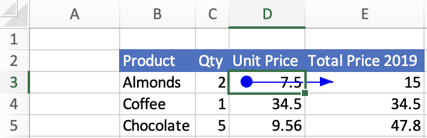

# Get formula precedents and dependents using the Excel JavaScript API

Excel formulas often refer to other cells. These cross-cell references are known as "precedents" and "dependents". A precedent is a cell that provides data to a formula. A dependent is a cell that contains a formula that refers to other cells. To learn more about Excel features related to relationships between cells, see [Display the relationships between formulas and cells](https://support.microsoft.com/office/a59bef2b-3701-46bf-8ff1-d3518771d507).

A cell may have a precedent cell, and that precedent cell may have its own precedent cells. A "direct precedent" is the first preceding group of cells in this sequence, similar to the concept of parents in a parent-child relationship. A "direct dependent" is the first dependent group of cells in a sequence, similar to children in a parent-child relationship. Cells that refer to other cells in a workbook, but whose relationship is not a parent-child relationship, are not direct dependents or direct precedents.

This article provides code samples that retrieve precedents and dependents of formulas using the Excel JavaScript API. For the complete list of properties and methods that the `Range` object supports, see [Range Object (JavaScript API for Excel)](/javascript/api/excel/excel.range).

## Get the precedents of a formula

Locate a formula's precedent cells with [Range.getPrecedents](/javascript/api/excel/excel.range#getPrecedents__). `Range.getPrecedents` returns a `WorkbookRangeAreas` object. This object contains the addresses of all the precedents in the workbook. It has a separate `RangeAreas` object for each worksheet containing at least one formula precedent. To learn more about the `RangeAreas` object, see [Work with multiple ranges simultaneously in Excel add-ins](excel-add-ins-multiple-ranges.md).

To locate only the direct precedent cells of a formula, use [Range.getDirectPrecedents](/javascript/api/excel/excel.range#getDirectPrecedents__). `Range.getDirectPrecedents` works like `Range.getPrecedents` and returns a `WorkbookRangeAreas` object containing the addresses of direct precedents.

The following screenshot shows the result of selecting the **Trace Precedents** button in the Excel UI. This button draws an arrow from precedent cells to the selected cell. The selected cell, **E3**, contains the formula "=C3 * D3", so both **C3** and **D3** are precedent cells. Unlike the Excel UI button, the `getPrecedents` and `getDirectPrecedents` methods don't draw arrows.


> [!IMPORTANT]
> The `getPrecedents` and `getDirectPrecedents` methods don't retrieve precedent cells across workbooks.

The following code sample shows how to work with the `Range.getPrecedents` and `Range.getDirectPrecedents` methods. The sample gets the precedents for the active range and then changes the background color of those precedent cells. The background color of the direct precedent cells is set to yellow and the background color of the other precedent cells is set to orange.

```js
// This code sample shows how to find and highlight the precedents 
// and direct precedents of the currently selected cell.
Excel.run(function (context) {
  var range = context.workbook.getActiveCell();
  // Precedents are all cells that provide data to the selected formula.
  var precedents = range.getPrecedents();
  // Direct precedents are the parent cells, or the first preceding group of cells that provide data to the selected formula.    
  var directPrecedents = range.getDirectPrecedents();

  range.load("address");
  precedents.areas.load("address");
  directPrecedents.areas.load("address");
  
  return context.sync()
    .then(function () {
      console.log(`All precedent cells of ${range.address}:`);
      
      // Use the precedents API to loop through all precedents of the active cell.
      for (var i = 0; i < precedents.areas.items.length; i++) {
        // Highlight and print out the address of all precedent cells.
        precedents.areas.items[i].format.fill.color = "Orange";
        console.log(`  ${precedents.areas.items[i].address}`);
      }

      console.log(`Direct precedent cells of ${range.address}:`);

      // Use the direct precedents API to loop through direct precedents of the active cell.
      for (var i = 0; i < directPrecedents.areas.items.length; i++) {
        // Highlight and print out the address of each direct precedent cell.
        directPrecedents.areas.items[i].format.fill.color = "Yellow";
        console.log(`  ${directPrecedents.areas.items[i].address}`);
      }
    });
}).catch(errorHandlerFunction);
```

## Get the direct dependents of a formula

Locate a formula's direct dependent cells with [Range.getDirectDependents](/javascript/api/excel/excel.range#getDirectDependents__). Like `Range.getDirectPrecedents`, `Range.getDirectDependents` also returns a `WorkbookRangeAreas` object. This object contains the addresses of all the direct dependents in the workbook. It has a separate `RangeAreas` object for each worksheet containing at least one formula dependent. For more information on working with the `RangeAreas` object, see [Work with multiple ranges simultaneously in Excel add-ins](excel-add-ins-multiple-ranges.md).

The following screenshot shows the result of selecting the **Trace Dependents** button in the Excel UI. This button draws an arrow from dependent cells to the selected cell. The selected cell, **D3**, has cell **E3** as a dependent. **E3** contains the formula "=C3 * D3". Unlike the Excel UI button, the `getDirectDependents` method does not draw arrows.



> [!IMPORTANT]
> The `getDirectDependents` method can't retrieve dependent cells across workbooks.

The following code sample gets the direct dependents for the active range and then changes the background color of those dependent cells to yellow.

```js
// This code sample shows how to find and highlight the dependents of the currently selected cell.
Excel.run(function (context) {
    // Direct dependents are cells that contain formulas that refer to other cells.
    var range = context.workbook.getActiveCell();
    var directDependents = range.getDirectDependents();
    range.load("address");
    directDependents.areas.load("address");
    
    return context.sync()
        .then(function () {
            console.log(`Direct dependent cells of ${range.address}:`);
    
            // Use the direct dependents API to loop through direct dependents of the active cell.
            for (var i = 0; i < directDependents.areas.items.length; i++) {
              // Highlight and print the address of each dependent cell.
              directDependents.areas.items[i].format.fill.color = "Yellow";
              console.log(`  ${directDependents.areas.items[i].address}`);
            }
        });
}).catch(errorHandlerFunction);
```

## See also

- [Excel JavaScript object model in Office Add-ins](excel-add-ins-core-concepts.md)
- [Work with cells using the Excel JavaScript API](excel-add-ins-cells.md)
- [Work with multiple ranges simultaneously in Excel add-ins](excel-add-ins-multiple-ranges.md)
