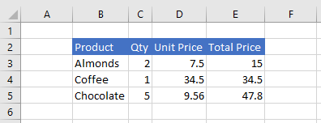

# Set range format using the Excel JavaScript API

This article provides code samples that set font color, fill color, and number format for cells in a range with the Excel JavaScript API. For the complete list of properties and methods that the `Range` object supports, see [Excel.Range class](/javascript/api/excel/excel.range).

[!include[Excel cells and ranges note](../includes/note-excel-cells-and-ranges.md)]

## Set font color and fill color

The following code sample sets the font color and fill color for cells in range **B2:E2**.

```js
await Excel.run(async (context) => {
    let sheet = context.workbook.worksheets.getItem("Sample");

    let range = sheet.getRange("B2:E2");
    range.format.fill.color = "#4472C4";
    range.format.font.color = "white";

    await context.sync();
});
```

### Data in range before font color and fill color are set


### Data in range after font color and fill color are set



## Set number format

The following code sample sets the number format for the cells in range **D3:E5**.

```js
await Excel.run(async (context) => {
    let sheet = context.workbook.worksheets.getItem("Sample");

    let formats = [
        ["0.00", "0.00"],
        ["0.00", "0.00"],
        ["0.00", "0.00"]
    ];

    let range = sheet.getRange("D3:E5");
    range.numberFormat = formats;

    await context.sync();
});
```

### Data in range before number format is set


### Data in range after number format is set


## See also

- [Excel JavaScript object model in Office Add-ins](excel-add-ins-core-concepts.md)
- [Work with cells using the Excel JavaScript API](excel-add-ins-cells.md)
- [Set and get ranges using the Excel JavaScript API](excel-add-ins-ranges-set-get.md)
- [Set and get range values, text, or formulas using the Excel JavaScript API](excel-add-ins-ranges-set-get-values.md)
