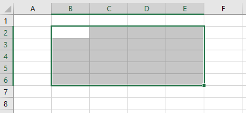
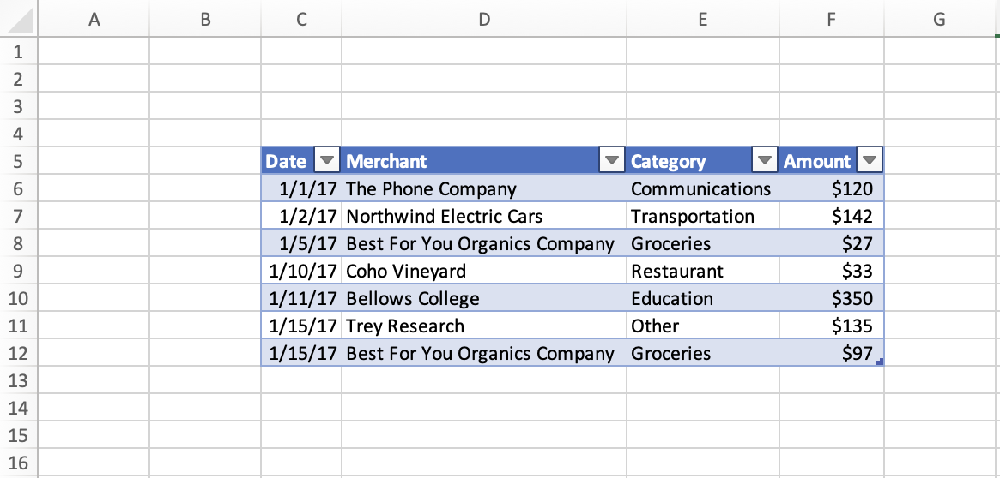
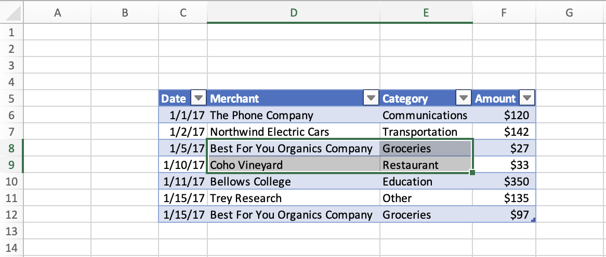
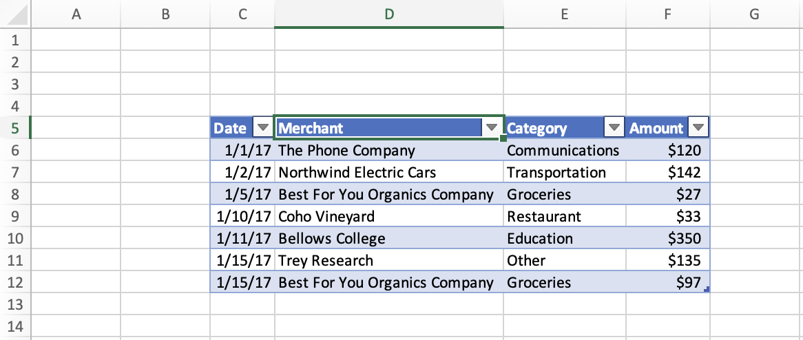
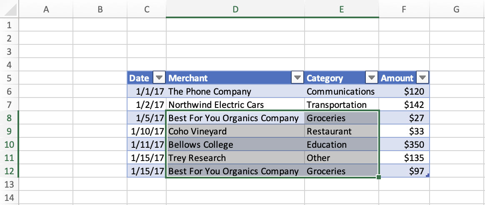

# Set and get the selected range using the Excel JavaScript API

This article provides code samples that set and get the selected range with the Excel JavaScript API. For the complete list of properties and methods that the `Range` object supports, see [Excel.Range class](/javascript/api/excel/excel.range).

[!include[Excel cells and ranges note](../includes/note-excel-cells-and-ranges.md)]

## Set the selected range

The following code sample selects the range **B2:E6** in the active worksheet.

```js
await Excel.run(async (context) => {
    let sheet = context.workbook.worksheets.getActiveWorksheet();
    let range = sheet.getRange("B2:E6");

    range.select();

    await context.sync();
});
```

### Selected range B2:E6



## Get the selected range

The following code sample gets the selected range, loads its `address` property, and writes a message to the console.

```js
await Excel.run(async (context) => {
    let range = context.workbook.getSelectedRange();
    range.load("address");

    await context.sync();
    
    console.log(`The address of the selected range is "${range.address}"`);
});
```

## Select the edge of a used range

The [Range.getRangeEdge](/javascript/api/excel/excel.range#excel-excel-range-getrangeedge-member(1)) and [Range.getExtendedRange](/javascript/api/excel/excel.range#excel-excel-range-getextendedrange-member(1)) methods let your add-in replicate the behavior of the keyboard selection shortcuts, selecting the edge of the used range based on the currently selected range. To learn more about used ranges, see [Get used range](excel-add-ins-ranges-get.md#get-used-range).

In the following screenshot, the used range is the table with values in each cell, **C5:F12**. The empty cells outside this table are outside the used range.



### Select the cell at the edge of the current used range

The following code sample shows how use the `Range.getRangeEdge` method to select the cell at the furthest edge of the current used range, in the direction up. This action matches the result of using the <kbd>Ctrl</kbd>+<kbd>Up arrow key</kbd> keyboard shortcut while a range is selected.

```js
await Excel.run(async (context) => {
    // Get the selected range.
    let range = context.workbook.getSelectedRange();

    // Specify the direction with the `KeyboardDirection` enum.
    let direction = Excel.KeyboardDirection.up;

    // Get the active cell in the workbook.
    let activeCell = context.workbook.getActiveCell();

    // Get the top-most cell of the current used range.
    // This method acts like the Ctrl+Up arrow key keyboard shortcut while a range is selected.
    let rangeEdge = range.getRangeEdge(
      direction,
      activeCell
    );
    rangeEdge.select();

    await context.sync();
});
```

#### Before selecting the cell at the edge of the used range

The following screenshot shows a used range and a selected range within the used range. The used range is a table with data at **C5:F12**. Inside this table, the range **D8:E9** is selected. This selection is the *before* state, prior to running the `Range.getRangeEdge` method.



#### After selecting the cell at the edge of the used range

The following screenshot shows the same table as the preceding screenshot, with data in the range **C5:F12**. Inside this table, the range **D5** is selected. This selection is *after* state, after running the `Range.getRangeEdge` method to select the cell at the edge of the used range in the up direction.



### Select all cells from current range to furthest edge of used range

The following code sample shows how use the `Range.getExtendedRange` method to to select all the cells from the currently selected range to the furthest edge of the used range, in the direction down. This action matches the result of using the <kbd>Ctrl</kbd>+<kbd>Shift</kbd>+<kbd>Down arrow key</kbd> keyboard shortcut while a range is selected.

```js
await Excel.run(async (context) => {
    // Get the selected range.
    let range = context.workbook.getSelectedRange();

    // Specify the direction with the `KeyboardDirection` enum.
    let direction = Excel.KeyboardDirection.down;

    // Get the active cell in the workbook.
    let activeCell = context.workbook.getActiveCell();

    // Get all the cells from the currently selected range to the bottom-most edge of the used range.
    // This method acts like the Ctrl+Shift+Down arrow key keyboard shortcut while a range is selected.
    let extendedRange = range.getExtendedRange(
      direction,
      activeCell
    );
    extendedRange.select();

    await context.sync();
});
```

#### Before selecting all the cells from the current range to the edge of the used range

The following screenshot shows a used range and a selected range within the used range. The used range is a table with data at **C5:F12**. Inside this table, the range **D8:E9** is selected. This selection is the *before* state, prior to running the `Range.getExtendedRange` method.


#### After selecting all the cells from the current range to the edge of the used range

The following screenshot shows the same table as the preceding screenshot, with data in the range **C5:F12**. Inside this table, the range **D8:E12** is selected. This selection is *after* state, after running the `Range.getExtendedRange` method to select all the cells from the current range to the edge of the used range in the down direction.



## See also

- [Excel JavaScript object model in Office Add-ins](excel-add-ins-core-concepts.md)
- [Work with cells using the Excel JavaScript API](excel-add-ins-cells.md)
- [Set and get range values, text, or formulas using the Excel JavaScript API](excel-add-ins-ranges-set-get-values.md)
- [Set range format using the Excel JavaScript API](excel-add-ins-ranges-set-format.md)
