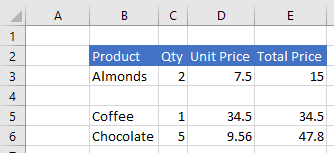
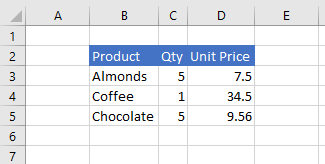
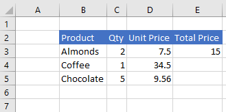

# Work with ranges using the Excel JavaScript API

This article provides code samples that show how to perform common tasks with ranges using the Excel JavaScript API. For the complete list of properties and methods that the **Range** object supports, see [Range Object (JavaScript API for Excel)](/javascript/api/excel/excel.range).

> [!NOTE]
> For code samples that show how to perform more advanced tasks with ranges, see [Work with ranges using the Excel JavaScript API (advanced)](excel-add-ins-ranges-advanced.md).

## Get a range

The following examples show different ways to get a reference to a range within a worksheet.

### Get range by address

The following code sample gets the range with address **B2:B5** from the worksheet named **Sample**, loads its **address** property, and writes a message to the console.

```js
Excel.run(function (context) {
    var sheet = context.workbook.worksheets.getItem("Sample");
    var range = sheet.getRange("B2:C5");
    range.load("address");

    return context.sync()
        .then(function () {
            console.log(`The address of the range B2:C5 is "${range.address}"`);
        });
}).catch(errorHandlerFunction);
```

### Get range by name

The following code sample gets the range named **MyRange** from the worksheet named **Sample**, loads its **address** property, and writes a message to the console.

```js
Excel.run(function (context) {
    var sheet = context.workbook.worksheets.getItem("Sample");
    var range = sheet.getRange("MyRange");
    range.load("address");

    return context.sync()
        .then(function () {
            console.log(`The address of the range "MyRange" is "${range.address}"`);
        });
}).catch(errorHandlerFunction);
```

### Get used range

The following code sample gets the used range from the worksheet named **Sample**, loads its **address** property, and writes a message to the console. The used range is the smallest range that encompasses any cells in the worksheet that have a value or formatting assigned to them. If the entire worksheet is blank, the **getUsedRange()** method returns a range that consists of only the top-left cell in the worksheet.

```js
Excel.run(function (context) {
    var sheet = context.workbook.worksheets.getItem("Sample");
    var range = sheet.getUsedRange();
    range.load("address");

    return context.sync()
        .then(function () {
            console.log(`The address of the used range in the worksheet is "${range.address}"`);
        });
}).catch(errorHandlerFunction);
```

### Get entire range

The following code sample gets the entire worksheet range from the worksheet named **Sample**, loads its **address** property, and writes a message to the console.

```js
Excel.run(function (context) {
    var sheet = context.workbook.worksheets.getItem("Sample");
    var range = sheet.getRange();
    range.load("address");

    return context.sync()
        .then(function () {
            console.log(`The address of the entire worksheet range is "${range.address}"`);
        });
}).catch(errorHandlerFunction);
```

## Insert a range of cells

The following code sample inserts a range of cells in location **B4:E4** and shifts other cells down to provide space for the new cells.

```js
Excel.run(function (context) {
    var sheet = context.workbook.worksheets.getItem("Sample");
    var range = sheet.getRange("B4:E4");

    range.insert(Excel.InsertShiftDirection.down);
    
    return context.sync();
}).catch(errorHandlerFunction);
```

**Data before range is inserted**


**Data after range is inserted**



## Clear a range of cells

The following code sample clears all contents and formatting of cells in the range **E2:E5**.  

```js
Excel.run(function (context) {
    var sheet = context.workbook.worksheets.getItem("Sample");
    var range = sheet.getRange("E2:E5");

    range.clear();

    return context.sync();
}).catch(errorHandlerFunction);
```

**Data before range is cleared**


**Data after range is cleared**


## Delete a range of cells

The following code sample deletes the cells in the range **B4:E4** and shift other cells up to fill the space that was vacated by the deleted cells.

```js
Excel.run(function (context) {
    var sheet = context.workbook.worksheets.getItem("Sample");
    var range = sheet.getRange("B4:E4");

    range.delete(Excel.DeleteShiftDirection.up);

    return context.sync();
}).catch(errorHandlerFunction);
```

**Data before range is deleted**


**Data after range is deleted**


## Set the selected range

The following code sample selects the range **B2:E6** in the active worksheet.

```js
Excel.run(function (context) {
    var sheet = context.workbook.worksheets.getActiveWorksheet();
    var range = sheet.getRange("B2:E6");

    range.select();

    return context.sync();
}).catch(errorHandlerFunction);
```

**Selected range B2:E6**


## Get the selected range

The following code sample gets the selected range, loads its **address** property, and writes a message to the console. 

```js
Excel.run(function (context) {
    var range = context.workbook.getSelectedRange();
    range.load("address");

    return context.sync()
        .then(function () {
            console.log(`The address of the selected range is "${range.address}"`);
        });
}).catch(errorHandlerFunction);
```

## Set values or formulas

The following examples show how to set values and formulas for a single cell or a range of cells.

### Set value for a single cell

The following code sample sets the value of cell **C3** to "5" and then sets the width of the columns to best fit the data.

```js
Excel.run(function (context) {
    var sheet = context.workbook.worksheets.getItem("Sample");

    var range = sheet.getRange("C3");
    range.values = [[ 5 ]];
    range.format.autofitColumns();

    return context.sync();
}).catch(errorHandlerFunction);
```

**Data before cell value is updated**


**Data after cell value is updated**



### Set values for a range of cells

The following code sample sets values for the cells in the range **B5:D5** and then sets the width of the columns to best fit the data.

```js
Excel.run(function (context) {
    var sheet = context.workbook.worksheets.getItem("Sample");

    var data = [
        ["Potato Chips", 10, 1.80],
    ];
    
    var range = sheet.getRange("B5:D5");
    range.values = data;
    range.format.autofitColumns();

    return context.sync();
}).catch(errorHandlerFunction);
```

**Data before cell values are updated**


**Data after cell values are updated**


### Set formula for a single cell

The following code sample sets a formula for cell **E3** and then sets the width of the columns to best fit the data.

```js
Excel.run(function (context) {
    var sheet = context.workbook.worksheets.getItem("Sample");

    var range = sheet.getRange("E3");
    range.formulas = [[ "=C3 * D3" ]];
    range.format.autofitColumns();

    return context.sync();
}).catch(errorHandlerFunction);
```

**Data before cell formula is set**


**Data after cell formula is set**



### Set formulas for a range of cells

The following code sample sets formulas for cells in the range **E2:E6** and then sets the width of the columns to best fit the data.

```js
Excel.run(function (context) {
    var sheet = context.workbook.worksheets.getItem("Sample");

    var data = [
        ["=C3 * D3"],
        ["=C4 * D4"],
        ["=C5 * D5"],
        ["=SUM(E3:E5)"]
    ];
    
    var range = sheet.getRange("E3:E6");
    range.formulas = data;
    range.format.autofitColumns();

    return context.sync();
}).catch(errorHandlerFunction);
```

**Data before cell formulas are set**


**Data after cell formulas are set**


## Get values, text, or formulas

These examples show how to get values, text, and formulas from a range of cells.

### Get values from a range of cells

The following code sample gets the range **B2:E6**, loads its **values** property, and writes the values to the console. The **values** property of a range specifies the raw values that the cells contain. Even if some cells in a range contain formulas, the **values** property of the range specifies the raw values for those cells, not any of the formulas.

```js
Excel.run(function (context) {
    var sheet = context.workbook.worksheets.getItem("Sample");
    var range = sheet.getRange("B2:E6");
    range.load("values");

    return context.sync()
        .then(function () {
            console.log(JSON.stringify(range.values, null, 4));
        });
}).catch(errorHandlerFunction);
```

**Data in range (values in column E are a result of formulas)**


**range.values (as logged to the console by the code sample above)**

```json
[
    [
        "Product",
        "Qty",
        "Unit Price",
        "Total Price"
    ],
    [
        "Almonds",
        2,
        7.5,
        15
    ],
    [
        "Coffee",
        1,
        34.5,
        34.5
    ],
    [
        "Chocolate",
        5,
        9.56,
        47.8
    ],
    [
        "",
        "",
        "",
        97.3
    ]
]
```

### Get text from a range of cells

The following code sample gets the range **B2:E6**, loads its **text** property, and writes it to the console.  The **text** property of a range specifies the display values for cells in the range. Even if some cells in a range contain formulas, the **text** property of the range specifies the display values for those cells, not any of the formulas.

```js
Excel.run(function (context) {
    var sheet = context.workbook.worksheets.getItem("Sample");
    var range = sheet.getRange("B2:E6");
    range.load("text");

    return context.sync()
        .then(function () {
            console.log(JSON.stringify(range.text, null, 4));
        });
}).catch(errorHandlerFunction);
```

**Data in range (values in column E are a result of formulas)**


**range.text (as logged to the console by the code sample above)**

```json
[
    [
        "Product",
        "Qty",
        "Unit Price",
        "Total Price"
    ],
    [
        "Almonds",
        "2",
        "7.5",
        "15"
    ],
    [
        "Coffee",
        "1",
        "34.5",
        "34.5"
    ],
    [
        "Chocolate",
        "5",
        "9.56",
        "47.8"
    ],
    [
        "",
        "",
        "",
        "97.3"
    ]
]
```

### Get formulas from a range of cells

The following code sample gets the range **B2:E6**, loads its **formulas** property, and writes it to the console.  The **formulas** property of a range specifies the formulas for cells in the range that contain formulas and the raw values for cells in the range that do not contain formulas.

```js
Excel.run(function (context) {
    var sheet = context.workbook.worksheets.getItem("Sample");
    var range = sheet.getRange("B2:E6");
    range.load("formulas");

    return context.sync()
        .then(function () {
            console.log(JSON.stringify(range.formulas, null, 4));
        });
}).catch(errorHandlerFunction);
```

**Data in range (values in column E are a result of formulas)**


**range.formulas (as logged to the console by the code sample above)**

```json
[
    [
        "Product",
        "Qty",
        "Unit Price",
        "Total Price"
    ],
    [
        "Almonds",
        2,
        7.5,
        "=C3 * D3"
    ],
    [
        "Coffee",
        1,
        34.5,
        "=C4 * D4"
    ],
    [
        "Chocolate",
        5,
        9.56,
        "=C5 * D5"
    ],
    [
        "",
        "",
        "",
        "=SUM(E3:E5)"
    ]
]
```

## Set range format

The following examples show how to set font color, fill color, and number format for cells in a range.

### Set font color and fill color

The following code sample sets the font color and fill color for cells in range **B2:E2**.

```js
Excel.run(function (context) {
    var sheet = context.workbook.worksheets.getItem("Sample");

    var range = sheet.getRange("B2:E2");
    range.format.fill.color = "#4472C4";;
    range.format.font.color = "white";

    return context.sync();
}).catch(errorHandlerFunction);
```

**Data in range before font color and fill color are set**


**Data in range after font color and fill color are set**


### Set number format

The following code sample sets the number format for the cells in range **D3:E5**.

```js
Excel.run(function (context) {
    var sheet = context.workbook.worksheets.getItem("Sample");

    var formats = [
        ["0.00", "0.00"],
        ["0.00", "0.00"],
        ["0.00", "0.00"]
    ];

    var range = sheet.getRange("D3:E5");
    range.numberFormat = formats;

    return context.sync();
}).catch(errorHandlerFunction);
```

**Data in range before number format is set**


**Data in range after number format is set**


### Conditional formatting of ranges

Ranges can have formats applied to individual cells based on conditions. For more information about this, see [Apply conditional formatting to Excel ranges](excel-add-ins-conditional-formatting.md).

## Find a cell using string matching (preview)

> [!NOTE]
> The Range object's `find` function is currently available only in public preview. To use this feature, you must use the preview version of the Office JavaScript library from the [Office.js CDN](https://appsforoffice.microsoft.com/lib/beta/hosted/office.js). The [type definition file] (https://appsforoffice.microsoft.com/lib/beta/hosted/office.d.ts) for TypeScript compilation and Intellisense and is also found at the CDN. For more information on our upcoming APIs, please visit [Excel JavaScript API requirement sets](../reference/requirement-sets/excel-api-requirement-sets.md#excel-javascript-preview-apis).

The `Range` object has a `find` method to search for a specified string within the range. It returns the range of the first cell with matching text. The following code sample finds the first cell with a value equal to the string **Food** and logs its address to the console. Note that `find` throws an `ItemNotFound` error if the specified string doesn't exist in the range. If you expect that the specified string may not exist in the range, use the [findOrNullObject](excel-add-ins-advanced-concepts.md#42ornullobject-methods) method instead, so your code gracefully handles that scenario.

```js
Excel.run(function (context) {
    var sheet = context.workbook.worksheets.getItem("Sample");
    var table = sheet.tables.getItem("ExpensesTable");
    var searchRange = table.getRange();
    var foundRange = searchRange.find("Food", {
        completeMatch: true, // find will match the whole cell value
        matchCase: false, // find will not match case
        searchDirection: Excel.SearchDirection.forward // find will start searching at the beginning of the range
    });

    foundRange.load("address");
    return context.sync()
        .then(function() {
            console.log(foundRange.address);
    });
}).catch(errorHandlerFunction);
```

When the `find` method is called on a range representing a single cell, the entire worksheet is searched. The search begins at that cell and goes in the direction specified by `SearchCriteria.searchDirection`, wrapping around the ends of the worksheet if needed.

## See also

- [Work with ranges using the Excel JavaScript API (advanced)](excel-add-ins-ranges-advanced.md)
- [Fundamental programming concepts with the Excel JavaScript API](excel-add-ins-core-concepts.md)
