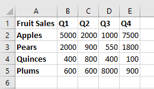
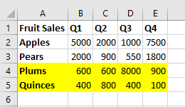
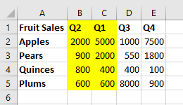

# Work with worksheets using the Excel JavaScript API

This article provides code samples that show how to perform common tasks with worksheets using the Excel JavaScript API. For the complete list of properties and methods that the `Worksheet` and `WorksheetCollection` objects support, see [Worksheet Object (JavaScript API for Excel)](/javascript/api/excel/excel.worksheet) and [WorksheetCollection Object (JavaScript API for Excel)](/javascript/api/excel/excel.worksheetcollection).

> [!NOTE]
> The information in this article applies only to regular worksheets; it does not apply to "chart" sheets or "macro" sheets.

## Get worksheets

The following code sample gets the collection of worksheets, loads the `name` property of each worksheet, and writes a message to the console.

```js
Excel.run(function (context) {
    var sheets = context.workbook.worksheets;
    sheets.load("items/name");

    return context.sync()
        .then(function () {
            if (sheets.items.length > 1) {
                console.log(`There are ${sheets.items.length} worksheets in the workbook:`);
            } else {
                console.log(`There is one worksheet in the workbook:`);
            }
            for (var i in sheets.items) {
                console.log(sheets.items[i].name);
            }
        });
}).catch(errorHandlerFunction);
```

> [!NOTE]
> The `id` property of a worksheet uniquely identifies the worksheet in a given workbook and its value will remain the same even when the worksheet is renamed or moved. When a worksheet is deleted from a workbook in Excel on Mac, the `id` of the deleted worksheet may be reassigned to a new worksheet that is subsequently created.

## Get the active worksheet

The following code sample gets the active worksheet, loads its `name` property, and writes a message to the console.

```js
Excel.run(function (context) {
    var sheet = context.workbook.worksheets.getActiveWorksheet();
    sheet.load("name");

    return context.sync()
        .then(function () {
            console.log(`The active worksheet is "${sheet.name}"`);
        });
}).catch(errorHandlerFunction);
```

## Set the active worksheet

The following code sample sets the active worksheet to the worksheet named **Sample**, loads its `name` property, and writes a message to the console. If there is no worksheet with that name, the `activate()` method throws an `ItemNotFound` error.

```js
Excel.run(function (context) {
    var sheet = context.workbook.worksheets.getItem("Sample");
    sheet.activate();
    sheet.load("name");

    return context.sync()
        .then(function () {
            console.log(`The active worksheet is "${sheet.name}"`);
        });
}).catch(errorHandlerFunction);
```

## Reference worksheets by relative position

These examples show how to reference a worksheet by its relative position.

### Get the first worksheet

The following code sample gets the first worksheet in the workbook, loads its `name` property, and writes a message to the console.

```js
Excel.run(function (context) {
    var firstSheet = context.workbook.worksheets.getFirst();
    firstSheet.load("name");

    return context.sync()
        .then(function () {
            console.log(`The name of the first worksheet is "${firstSheet.name}"`);
        });
}).catch(errorHandlerFunction);
```

### Get the last worksheet

The following code sample gets the last worksheet in the workbook, loads its `name` property, and writes a message to the console.

```js
Excel.run(function (context) {
    var lastSheet = context.workbook.worksheets.getLast();
    lastSheet.load("name");

    return context.sync()
        .then(function () {
            console.log(`The name of the last worksheet is "${lastSheet.name}"`);
        });
}).catch(errorHandlerFunction);
```

### Get the next worksheet

The following code sample gets the worksheet that follows the active worksheet in the workbook, loads its `name` property, and writes a message to the console. If there is no worksheet after the active worksheet, the `getNext()` method throws an `ItemNotFound` error.

```js
 Excel.run(function (context) {
    var currentSheet = context.workbook.worksheets.getActiveWorksheet();
    var nextSheet = currentSheet.getNext();
    nextSheet.load("name");

    return context.sync()
        .then(function () {
            console.log(`The name of the sheet that follows the active worksheet is "${nextSheet.name}"`);
        });
}).catch(errorHandlerFunction);
```

### Get the previous worksheet

The following code sample gets the worksheet that precedes the active worksheet in the workbook, loads its `name` property, and writes a message to the console. If there is no worksheet before the active worksheet, the `getPrevious()` method throws an `ItemNotFound` error.

```js
Excel.run(function (context) {
    var currentSheet = context.workbook.worksheets.getActiveWorksheet();
    var previousSheet = currentSheet.getPrevious();
    previousSheet.load("name");

    return context.sync()
        .then(function () {
            console.log(`The name of the sheet that precedes the active worksheet is "${previousSheet.name}"`);
        });
}).catch(errorHandlerFunction);
```

## Add a worksheet

The following code sample adds a new worksheet named **Sample** to the workbook, loads its `name` and `position` properties, and writes a message to the console. The new worksheet is added after all existing worksheets.

```js
Excel.run(function (context) {
    var sheets = context.workbook.worksheets;

    var sheet = sheets.add("Sample");
    sheet.load("name, position");

    return context.sync()
        .then(function () {
            console.log(`Added worksheet named "${sheet.name}" in position ${sheet.position}`);
        });
}).catch(errorHandlerFunction);
```

### Copy an existing worksheet

`Worksheet.copy` adds a new worksheet that is a copy of an existing worksheet. The new worksheet's name will have a number appended to the end, in a manner consistent with copying a worksheet through the Excel UI (for example, **MySheet (2)**). `Worksheet.copy` can take two parameters, both of which are optional:

- `positionType` - A [WorksheetPositionType](/javascript/api/excel/excel.worksheetpositiontype) enum specifying where in the workbook the new worksheet is to be added.
- `relativeTo` - If the `positionType` is `Before` or `After`, you need to specify a worksheet relative to which the new sheet is to be added (this parameter answers the question "Before or after what?").

The following code sample copies the current worksheet and inserts the new sheet directly after the current worksheet.

```js
Excel.run(function (context) {
    var myWorkbook = context.workbook;
    var sampleSheet = myWorkbook.worksheets.getActiveWorksheet();
    var copiedSheet = sampleSheet.copy(Excel.WorksheetPositionType.after, sampleSheet);
    return context.sync();
});
```

## Delete a worksheet

The following code sample deletes the final worksheet in the workbook (as long as it's not the only sheet in the workbook) and writes a message to the console.

```js
Excel.run(function (context) {
    var sheets = context.workbook.worksheets;
    sheets.load("items/name");

    return context.sync()
        .then(function () {
            if (sheets.items.length === 1) {
                console.log("Unable to delete the only worksheet in the workbook");
            } else {
                var lastSheet = sheets.items[sheets.items.length - 1];

                console.log(`Deleting worksheet named "${lastSheet.name}"`);
                lastSheet.delete();

                return context.sync();
            };
        });
}).catch(errorHandlerFunction);
```

> [!NOTE]
> A worksheet with a visibility of "[Very Hidden](/javascript/api/excel/excel.sheetvisibility)" cannot be deleted with the `delete` method. If you wish to delete the worksheet anyway, you must first change the visibility.

## Rename a worksheet

The following code sample changes the name of the active worksheet to **New Name**.

```js
Excel.run(function (context) {
    var currentSheet = context.workbook.worksheets.getActiveWorksheet();
    currentSheet.name = "New Name";

    return context.sync();
}).catch(errorHandlerFunction);
```

## Move a worksheet

The following code sample moves a worksheet from the last position in the workbook to the first position in the workbook.

```js
Excel.run(function (context) {
    var sheets = context.workbook.worksheets;
    sheets.load("items");

    return context.sync()
        .then(function () {
            var lastSheet = sheets.items[sheets.items.length - 1];
            lastSheet.position = 0;

            return context.sync();
        });
}).catch(errorHandlerFunction);
```

## Set worksheet visibility

These examples show how to set the visibility of a worksheet.

### Hide a worksheet

The following code sample sets the visibility of worksheet named **Sample** to hidden, loads its `name` property, and writes a message to the console.

```js
Excel.run(function (context) {
    var sheet = context.workbook.worksheets.getItem("Sample");
    sheet.visibility = Excel.SheetVisibility.hidden;
    sheet.load("name");

    return context.sync()
        .then(function () {
            console.log(`Worksheet with name "${sheet.name}" is hidden`);
        });
}).catch(errorHandlerFunction);
```

### Unhide a worksheet

The following code sample sets the visibility of worksheet named **Sample** to visible, loads its `name` property, and writes a message to the console.

```js
Excel.run(function (context) {
    var sheet = context.workbook.worksheets.getItem("Sample");
    sheet.visibility = Excel.SheetVisibility.visible;
    sheet.load("name");

    return context.sync()
        .then(function () {
            console.log(`Worksheet with name "${sheet.name}" is visible`);
        });
}).catch(errorHandlerFunction);
```

## Get a single cell within a worksheet

The following code sample gets the cell that is located in row 2, column 5 of the worksheet named **Sample**, loads its `address` and `values` properties, and writes a message to the console. The values that are passed into the `getCell(row: number, column:number)` method are the zero-indexed row number and column number for the cell that is being retrieved.

```js
Excel.run(function (context) {
    var sheet = context.workbook.worksheets.getItem("Sample");
    var cell = sheet.getCell(1, 4);
    cell.load("address, values");

    return context.sync()
        .then(function() {
            console.log(`The value of the cell in row 2, column 5 is "${cell.values[0][0]}" and the address of that cell is "${cell.address}"`);
        })
}).catch(errorHandlerFunction);
```

## Detect data changes

Your add-in may need to react to users changing the data in a worksheet. To detect these changes, you can [register an event handler](excel-add-ins-events.md#register-an-event-handler) for the `onChanged` event of a worksheet. Event handlers for the `onChanged` event receive a [WorksheetChangedEventArgs](/javascript/api/excel/excel.worksheetchangedeventargs) object when the event fires.

The `WorksheetChangedEventArgs` object provides information about the changes and the source. Since `onChanged` fires when either the format or value of the data changes, it can be useful to have your add-in check if the values have actually changed. The `details` property encapsulates this information as a [ChangedEventDetail](/javascript/api/excel/excel.changedeventdetail). The following code sample shows how to display the before and after values and types of a cell that has been changed.

```js
// This function would be used as an event handler for the Worksheet.onChanged event.
function onWorksheetChanged(eventArgs) {
    Excel.run(function (context) {
        var details = eventArgs.details;
        var address = eventArgs.address;

        // Print the before and after types and values to the console.
        console.log(`Change at ${address}: was ${details.valueBefore}(${details.valueTypeBefore}),`
            + ` now is ${details.valueAfter}(${details.valueTypeAfter})`);
        return context.sync();
    });
}
```

## Handle sorting events

The `onColumnSorted` and `onRowSorted` events indicate when any worksheet data is sorted. These events are connected to individual `Worksheet` objects and to the workbook's `WorkbookCollection`. They fire whether the sorting is done programmatically or manually through the Excel user interface.

> [!NOTE]
> `onColumnSorted` fires when columns are sorted as the result of a left-to-right sort operation. `onRowSorted` fires when rows are sorted as the result of a top-to-bottom sort operation. Sorting a table using the drop-down menu on a column header results in an `onRowSorted` event. The event corresponds with what is moving, not what is being considered as the sorting criteria.

The `onColumnSorted` and `onRowSorted` events provide their callbacks with [WorksheetColumnSortedEventArgs](/javascript/api/excel/excel.worksheetcolumnsortedeventargs) or [WorksheetRowSortedEventArgs](/javascript/api/excel/excel.worksheetrowsortedeventargs), respectively. These give more details about the event. In particular, both `EventArgs` have an `address` property that represents the rows or columns moved as a result of the sort operation. Any cell with sorted content is included, even if that cell's value was not part of the sorting criteria.

The following images show the ranges returned by the `address` property for sort events. First, here is the sample data before sorting:



If a top-to-bottom sort is performed on "**Q1**" (the values in "**B**"), the following highlighted rows are returned by `WorksheetRowSortedEventArgs.address`:



If a left-to-right sort is performed on "**Quinces**" (the values in "**4**") on the original data, the following highlighted columns are returned by `WorksheetColumnsSortedEventArgs.address`:



The following code sample shows how to register an event handler for the `Worksheet.onRowSorted` event. The handler's callback clears the fill color for the range, then fills the cells of the moved rows.

```js
Excel.run(function (context) {
    var sheet = context.workbook.worksheets.getActiveWorksheet();

    // This will fire whenever a row has been moved as the result of a sort action.
    sheet.onRowSorted.add(function (event) {
        return Excel.run(function (context) {
            console.log("Row sorted: " + event.address);
            var sheet = context.workbook.worksheets.getActiveWorksheet();

            // Clear formatting for section, then highlight the sorted area.
            sheet.getRange("A1:E5").format.fill.clear();
            if (event.address !== "") {
                sheet.getRanges(event.address).format.fill.color = "yellow";
            }

            return context.sync();
        });
    });

    return context.sync();
}).catch(errorHandlerFunction);
```

## Find all cells with matching text

The `Worksheet` object has a `find` method to search for a specified string within the worksheet. It returns a `RangeAreas` object, which is a collection of `Range` objects that can be edited all at once. The following code sample finds all cells with values equal to the string **Complete** and colors them green. Note that `findAll` will throw an `ItemNotFound` error if the specified string doesn't exist in the worksheet. If you expect that the specified string may not exist in the worksheet, use the [findAllOrNullObject](excel-add-ins-advanced-concepts.md#ornullobject-methods) method instead, so your code gracefully handles that scenario.

```js
Excel.run(function (context) {
    var sheet = context.workbook.worksheets.getItem("Sample");
    var foundRanges = sheet.findAll("Complete", {
        completeMatch: true, // findAll will match the whole cell value
        matchCase: false // findAll will not match case
    });

    return context.sync()
        .then(function() {
            foundRanges.format.fill.color = "green"
    });
}).catch(errorHandlerFunction);
```

> [!NOTE]
> This section describes how to find cells and ranges using the `Worksheet` object's functions. More range retrieval information can be found in object-specific articles.
> - For examples that show how to get a range within a worksheet using the `Range` object, see [Work with ranges using the Excel JavaScript API](excel-add-ins-ranges.md).
> - For examples that show how to get ranges from a `Table` object, see [Work with tables using the Excel JavaScript API](excel-add-ins-tables.md).
> - For examples that show how to search a large range for multiple sub-ranges based on cell characteristics, see [Work with multiple ranges simultaneously in Excel add-ins](excel-add-ins-multiple-ranges.md).

## Filter data

An [AutoFilter](/javascript/api/excel/excel.autofilter) applies data filters across a range within the worksheet. This is created with `Worksheet.autoFilter.apply`, which has the following parameters:

- `range`: The range to which the filter is applied, specified as either a `Range` object or a string.
- `columnIndex`: The zero-based column index against which the filter criteria is evaluated.
- `criteria`: A [FilterCriteria](/javascript/api/excel/excel.filtercriteria) object determining which rows should be filtered based on the column's cell.

The first code sample shows how to add a filter to the worksheet's used range. This filter will hide entries that are not in the top 25%, based on the values in column **3**.

```js
Excel.run(function (context) {
    var sheet = context.workbook.worksheets.getActiveWorksheet();
    var farmData = sheet.getUsedRange();

    // This filter will only show the rows with the top 25% of values in column 3.
    sheet.autoFilter.apply(farmData, 3, { criterion1: "25", filterOn: Excel.FilterOn.topPercent });
    return context.sync();
}).catch(errorHandlerFunction);
```

The next code sample shows how to refresh the auto-filter using the `reapply` method. This should be done when the data in the range changes.

```js
Excel.run(function (context) {
    var sheet = context.workbook.worksheets.getActiveWorksheet();
    sheet.autoFilter.reapply();
    return context.sync();
}).catch(errorHandlerFunction);
```

The final auto-filter code sample shows how to remove the auto-filter from the worksheet with the `remove` method.

```js
Excel.run(function (context) {
    var sheet = context.workbook.worksheets.getActiveWorksheet();
    sheet.autoFilter.remove();
    return context.sync();
}).catch(errorHandlerFunction);
```

An `AutoFilter` can also be applied to individual tables. See [Work with tables using the Excel JavaScript API](excel-add-ins-tables.md#autofilter) for more information.

## Data protection

Your add-in can control a user's ability to edit data in a worksheet. The worksheet's `protection` property is a [WorksheetProtection](/javascript/api/excel/excel.worksheetprotection) object with a `protect()` method. The following example shows a basic scenario toggling the complete protection of the active worksheet.

```js
Excel.run(function (context) {
    var activeSheet = context.workbook.worksheets.getActiveWorksheet();
    activeSheet.load("protection/protected");

    return context.sync().then(function() {
        if (!activeSheet.protection.protected) {
            activeSheet.protection.protect();
        }
    })
}).catch(errorHandlerFunction);
```

The `protect` method has two optional parameters:

- `options`: A [WorksheetProtectionOptions](/javascript/api/excel/excel.worksheetprotectionoptions) object defining specific editing restrictions.
- `password`: A string representing the password needed for a user to bypass protection and edit the worksheet.

The article [Protect a worksheet](https://support.office.com/article/protect-a-worksheet-3179efdb-1285-4d49-a9c3-f4ca36276de6) has more information about worksheet protection and how to change it through the Excel UI.

## Page layout and print settings

Add-ins have access to page layout settings at a worksheet level. These control how the sheet is printed. A `Worksheet` object has three layout-related properties: `horizontalPageBreaks`, `verticalPageBreaks`, `pageLayout`.

`Worksheet.horizontalPageBreaks` and `Worksheet.verticalPageBreaks` are [PageBreakCollections](/javascript/api/excel/excel.pagebreakcollection). These are collections of [PageBreaks](/javascript/api/excel/excel.pagebreak), which specify ranges where manual page breaks are inserted. The following code sample adds a horizontal page break above row **21**.

```js
Excel.run(function (context) {
    var sheet = context.workbook.worksheets.getActiveWorksheet();
    sheet.horizontalPageBreaks.add("A21:E21"); // The page break is added above this range.
    return context.sync();
}).catch(errorHandlerFunction);
```

`Worksheet.pageLayout` is a [PageLayout](/javascript/api/excel/excel.pagelayout) object. This object contains layout and print settings that are not dependent any printer-specific implementation. These settings include margins, orientation, page numbering, title rows, and print area.

The following code sample centers the page (both vertically and horizontally), sets a title row that will be printed at the top of every page, and sets the printed area to a subsection of the worksheet.

```js
Excel.run(function (context) {
    var sheet = context.workbook.worksheets.getActiveWorksheet();

    // Center the page in both directions.
    sheet.pageLayout.centerHorizontally = true;
    sheet.pageLayout.centerVertically = true;

    // Set the first row as the title row for every page.
    sheet.pageLayout.setPrintTitleRows("$1:$1");

    // Limit the area to be printed to the range "A1:D100".
    sheet.pageLayout.setPrintArea("A1:D100");

    return context.sync();
}).catch(errorHandlerFunction);
```

## See also

- [Fundamental programming concepts with the Excel JavaScript API](excel-add-ins-core-concepts.md)
