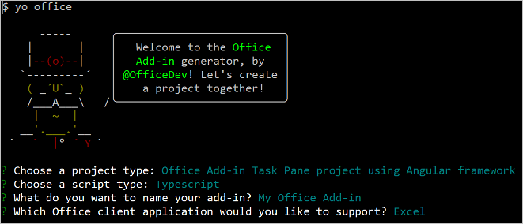

# Use Angular to build an Excel task pane add-in

In this article, you'll walk through the process of building an Excel task pane add-in using Angular and the Excel JavaScript API.

## Prerequisites

[!include[Yeoman generator prerequisites](../includes/quickstart-yo-prerequisites.md)]

## Create the add-in project

[!include[Yeoman generator create project guidance](../includes/yo-office-command-guidance.md)]

- **Choose a project type:** `Office Add-in Task Pane project using Angular framework`
- **Choose a script type:** `TypeScript`
- **What do you want to name your add-in?** `My Office Add-in`
- **Which Office client application would you like to support?** `Excel`



After you complete the wizard, the generator creates the project and installs supporting Node components.

## Explore the project

The add-in project that you've created with the Yeoman generator contains sample code for a basic task pane add-in. If you'd like to explore the key components of your add-in project, open the project in your code editor and review the files listed below. When you're ready to try out your add-in, proceed to the next section.

- The **manifest.xml** file in the root directory of the project defines the settings and capabilities of the add-in. To learn more about the **manifest.xml** file, see [Office Add-ins with the add-in only manifest](../develop/xml-manifest-overview.md).
- The **./src/taskpane/app/app.component.html** file contains the HTML markup for the task pane.
- The **./src/taskpane/taskpane.css** file contains the CSS that's applied to content in the task pane.
- The **./src/taskpane/app/app.component.ts** file contains the Office JavaScript API code that facilitates interaction between the task pane and Excel.

## Try it out

1. Navigate to the root folder of the project.

    ```command&nbsp;line
    cd "My Office Add-in"
    ```

1. [!include[Start server section](../includes/quickstart-yo-start-server-excel.md)]

1. In Excel, choose the **Home** tab, and then choose the **Show Taskpane** button on the ribbon to open the add-in task pane.

    

1. Select any range of cells in the worksheet.

1. At the bottom of the task pane, choose the **Run** link to set the color of the selected range to yellow.

    

## Next steps

Congratulations, you've successfully created an Excel task pane add-in using Angular! Next, learn more about the capabilities of an Excel add-in and build a more complex add-in by following along with the Excel add-in tutorial.

> [!div class="nextstepaction"]
> [Excel add-in tutorial](../tutorials/excel-tutorial.md)

## See also

- [Office Add-ins platform overview](../overview/office-add-ins.md)
- [Develop Office Add-ins](../develop/develop-overview.md)
- [Excel JavaScript object model in Office Add-ins](../excel/excel-add-ins-core-concepts.md)
- [Excel add-in code samples](https://developer.microsoft.com/office/gallery/?filterBy=Samples,Excel)
- [Excel JavaScript API reference](../reference/overview/excel-add-ins-reference-overview.md)
- [Using Visual Studio Code to publish](../publish/publish-add-in-vs-code.md#using-visual-studio-code-to-publish)
