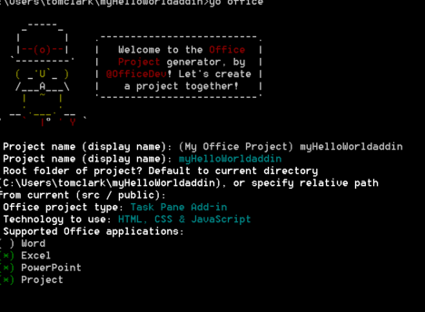

# Create an Office add-in using any editor

An Office add-in is a web app that you host within an Office application. This article describes how to use the Yeoman generator to provide project scaffolding and build management. The  `manifest.xml` file tells the Office application where your add-in is located and how you want it to appear. The Office application takes care of hosting it within Office.

 >**Note**  The instructions include steps that use the Windows command prompt but are equally applicable for other shell environments. 


## Prerequisites for Yeoman generator

To run the Yeoman Office generator, you need the following:


- [Git](https://git-scm.com/downloads)
    
- [npm](https://www.nodejs.org/en/download)
    
- [Bower](http://bower.io/)
    
- [Yeoman Office generator](https://www.npmjs.com/package/generator-office)
    
- [Gulp](http://gulpjs.com/)
    
- [TSD](http://definitelytyped.org/tsd/)
    
Only Git and npm require separate installation. The others can be installed using npm.

When you install Git, use the defaults except that you should choose the following options: 


- Use Git from the Windows Command Prompt
    
- Use Windows' default console window
    
Install npm using the defaults. Then open a command prompt as administrator and install the other software globally, which you can do as follows:


```
npm install -g bower yo generator-office gulp tsd
```


## Create the default files for your add-in

Before you develop an Office add-in, you should first create a folder for your project and run the generator from there. The Yeoman generator runs in the directory where you want to scaffold the project. 

In the command prompt, move to the parent folder where you want to create your project. Then use the following commands create a new folder named  _myHelloWorldaddin_ and shift the current directory to it:


```
mkdir myHelloWorldaddin
cd myHelloWorldaddin
```

Use the Yeoman generator to create the Office add-in of your choice: Outlook, content, or task pane. In this topic, we'll create a task pane add-in. To run the generator, enter the following instruction:


```
yo office
```

The generator will prompt you for the following: 


- Name of the add-in -- use  _myHelloWorldaddin_
    
- Root folder of the project - use  _current folder_
    
- Type of add-in - use  _task pane_
    
- Technology to create the add-in - use  _HTML, CSS &amp; JavaScript_
    
- The supported Office application - you can choose any application
    

**Yeoman generator input for an add-in**



This creates the structure and basic files for your add-in.


## Hosting your Office Add-in

Office add-ins must be served via HTTPS; the Office application will not load a web app as an add-in if it is HTTP. To develop, debug and host the add-in locally, you need a way to create and serve a web app locally using HTTPS. You could create a self-hosted HTTPS site through gulp (described in the following section) or you could use Azure. 


### Using a self-hosted HTTPS site

The gulp-webserver plug-in creates a self-hosted HTTPS site. The Office generator will add this to the gulpfile.js as a task named serve-static for the project that's generated. Start the self-hosted webserver using the following statement: 


```
gulp serve-static
```

This will start a HTTPS server at https://localhost:8443.


## Develop your Office Add-in

You can use any text editor to develop the files for your custom Office Add-in.


### JavaScript project support

The Office generator will create a jsconfig.json file when it creates your project. This is the file that you can use to infer all the JavaScript files within your project and save you from having to include the repetitive /// <reference path="../App.js" /> code blocks.

Learn more about the jsconfig.json file on the [JavaScript language](https://code.visualstudio.com/docs/languages/javascript#_javascript-projects-jsconfigjson) page.


### JavaScript intellisense support

In addition, even if you are writing plain JavaScript, you can use TypeScript type definition files ( `*.d.ts`) to provide additional IntelliSense support. The Office generator adds a  `tsd.json` file to the created files with references to all third-party libraries used by the project type you selected.

All you have to do after creating the project using the Yeoman Office generator is run the following command to download the referenced type definition files:


```
tsd install
```


### Create a Hello World Office Add-in


For our example, we'll create a Hello World add-in. The UI of the add-in is provided by an HTML file that can optionally provide JavaScript programming logic. 


### To create the files for a Hello World add-in


1. In your project folder, go to  _[project folder]/app/home_ (in our example, it's myHelloWorldaddin/app/home), open home.html, and replace the existing code with the following code.
    
      ```HTML
        <!DOCTYPE html>  
      <html> 
        <head> 
           <meta charset="UTF-8" /> 
           <meta http-equiv="X-UA-Compatible" content="IE=Edge"/> 
           <link rel="stylesheet" type="text/css" href="program.css" />
         </head> 
   
        <body> 
           <p>Hello World!</p> 
        </body> 
      
       </html> 
      ```


    This file provides the minimum set of HTML tags to display the UI of an add-in.
    
2. In the same folder, open the home.css file and add the following CSS code.
    
   ```
     body 
   { 
        position:relative; 
   } 
   li :hover 
   { 
        text-decoration: underline; 
        cursor:pointer; 
   } 
   h1,h3,h4,p,a,li 
   { 
        font-family: "Segoe UI Light","Segoe UI",Tahoma,sans-serif; 
        text-decoration-color:#4ec724; 
   } 
   ```


       This file provides the style sheet for the add-in.
    
3. Go back to the parent project folder and make sure the XML file named manifest-myHelloWorldaddin.xml contains the following XML code.
    
     >**Important**  The value in the  `<id>` tag is a GUID that the yeoman generator creates when it generates the project. Do not change the GUID that the yeoman generator created for your add-in.If the host is Azure, the the  `SourceLocation` value will be a URL that is similar to _https:// [name-of-your-web-app].azurewebsites.net/[path-to-add-in]_. If you are using the self-hosted option, as in this example, it will be _https://localhost:8443/[path-to-add-in]_.

   ```XML
     <?xml version="1.0" encoding="utf-8"?> 
   <OfficeApp xmlns="http://schemas.microsoft.com/office/appforoffice/1.1" 
              xmlns:xsi="http://www.w3.org/2001/XMLSchema-instance" 
              xsi:type="TaskPaneApp"> 
   <Id>[GUID-for-your-add-in]</Id> 
   <Version>1.0</Version> 
   <ProviderName>Microsoft</ProviderName> 
   <DefaultLocale>EN-US</DefaultLocale> 
   <DisplayName DefaultValue="myHelloWorldaddin"/> 
   <Description DefaultValue="My first app."/> 
    
   <Hosts> 
     <Host Name="Document"/> 
     <Host Name="Workbook"/> 
   </Hosts>
    
   <DefaultSettings> 
     <SourceLocation DefaultValue="https://localhost:8443/app/home/home.html"/> 
   </DefaultSettings> 
   
   <Permissions>ReadWriteDocument</Permissions>
    
   </OfficeApp> 
   ```


### Running the add-in locally


To test your add-in locally, open your browser and enter the URL for your home.html file. This can be either on the web server or the self-hosted HTTPS site. If you hosted it locally, just type that URL into your browser. In our example, it is  `https://localhost:8443/app/home/home.html`. 

You will see an error saying "There is a problem with this website's security certificate." Select "Continue to this website..." and then you'll see the text, "Hello World!"


 >**Note**  The generated add-in comes with a self-signed certificate and key; add these to your trusted authority list of certificates so your browser does not issue certificate warnings. Refer to the [gulp-webserver](https://www.npmjs.com/package/gulp-webserver) documentation if you want to use your own self-signed certificates.Refer to [this KB article #PH18677](https://support.apple.com/kb/PH18677?locale=en_US) for instructions on how to trust a certificate in OS X Yosemite.


## Install the add-in for testing

You can use sideloading to install your add-in for testing:


- [Sideload Office Add-ins for testing](../testing/sideload-an-office-add-in-on-ipad-and-mac.md)
    
- [Sideload Outlook add-ins for testing](../outlook/testing-and-tips.md)
    
Alternatively, you can publish the add-in to a catalog or network share and install it the way end-users do. For details, see [Publish task pane and content add-ins to an add-in catalog on SharePoint](https://msdn.microsoft.com/EN-US/library/office/fp123517.aspx.aspx) and [Create a network shared folder catalog for task pane and content add-ins](https://msdn.microsoft.com/EN-US/library/office/fp123503.aspx.aspx).


## Debugging your Office add-in

There are different ways to debug your add-in:


- You can use the Office web clients and open the browser's developer tools and debug the add-in just like any other client-side JavaScript application. 
    
- If you're using desktop Office on Windows 10, you can [Debug add-ins using F12 developer tools on Windows 10](../testing/debug-add-ins-using-f12-developer-tools-on-windows-10.md).
    


## Additional resources


- [Create and debug Office Add-ins in Visual Studio](../../docs/get-started/create-and-debug-office-add-ins-in-visual-studio.md)
    
