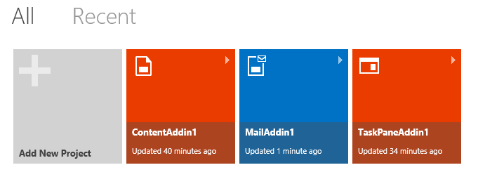
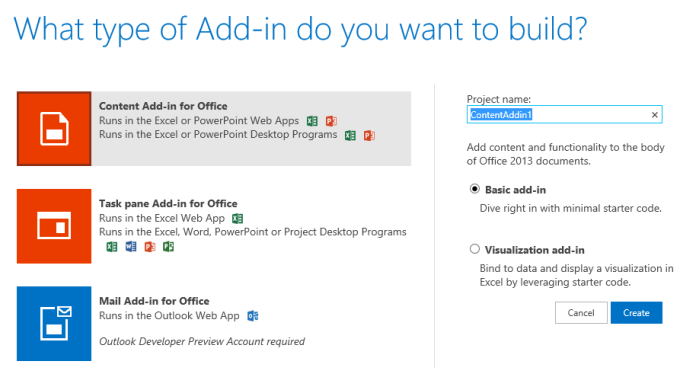

# Create an Office Add-in with Napa

An [Office Add-in](../../docs/overview/office-add-ins.md) is a web application hosted in a browser control or iframe running in the context of an Office application. Add-ins can access data in the current document or mail item, and connect to web services and other web-based resources. To develop add-ins, you use web standards-based technologies, such as HTML5, JavaScript, CSS3, XML, and REST APIs. An add-in isn't actually installed on the computer running the Office host application; its implementation is hosted on a web server, so you can easily maintain and update it from that server.

You can create a simple Office Add-in by using Napa.

Here's what you need to do that:

- A [Microsoft account](http://www.microsoft.com/en-us/account/default.aspx)
    
- The URL for the [Napa](https://www.napacloudapp.com/ ) web app
    

## Create a basic add-in

1. Open [Napa](https://www.napacloudapp.com/ ) in your browser.
    
2. Choose the  **Add New Project** tile.
    
     **Note:** The **Add New Project** tile appears only if you have created other projects. If this is your first project, skip to the next step.
    
    

3. Choose the kind of add-in you want to create, name the project, and then choose the  **Create** button.
    
    

    The code editor opens and shows the default webpage, which already contains some sample code that you can run without doing anything else.
    
4. On the side of the page, choose the Run button (
).
    
    The Office application associated with the kind of add-in you chose opens, and the sample add-in appears. You can now experiment with the features of the add-in.
    

## Additional resources

- [Office Add-ins overview](../../docs/overview/office-add-ins.md)
    
- [Provide feedback about the Office Developer Platform](http://officespdev.uservoice.com/)
    
- [Post a question in the Office Add-ins forums](http://social.msdn.microsoft.com/Forums/officeapps/en-US/home?forum=appsforoffice%2Cofficestore&amp;filter=alltypes&amp;sort=lastpostdesc)
    
