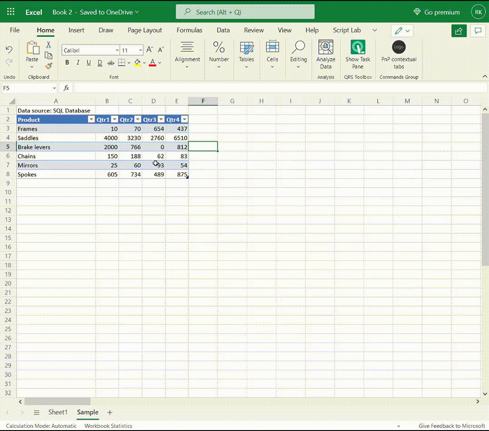

The following animation shows how events can toggle the visibility of contextual tabs and change the enabled status of buttons.

1. At the start, focus is not on the table.
1. A table cell is clicked and the custom contextual tab **Table Data** appears on the ribbon (in addition to the built-in contextual tab **Table Design**).
1. Selecting the **Table Data** tab opens it. Two of the buttons on the tab are disabled.
1. Changing data in a cell enables the two buttons.
1. Clicking one of the buttons disables the two buttons again.
1. Clicking a cell outside the table removes focus from the table, and the two contextual tabs are removed from the ribbon.

