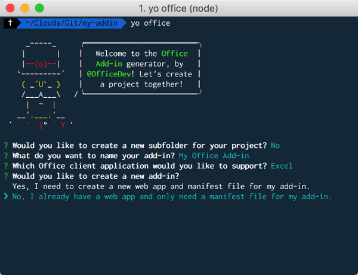

# Build an Excel add-in using Angular

In this article, you'll walk you through the process of building an Excel add-in using Angular and the Excel JavaScript API.

## Prerequisites

- Check whether you already have the [Angular CLI prerequisites](https://github.com/angular/angular-cli#prerequisites) and install any prerequistes that you are missing.

- Install the [Angular CLI](https://github.com/angular/angular-cli) globally. 

    ```bash
    npm install -g @angular/cli
    ```

- Install the latest version of [Yeoman](https://github.com/yeoman/yo) and the [Yeoman generator for Office Add-ins](https://github.com/OfficeDev/generator-office) globally.

    ```bash
    npm install -g yo generator-office
    ```

## Generate a new Angular app

Use the Angular CLI to generate your Angular app. From the terminal, run the following command:

```bash
ng new my-addin
```

## Generate the manifest file

An add-in's manifest file defines its settings and capabilities.

1. Navigate to your app folder.

    ```bash
    cd my-addin
    ```

2. Use the Yeoman generator to generate the manifest file for your add-in. Run the following command and then answer the prompts as shown below.

    ```bash
    yo office 
    ```

    - **Choose a project type:** `Manifest`
    - **What do you want to name your add-in?:** `My Office Add-in`
    - **Which Office client application would you like to support?:** `Excel`


    After you complete the wizard, a manifest file and resource file are available for you to build your project.

    
    
    > [!NOTE]
    > If you're prompted to overwrite **package.json**, answer **No** (do not overwrite).

## Secure the app

[!include[HTTPS guidance](../includes/https-guidance.md)]

For this quick start, you can use the certificates that the **Yeoman generator for Office Add-ins** provides. You've already installed the generator globally (as part of the **Prerequisites** for this quick start), so you'll just need to copy the certificates from the global install location into your app folder. The following steps describe how to complete this process.

1. From the terminal, run the following command to identify the folder where global **npm** libraries are installed:

    ```bash	
    npm list -g	
    ```	
	
    > [!TIP]	
    > The first line of output that's generated by this command specifies the folder where global **npm** libraries are installed.       	
	
2. Using File Explorer, navigate to the `{global libraries folder}/node_modules/generator-office/generators/app/templates/js/base` folder. From that location, copy the `certs` folder to your clipboard.

3. Navigate to the root folder of the Angular app that you created in step 1 of the previous section, and paste the `certs` folder from your clipboard into that folder.

## Update the app

1. In your code editor, open **package.json** in the root of the project. Modify the `start` script to specify that the server should run using SSL and port 3000, and save the file.

    ```json
    "start": "ng serve --ssl true --port 3000"
    ```

2. Open **.angular-cli.json** in the root of the project. Modify the **defaults** object to specify the location of the certificate files, and save the file.

    ```json
    "defaults": {
      "styleExt": "css",
      "component": {},
	  "serve": {
        "sslKey": "certs/server.key",
        "sslCert": "certs/server.crt"
      }
    }
    ```

3. Open **src/index.html**, add the following `<script>` tag immediately before the `</head>` tag, and save the file.

    ```html
    <script src="https://appsforoffice.microsoft.com/lib/1/hosted/office.js"></script>
    ```

4. Open **src/main.ts**, replace `platformBrowserDynamic().bootstrapModule(AppModule).catch(err => console.log(err));` with the following code, and save the file. 

    ```typescript 
    declare const Office: any;

    Office.initialize = () => {
    platformBrowserDynamic().bootstrapModule(AppModule)
        .catch(err => console.log(err));
    };
    ```

5. Open **src/polyfills.ts**, add the following line of code above all other existing `import` statements, and save the file.

    ```typescript
    import 'core-js/client/shim';
    ```

6. In **src/polyfills.ts**, uncomment the following lines, and save the file.

    ```typescript
    import 'core-js/es6/symbol';
    import 'core-js/es6/object';
    import 'core-js/es6/function';
    import 'core-js/es6/parse-int';
    import 'core-js/es6/parse-float';
    import 'core-js/es6/number';
    import 'core-js/es6/math';
    import 'core-js/es6/string';
    import 'core-js/es6/date';
    import 'core-js/es6/array';
    import 'core-js/es6/regexp';
    import 'core-js/es6/map';
    import 'core-js/es6/weak-map';
    import 'core-js/es6/set';
    ```

7. Open **src/app/app.component.html**, replace file contents with the following HTML, and save the file. 

    ```html
    <div id="content-header">
        <div class="padding">
            <h1>Welcome</h1>
        </div>
    </div>
    <div id="content-main">
        <div class="padding">
            <p>Choose the button below to set the color of the selected range to green.</p>
            <br />
            <h3>Try it out</h3>
            <button (click)="onSetColor()">Set color</button>
        </div>
    </div>
    ```

8. Open **src/app/app.component.css**, replace file contents with the following CSS code, and save the file.

    ```css
    #content-header {
        background: #2a8dd4;
        color: #fff;
        position: absolute;
        top: 0;
        left: 0;
        width: 100%;
        height: 80px; 
        overflow: hidden;
    }

    #content-main {
        background: #fff;
        position: fixed;
        top: 80px;
        left: 0;
        right: 0;
        bottom: 0;
        overflow: auto; 
    }

    .padding {
        padding: 15px;
    }
    ```

9. Open **src/app/app.component.ts**, replace file contents with the following code, and save the file. 

    ```typescript
    import { Component } from '@angular/core';

    declare const Excel: any;

    @Component({
    selector: 'app-root',
    templateUrl: './app.component.html',
    styleUrls: ['./app.component.css']
    })
    export class AppComponent {
    onSetColor() {
        Excel.run(async (context) => {
        const range = context.workbook.getSelectedRange();
        range.format.fill.color = 'green';
        await context.sync();
        });
    }
    }
    ```

## Start the dev server

1. From the terminal, run the following command to start the dev server.

    ```bash
    npm run start
    ```

2. In a web browser, navigate to `https://localhost:3000`. If your browser indicates that the site's certificate is not trusted, you will need to add the certificate as a trusted certificate. See [Adding Self-Signed Certificates as Trusted Root Certificate](https://github.com/OfficeDev/generator-office/blob/master/src/docs/ssl.md) for details.

    > [!NOTE]
    > Chrome (web browser) may continue to indicate the the site's certificate is not trusted, even after you have completed the process described in [Adding Self-Signed Certificates as Trusted Root Certificate](https://github.com/OfficeDev/generator-office/blob/master/src/docs/ssl.md). You can disregard this warning in Chrome and can verify that the certificate is trusted by navigating to `https://localhost:3000` in either Internet Explorer or Microsoft Edge. 

3. After your browser loads the add-in page without any certificate errors, you're ready test your add-in. 

## Try it out

1. Follow the instructions for the platform you'll be using to run your add-in and sideload the add-in within Excel.

    - Windows: [Sideload Office Add-ins on Windows](../testing/create-a-network-shared-folder-catalog-for-task-pane-and-content-add-ins.md)
    - Excel Online: [Sideload Office Add-ins in Office Online](../testing/sideload-office-add-ins-for-testing.md#sideload-an-office-add-in-on-office-online)
    - iPad and Mac: [Sideload Office Add-ins on iPad and Mac](../testing/sideload-an-office-add-in-on-ipad-and-mac.md)

   
2. In Excel, choose the **Home** tab, and then choose the **Show Taskpane** button in the ribbon to open the add-in task pane.

    

3. Select any range of cells in the worksheet.

4. In the task pane, choose the **Set color** button to set the color of the selected range to green.

    

## Next steps

Congratulations, you've successfully created an Excel add-in using Angular! Next, learn more about the capabilities of an Excel add-in and build a more complex add-in by following along with the Excel add-in tutorial.

> [!div class="nextstepaction"]
> [Excel add-in tutorial](../tutorials/excel-tutorial.yml)

## See also

* [Excel add-in tutorial](../tutorials/excel-tutorial-create-table.md)
* [Excel JavaScript API core concepts](../excel/excel-add-ins-core-concepts.md)
* [Excel add-in code samples](http://dev.office.com/code-samples#?filters=excel,office%20add-ins)
* [Excel JavaScript API reference](https://dev.office.com/reference/add-ins/excel/excel-add-ins-reference-overview)
