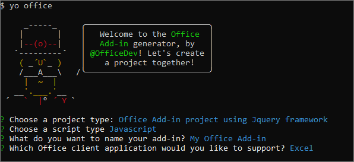

# Build an Excel add-in using jQuery

In this article, you'll walk through the process of building an Excel add-in by using jQuery and the Excel JavaScript API. 

[!include[Tip: choose your editor in the next section](../includes/alert-choose-editor.md)]

## Create the add-in 

# [Visual Studio](#tab/visual-studio)

### Prerequisites

[!include[Quickstart prerequisites](../includes/quickstart-vs-prerequisites.md)]

### Create the add-in project

1. On the Visual Studio menu bar, choose  **File** > **New** > **Project**.
    
2. In the list of project types under **Visual C#** or **Visual Basic**, expand  **Office/SharePoint**, choose **Add-ins**, and then choose **Excel Web Add-in** as the project type. 

3. Name the project, and then choose **OK**.

4. In the **Create Office Add-in** dialog window, choose **Add new functionalities to Excel**, and then choose **Finish** to create the project.

5. Visual Studio creates a solution its two projects appear in **Solution Explorer**. The **Home.html** file opens in Visual Studio.
    
### Explore the Visual Studio solution

[!include[Description of Visual Studio projects](../includes/quickstart-vs-solution.md)]

### Update the code

1. **Home.html** contains the HTML that will be rendered in the add-in's task pane. In **Home.html**, replace the `<body>` element with the following markup.
 
    ```html
    <body class="ms-font-m ms-welcome">
        <div id="content-header">
            <div class="padding">
                <h1>Welcome</h1>
            </div>
        </div>
        <div id="content-main">
            <div class="padding">
                <p>Choose the button below to set the color of the selected range to green.</p>
                <br />
                <h3>Try it out</h3>
                <button class="ms-Button" id="set-color">Set color</button>
            </div>
        </div>
    </body>
    ```

2. Open **Home.js** in the root of the web application project, replace the entire contents with the following code, and save the file.

    ```js
    'use strict';

    (function () {
        Office.initialize = function (reason) {
            $(document).ready(function () {
                $('#set-color').click(setColor);
            });
        };

        function setColor() {
            Excel.run(function (context) {
                var range = context.workbook.getSelectedRange();
                range.format.fill.color = 'green';

                return context.sync();
            }).catch(function (error) {
                console.log("Error: " + error);
                if (error instanceof OfficeExtension.Error) {
                    console.log("Debug info: " + JSON.stringify(error.debugInfo));
                }
            });
        }
    })();
    ```

3. Open **Home.css** in the root of the web application project, replace the entire contents with the following code, and save the file.

    ```css
    #content-header {
        background: #2a8dd4;
        color: #fff;
        position: absolute;
        top: 0;
        left: 0;
        width: 100%;
        height: 80px; 
        overflow: hidden;
    }

    #content-main {
        background: #fff;
        position: fixed;
        top: 80px;
        left: 0;
        right: 0;
        bottom: 0;
        overflow: auto; 
    }

    .padding {
        padding: 15px;
    }
    ```

### Update the manifest

1. Open the XML manifest file in the Add-in project.

2. The `ProviderName` element has a placeholder value. Replace it with your name.

3. The `DefaultValue` attribute of the `DisplayName` element has a placeholder. Replace it with **My Office Add-in**.

4. The `DefaultValue` attribute of the `Description` element has a placeholder. Replace it with **A task pane add-in for Excel**.

5. Save the file.

    ```xml
    ...
    <ProviderName>John Doe</ProviderName>
    <DefaultLocale>en-US</DefaultLocale>
    <!-- The display name of your add-in. Used on the store and various places of the Office UI such as the add-ins dialog. -->
    <DisplayName DefaultValue="My Office Add-in" />
    <Description DefaultValue="A task pane add-in for Excel"/>
    ...
    ```

### Try it out

1. Using Visual Studio, test the newly created Excel add-in by pressing F5 or choosing the **Start** button to launch Excel with the **Show Taskpane** add-in button displayed in the ribbon. The add-in will be hosted locally on IIS.

2. In Excel, choose the **Home** tab, and then choose the **Show Taskpane** button in the ribbon to open the add-in task pane.

    

3. Select any range of cells in the worksheet.

4. In the task pane, choose the **Set color** button to set the color of the selected range to green.

    

# [Any editor](#tab/visual-studio-code)

### Prerequisites

- [Node.js](https://nodejs.org)

- If you haven't done so previously, you'll need to install [Yeoman](https://github.com/yeoman/yo) and the [Yeoman generator for Office Add-ins](https://github.com/OfficeDev/generator-office) globally.

    ```bash
    npm install -g yo generator-office
    ```

### Create the web app

1. Create a folder on your local drive and name it **my-addin**. This is where you'll create the files for your app.

2. Navigate to your app folder.

    ```bash
    cd my-addin
    ```

3. Use the Yeoman generator to generate the manifest file for your add-in. Run the following command and then answer the prompts as shown in the following screenshot:

    ```bash
    yo office
    ```
    


4. In your code editor, open **index.html** in the root of the project. This file specifies the HTML that will be rendered in the add-in's task pane. 
 
5. Replace the generated `header` tag with the following markup.
 
    ```html
    <div id="content-header">
        <div class="padding">
            <h1>Welcome</h1>
        </div>
    </div>
    ```

6. Replace the generated `main` tag with the following markup and save the file.

    ```html
    <div id="content-main">
        <div class="padding">
            <p>Choose the button below to set the color of the selected range to green.</p>
            <br />
            <h3>Try it out</h3>
            <button class="ms-Button" id="set-color">Set color</button>
        </div>
    </div>
    ```

7. Open the file **app.js** to specify the script for the add-in. Replace the generated immediately invoked function expression with the following code and save the file.

    ```js
    'use strict';
    
    (function () {
        Office.initialize = function (reason) {
            $(document).ready(function () {
                $('#set-color').click(setColor);
            });
        };

        function setColor() {
            Excel.run(function (context) {
                var range = context.workbook.getSelectedRange();
                range.format.fill.color = 'green';

                return context.sync();
            }).catch(function (error) {
                console.log("Error: " + error);
                if (error instanceof OfficeExtension.Error) {
                    console.log("Debug info: " + JSON.stringify(error.debugInfo));
                }
            });
        }
    })();
    ```

8. Open the file **app.css** to specify the custom styles for the add-in. Replace the enitre contents with the following and save the file.

    ```css
    #content-header {
        background: #2a8dd4;
        color: #fff;
        position: absolute;
        top: 0;
        left: 0;
        width: 100%;
        height: 80px; 
        overflow: hidden;
    }

    #content-main {
        background: #fff;
        position: fixed;
        top: 80px;
        left: 0;
        right: 0;
        bottom: 0;
        overflow: auto; 
    }

    .padding {
        padding: 15px;
    }
    ```

### Configure the manifest file

1. Open the file **my-office-add-in-manifest.xml** to define the add-in's settings and capabilities. 

2. The `ProviderName` element has a placeholder value. Replace it with your name.

3. The `DefaultValue` attribute of the `DisplayName` element has a placeholder. Replace it with **My Office Add-in**.

4. The `DefaultValue` attribute of the `Description` element has a placeholder. Replace it with **A task pane add-in for Excel**.

5. Save the file but don't close it yet.

    ```xml
    ...
    <ProviderName>John Doe</ProviderName>
    <DefaultLocale>en-US</DefaultLocale>
    <!-- The display name of your add-in. Used on the store and various places of the Office UI such as the add-ins dialog. -->
    <DisplayName DefaultValue="My Office Add-in" />
    <Description DefaultValue="A task pane add-in for Excel"/>
    ...
    ```

### Configure to use HTTP

Office Web Add-ins should use HTTPS, not HTTP, even when you are developing. However, to get the add-in up and running fast, this quick start will use HTTP. To enable this, take these steps:

1. In the manifest file **my-office-add-in-manifest.xml**, replace "https" with "http" everywhere. Then save and close the file.

2. Open the **bsconfig.json** file in the root of the project. Change the value of the **https** property to `false`. Save the file.

### Try it out

1. Follow the instructions for the platform you'll use to run your add-in to sideload the add-in within Excel.

    - Windows: [Sideload Office Add-ins for testing on Windows](../testing/create-a-network-shared-folder-catalog-for-task-pane-and-content-add-ins.md)
    - Excel Online: [Sideload Office Add-ins in Office Online](../testing/sideload-office-add-ins-for-testing.md#sideload-an-office-add-in-on-office-online)
    - iPad and Mac: [Sideload Office Add-ins on iPad and Mac](../testing/sideload-an-office-add-in-on-ipad-and-mac.md)

2. Open a bash terminal in the root of the project and run the following command to start the dev server.

    ```bash
    npm start
    ```

   > [!NOTE]
   > A browser window will open with the add-in in it. Close this window.

3. In Excel, choose the **Home** tab, and then choose the **Show Taskpane** button in the ribbon to open the add-in task pane.

    

4. Select any range of cells in the worksheet.

5. In the task pane, choose the **Set color** button pane to set the color of the selected range to green.

    

---

## Next steps

Congratulations, you've successfully created an Excel add-in using jQuery! Next, learn more about the core concepts of building Excel add-ins.

> [!div class="nextstepaction"]
> [Excel JavaScript API core concepts](../excel/excel-add-ins-core-concepts.md)

## See also

* [Excel JavaScript API core concepts](../excel/excel-add-ins-core-concepts.md)
* [Excel add-in code samples](http://dev.office.com/code-samples#?filters=excel,office%20add-ins)
* [Excel JavaScript API reference](https://dev.office.com/reference/add-ins/excel/excel-add-ins-reference-overview)
