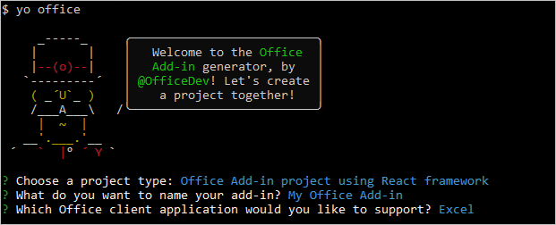

# Build an Excel add-in using React

In this article, you'll walk through the process of building an Excel add-in using React and the Excel JavaScript API.

## Environment

- **Office Desktop**: Ensure that you have the latest version of Office installed. Add-in commands require build 16.0.6769.0000 or higher (**16.0.6868.0000** recommended). Learn how to [Install the latest version of Office applications](http://aka.ms/latestoffice). 
 
- **Office Online**: There is no additional setup. Please note that support for commands in Office Online for work/school accounts is in preview.

## Prerequisites

- [Node.js](https://nodejs.org)

- Install the latest version of [Yeoman](https://github.com/yeoman/yo) and the [Yeoman generator for Office Add-ins](https://github.com/OfficeDev/generator-office) globally.
    ```bash
    npm install -g yo generator-office
    ```

### Create the web app

1. Create a folder on your local drive and name it **my-addin**. This is where you'll create the files for your app.

2. Navigate to your app folder.

    ```bash
    cd my-addin
    ```

3. Use the Yeoman generator to generate the manifest file for your add-in. Run the following command and then answer the prompts as shown in the following screenshot.

    ```bash
    yo office
    ```

    - **Choose a project type:** `Office Add-in project using React framework`
    - **What do you want to name your add-in?:** `My Office Add-in`
    - **Which Office client application would you like to support?:** `Excel`

    
    
    After you complete the wizard, the generator will create the project and install supporting Node components.

4.  Open **src/components/App.tsx**, search for the comment "Update the fill color," then change the fill color from 'yellow' to 'blue', and save the file. 

    ```js
    range.format.fill.color = 'blue'

    ```

5. In the `return` block of the `render` function within **src/components/App.tsx**, update the `<Herolist>` to the code below, and save the file. 

    ```js
      <HeroList message='Discover what My Office Add-in can do for you today!' items={this.state.listItems}>
        <p className='ms-font-l'>Choose the button below to set the color of the selected range to blue. <b>Set color</b>.</p>
        <Button className='ms-welcome__action' buttonType={ButtonType.hero} iconProps={{ iconName: 'ChevronRight' }} onClick={this.click}>Run</Button>
    </HeroList>
    ```

6. Carry out the steps in [Adding Self-Signed Certificates as Trusted Root Certificate](https://github.com/OfficeDev/generator-office/blob/master/src/docs/ssl.md) to trust the certificate for your development computer's operating system.

7. Sideload your add-in so it will appear in Excel. In the terminal, run the following command: 
    
    ```bash
    npm run sideload
    ```

## Try it out

1. From the terminal, run the following command to start the dev server.

    Windows:
    ```bash
    npm start
    ```

2. In Excel, choose the **Home** tab, and then choose the **Show Taskpane** button in the ribbon to open the add-in task pane.

    

3. Select any range of cells in the worksheet.

4. In the task pane, choose the **Set color** button to set the color of the selected range to blue.

    

## Next steps

Congratulations, you've successfully created an Excel add-in using React! Next, learn more about the capabilities of an Excel add-in and build a more complex add-in by following along with the Excel add-in tutorial.

> [!div class="nextstepaction"]
> [Excel add-in tutorial](../tutorials/excel-tutorial.yml)

## See also

* [Excel add-in tutorial](../tutorials/excel-tutorial-create-table.md)
* [Excel JavaScript API core concepts](../excel/excel-add-ins-core-concepts.md)
* [Excel add-in code samples](https://developer.microsoft.com/office/gallery/?filterBy=Samples,Excel)
* [Excel JavaScript API reference](https://docs.microsoft.com/javascript/office/overview/excel-add-ins-reference-overview?view=office-js)
