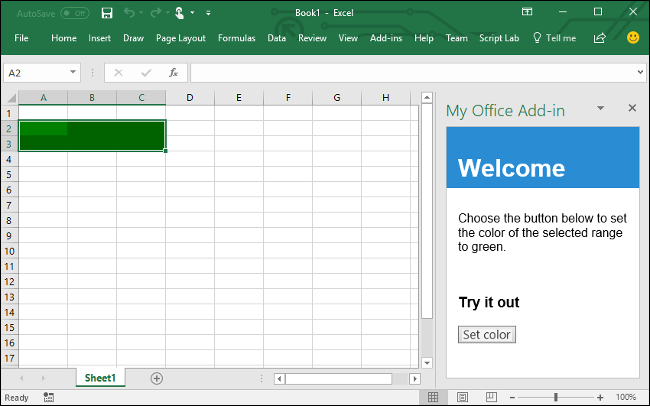

# Build an Excel add-in using React

In this article, you'll walk through the process of building an Excel add-in using React and the Excel JavaScript API.

## Prerequisites

- Install [Create React App](https://github.com/facebookincubator/create-react-app) globally.

    ```bash
    npm install -g create-react-app
    ```

- Install the latest version of [Yeoman](https://github.com/yeoman/yo) and the [Yeoman generator for Office Add-ins](https://github.com/OfficeDev/generator-office) globally.

    ```bash
    npm install -g yo generator-office
    ```

## Generate a new React app

Use Create React App to generate your React app. From the terminal, run the following command:

```bash
create-react-app my-addin
```

## Generate the manifest file and sideload the add-in

Each add-in requires a manifest file to define its settings and capabilities.

1. Navigate to your app folder.

    ```bash
    cd my-addin
    ```

2. Use the Yeoman generator to generate the manifest file for your add-in. Run the following command and then answer the prompts as shown in the following screenshot:

    ```bash
    yo office
    ```

    - **Would you like to create a new subfolder for your project?:** `No`
    - **What do you want to name your add-in?:** `My Office Add-in`
    - **Which Office client application would you like to support?:** `Excel`
    - **Would you like to create a new add-in?:** `No`

    The generator will then ask you if you want to open **resource.html**. It isn't necessary to open it for this tutorial, but feel free to open it if you're curious! Choose yes or no to complete the wizard and allow the generator to do its work.

    
    
    > [!NOTE]
    > If you're prompted to overwrite **package.json**, answer **No** (do not overwrite).

3. Follow the instructions for the platform you'll be using to run your add-in and sideload the add-in within Excel.

    - Windows: [Sideload Office Add-ins for testing on Windows](../testing/create-a-network-shared-folder-catalog-for-task-pane-and-content-add-ins.md)
    - Excel Online: [Sideload Office Add-ins in Office Online](../testing/sideload-office-add-ins-for-testing.md#sideload-an-office-add-in-on-office-online)
    - iPad and Mac: [Sideload Office Add-ins on iPad and Mac](../testing/sideload-an-office-add-in-on-ipad-and-mac.md)

## Update the app

1. Open **public/index.html**, add the following `<script>` tag immediately before the `</head>` tag, and save the file.

    ```html
    <script src="https://appsforoffice.microsoft.com/lib/1/hosted/office.js"></script>
    ```

2. Open **src/index.js**, replace `ReactDOM.render(<App />, document.getElementById('root'));` with the following code, and save the file. 

    ```typescript
    const Office = window.Office;
    
    Office.initialize = () => {
      ReactDOM.render(<App />, document.getElementById('root'));
    };
    ```

3. Open **src/App.js**, replace file contents with the following code, and save the file. 

    ```js
    import React, { Component } from 'react';
    import './App.css';

    class App extends Component {
      constructor(props) {
        super(props);

        this.onSetColor = this.onSetColor.bind(this);
      }

      onSetColor() {
        window.Excel.run(async (context) => {
          const range = context.workbook.getSelectedRange();
          range.format.fill.color = 'green';
          await context.sync();
        });
      }

      render() {
        return (
          <div id="content">
            <div id="content-header">
              <div className="padding">
                  <h1>Welcome</h1>
              </div>
            </div>
            <div id="content-main">
              <div className="padding">
                  <p>Choose the button below to set the color of the selected range to green.</p>
                  <br />
                  <h3>Try it out</h3>
                  <button onClick={this.onSetColor}>Set color</button>
              </div>
            </div>
          </div>
        );
      }
    }

    export default App;
    ```

4. Open **src/App.css**, replace file contents with the following CSS code, and save the file. 

    ```css
    #content-header {
        background: #2a8dd4;
        color: #fff;
        position: absolute;
        top: 0;
        left: 0;
        width: 100%;
        height: 80px; 
        overflow: hidden;
    }

    #content-main {
        background: #fff;
        position: fixed;
        top: 80px;
        left: 0;
        right: 0;
        bottom: 0;
        overflow: auto; 
    }

    .padding {
        padding: 15px;
    }
    ```

## Try it out

1. From the terminal, run the following command to start the dev server.

    Windows:
    ```bash
    set HTTPS=true&&npm start
    ```

    macOS:
    ```bash
    HTTPS=true npm start
    ```

   > [!NOTE]
   > A browser window will open with the add-in in it. Close this window.

2. In Excel, choose the **Home** tab, and then choose the **Show Taskpane** button in the ribbon to open the add-in task pane.

    

3. Select any range of cells in the worksheet.

4. In the task pane, choose the **Set color** button to set the color of the selected range to green.

    

## Next steps

Congratulations, you've successfully created an Excel add-in using React! Next, learn more about the capabilities of an Excel add-in and build a more complex add-in by following along with the Excel add-in tutorial.

> [!div class="nextstepaction"]
> [Excel add-in tutorial](../tutorials/excel-tutorial-create-table.md)

## See also

* [Excel add-in tutorial](../tutorials/excel-tutorial-create-table.md)
* [Excel JavaScript API core concepts](../excel/excel-add-ins-core-concepts.md)
* [Excel add-in code samples](http://dev.office.com/code-samples#?filters=excel,office%20add-ins)
* [Excel JavaScript API reference](https://dev.office.com/reference/add-ins/excel/excel-add-ins-reference-overview)
