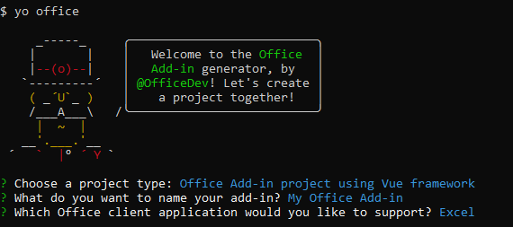

# Build an Excel add-in using Vue

In this article, you'll walk through the process of building an Excel add-in using Vue and the Excel JavaScript API.

## Prerequisites

- [Node.js](https://nodejs.org)

- Install the [Vue CLI](https://github.com/vuejs/vue-cli) globally.

    ```bash
    npm install -g vue-cli
    ```

- Install the latest version of [Yeoman](https://github.com/yeoman/yo) and the [Yeoman generator for Office Add-ins](https://github.com/OfficeDev/generator-office) globally.

    ```bash
    npm install -g yo generator-office
    ```

### Create the web app

1. Create a folder on your local drive and name it **my-addin**. This is where you'll create the files for your app.

2. Navigate to your app folder.

    ```bash
    cd my-addin
    ```

3. Use the Yeoman generator to generate the manifest file for your add-in. Run the following command and then answer the prompts with following choices.

    ```bash
    yo office
    ```

    - **Choose a project type:** `Office Add-in project using Vue framework`
    - **What do you want to name your add-in?:** `My Office Add-in`
    - **Which Office client application would you like to support?:** `Excel`

    
    
    After you complete the wizard, the generator creates the project and installs supporting Node components.

4. Open **src/App.vue**, replace contents of `<template> ... </template>` block with the following code and save the file. 

    ```html
    <template>
    <div id="app">
      <div id="content">
        <div id="content-header">
            <div class="padding">
            <h1>Welcome</h1>
            </div>
        </div>
        <div id="content-main">
            <div class="padding">
            <p>Choose the button below to set the color of the selected range to blue.</p>
            <br/>
            <h3>Try it out</h3>
            <button v-on:click="onClickRun">Set color</button>
            </div>
        </div>
      </div>
    </div>
    </template>
    ```

5.  Continue editing **src/App.vue** and search for comment "Update the fill color." inside `<script>..</script>` block. Change the fill color from 'yellow' to 'blue' and save the file.

    ```js
    range.format.fill.color = 'blue'

    ```

6.  Continue editing **src/App.vue**, replace contents of `<style>...</style>` block with following code and save the file.

    ```css
    #content-header {
        background: #2a8dd4;
        color: #fff;
        position: absolute;
        top: 0;
        left: 0;
        width: 100%;
        height: 80px;
        overflow: hidden;
    }

    #content-main {
        background: #fff;
        position: fixed;
        top: 80px;
        left: 0;
        right: 0;
        bottom: 0;
        overflow: auto;
    }

    .padding {
        padding: 15px;
    }
    
    ```

## Start the dev server

1. From the terminal, run the following command to start the dev server.

    ```bash
    npm start
    ```

2. In a web browser, navigate to `https://localhost:3000`. If your browser indicates that the site's certificate is not trusted, you will need to add the certificate as a trusted certificate. See [Adding Self-Signed Certificates as Trusted Root Certificate](https://github.com/OfficeDev/generator-office/blob/master/src/docs/ssl.md) for details.

    > [!NOTE]
    > Chrome (web browser) may continue to indicate the the site's certificate is not trusted, even after you have completed the process described in [Adding Self-Signed Certificates as Trusted Root Certificate](https://github.com/OfficeDev/generator-office/blob/master/src/docs/ssl.md). You can disregard this warning in Chrome and can verify that the certificate is trusted by navigating to `https://localhost:3000` in either Internet Explorer or Microsoft Edge. 

3. After your browser loads the add-in page without any certificate errors, you're ready test your add-in. 

## Try it out

1. Follow the instructions for the platform you'll be using to run your add-in and sideload the add-in within Excel.

    - Windows: [Sideload Office Add-ins on Windows](../testing/create-a-network-shared-folder-catalog-for-task-pane-and-content-add-ins.md)
    - Excel Online: [Sideload Office Add-ins in Office Online](../testing/sideload-office-add-ins-for-testing.md#sideload-an-office-add-in-on-office-online)
    - iPad and Mac: [Sideload Office Add-ins on iPad and Mac](../testing/sideload-an-office-add-in-on-ipad-and-mac.md)

   
2. In Excel, choose the **Home** tab, and then choose the **Show Taskpane** button in the ribbon to open the add-in task pane.

    

3. Select any range of cells in the worksheet.

4. In the task pane, choose the **Set color** button to set the color of the selected range to green.

    

## Next steps

Congratulations, you've successfully created an Excel add-in using Vue! Next, learn more about the capabilities of an Excel add-in and build a more complex add-in by following along with the Excel add-in tutorial.

> [!div class="nextstepaction"]
> [Excel add-in tutorial](../tutorials/excel-tutorial.yml)

## See also

* [Excel add-in tutorial](../tutorials/excel-tutorial-create-table.md)
* [Excel JavaScript API core concepts](../excel/excel-add-ins-core-concepts.md)
* [Excel add-in code samples](https://developer.microsoft.com/office/gallery/?filterBy=Samples,Excel)
* [Excel JavaScript API reference](https://docs.microsoft.com/javascript/office/overview/excel-add-ins-reference-overview?view=office-js)
