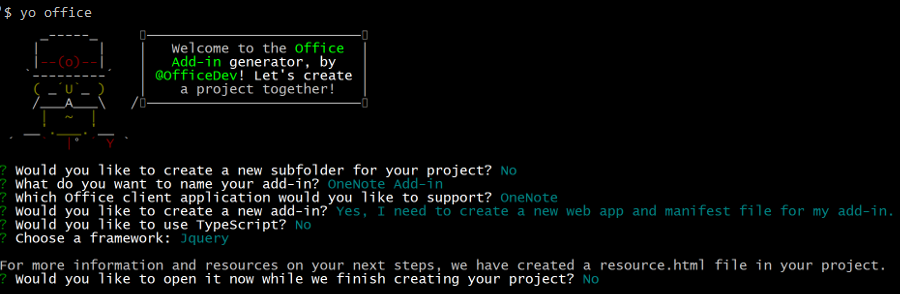

# Build your first OneNote add-in

In this article, you'll walk through the process of building a OneNote add-in by using jQuery and the Office JavaScript API.

## Prerequisites

- [Node.js](https://nodejs.org)

- Install the latest version of [Yeoman](https://github.com/yeoman/yo) and the [Yeoman generator for Office Add-ins](https://github.com/OfficeDev/generator-office) globally.

    ```bash
    npm install -g yo generator-office
    ```

## Create the add-in project

1. Create a folder on your local drive and name it `my-onenote-addin`. This is where you'll create the files for your add-in.

2. Navigate to your new folder.

    ```bash
    cd my-onenote-addin
    ```

3. Use the Yeoman generator to create a OneNote add-in project. Run the following command and then answer the prompts as follows:

    ```bash
    yo office
    ```

    - **Choose a project type:** `Jquery`
    - **Choose a script type:** `Javascript`
    - **What do you want to name your add-in?:** `My Office Add-in`
    - **Which Office client application would you like to support?:** `Onenote`

    
    
    After you complete the wizard, the generator will create the project and install supporting Node components.


## Update the code

1. In your code editor, open **index.html** in the root of the project. This file contains the HTML that will be rendered in the add-in's task pane.

2. Replace the `<main>` element inside the `<body>` element with the following markup and save the file. This adds a text area and a button using [Office UI Fabric components](http://dev.office.com/fabric/components).

    ```html
    <main class="ms-welcome__main">
        <br />
        <p class="ms-font-l">Enter content below</p>
        <div class="ms-TextField ms-TextField--placeholder">
            <textarea id="textBox" rows="5"></textarea>
        </div>
        <button id="addOutline" class="ms-welcome__action ms-Button ms-Button--hero ms-u-slideUpIn20">
            <span class="ms-Button-label">Add Outline</span>
            <span class="ms-Button-icon"><i class="ms-Icon"></i></span>
            <span class="ms-Button-description">Adds the content above to the current page.</span>
        </button>
    </main>
    ```

3. Open the file **app.js** to specify the script for the add-in. Replace the entire contents with the following code and save the file.

    ```js
    'use strict';

    (function () {

        Office.initialize = function (reason) {
            $(document).ready(function () {
                app.initialize();

                // Set up event handler for the UI.
                $('#addOutline').click(addOutlineToPage);
            });
        };

        // Add the contents of the text area to the page.
        function addOutlineToPage() {        
            OneNote.run(function (context) {
                var html = '<p>' + $('#textBox').val() + '</p>';

                // Get the current page.
                var page = context.application.getActivePage();

                // Queue a command to load the page with the title property.             
                page.load('title'); 

                // Add an outline with the specified HTML to the page.
                var outline = page.addOutline(40, 90, html);

                // Run the queued commands, and return a promise to indicate task completion.
                return context.sync()
                    .then(function() {
                        console.log('Added outline to page ' + page.title);
                    })
                    .catch(function(error) {
                        app.showNotification("Error: " + error); 
                        console.log("Error: " + error); 
                        if (error instanceof OfficeExtension.Error) { 
                            console.log("Debug info: " + JSON.stringify(error.debugInfo)); 
                        } 
                    }); 
            });
        }
    })();
    ```

## Update the manifest

1. Open the file **one-note-add-in-manifest.xml** to define the add-in's settings and capabilities.

2. The `ProviderName` element has a placeholder value. Replace it with your name.

3. The `DefaultValue` attribute of the `Description` element has a placeholder. Replace it with **A task pane add-in for OneNote**.

4. Save the file.

    ```xml
    ...
    <ProviderName>John Doe</ProviderName>
    <DefaultLocale>en-US</DefaultLocale>
    <!-- The display name of your add-in. Used on the store and various places of the Office UI such as the add-ins dialog. -->
    <DisplayName DefaultValue="OneNote Add-in" />
    <Description DefaultValue="A task pane add-in for OneNote"/>
    ...
    ```

## Start the dev server

[!include[Start server section](../includes/quickstart-yo-start-server.md)]

## Try it out

1. In [OneNote Online](https://www.onenote.com/notebooks), open a notebook.

2. Choose **Insert > Office Add-ins** to open the Office Add-ins dialog.

    - If you're signed in with your consumer account, select the **MY ADD-INS** tab, and then choose **Upload My Add-in**.

    - If you're signed in with your work or school account, select the **MY ORGANIZATION** tab, and then select **Upload My Add-in**. 

    The following image shows the **MY ADD-INS** tab for consumer notebooks.

    

3. In the Upload Add-in dialog, browse to **one-note-add-in-manifest.xml** in your project folder, and then choose **Upload**. 

4. From the **Home** tab, choose the **Show Taskpane** button in the ribbon. The add-in task pane opens in an iFrame next to the OneNote page.

5. Enter some text in the text area, and then choose **Add outline**. The text you entered is added to the page. 

    

## Troubleshooting and tips

- You can debug the add-in using your browser's developer tools. When you're using the Gulp web server and debugging in Internet Explorer or Chrome, you can save your changes locally and then just refresh the add-in's iFrame.

- When you inspect a OneNote object, the properties that are currently available for use display actual values. Properties that need to be loaded display *undefined*. Expand the `_proto_` node to see properties that are defined on the object but are not yet loaded.

   

- You need to enable mixed content in the browser if your add-in uses any HTTP resources. Production add-ins should use only secure HTTPS resources.

- Task pane add-ins can be opened from anywhere, but content add-ins can only be inserted inside regular page content (i.e. not in titles, images, iFrames, etc.). 

## Next steps

Congratulations, you've successfully created a OneNote add-in! Next, learn more about the core concepts of building OneNote add-ins.

> [!div class="nextstepaction"]
> [OneNote JavaScript API programming overview](../onenote/onenote-add-ins-programming-overview.md)

## See also

- [OneNote JavaScript API programming overview](../onenote/onenote-add-ins-programming-overview.md)
- [OneNote JavaScript API reference](https://dev.office.com/reference/add-ins/onenote/onenote-add-ins-javascript-reference)
- [Rubric Grader sample](https://github.com/OfficeDev/OneNote-Add-in-Rubric-Grader)
- [Office Add-ins platform overview](../overview/office-add-ins.md)
