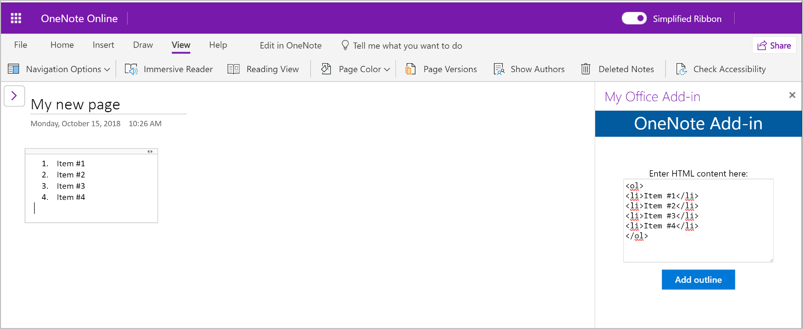

# Build your first OneNote add-in

In this article, you'll walk through the process of building a OneNote add-in by using jQuery and the Office JavaScript API.

## Prerequisites

- [Node.js](https://nodejs.org)

- Install the latest version of [Yeoman](https://github.com/yeoman/yo) and the [Yeoman generator for Office Add-ins](https://github.com/OfficeDev/generator-office) globally.

    ```bash
    npm install -g yo generator-office
    ```

## Create the add-in project

1. Use the Yeoman generator to create a OneNote add-in project. Run the following command and then answer the prompts as follows:

    ```bash
    yo office
    ```

    - **Choose a project type:** `Office Add-in project using Jquery framework`
    - **Choose a script type:** `Javascript`
    - **What do you want to name your add-in?:** `My Office Add-in`
    - **Which Office client application would you like to support?:** `Onenote`

    
    
    After you complete the wizard, the generator will create the project and install supporting Node components.
	
2. Navigate to the root folder of the project.

    ```bash
    cd "My Office Add-in"
    ```

## Update the code

1. In your code editor, open **index.html** in the root of the project. This file contains the HTML that will be rendered in the add-in's task pane.

2. Replace the `<body>` element with the following markup and save the file. 

    ```html
    <body class="ms-font-m ms-welcome">
        <header class="ms-welcome__header ms-bgColor-themeDark ms-u-fadeIn500">
            <h2 class="ms-fontSize-xxl ms-fontWeight-regular ms-fontColor-white">OneNote Add-in</h1>
        </header>
        <main id="app-body" class="ms-welcome__main">
            <br />
            <p class="ms-font-m">Enter HTML content here:</p>
            <div class="ms-TextField ms-TextField--placeholder">
                <textarea id="textBox" rows="8" cols="30"></textarea>
            </div>
            <button id="addOutline" class="ms-Button ms-Button--primary">
                <span class="ms-Button-label">Add outline</span>
            </button>
        </main>
        <script type="text/javascript" src="node_modules/jquery/dist/jquery.js"></script>
        <script type="text/javascript" src="node_modules/office-ui-fabric-js/dist/js/fabric.js"></script>
    </body>
    ```

3. Open the file **src\index.js** to specify the script for the add-in. Replace the entire contents with the following code and save the file.

    ```js
    import * as OfficeHelpers from "@microsoft/office-js-helpers";

    Office.onReady(() => {
        // Office is ready
        $(document).ready(() => {
            // The document is ready
            $('#addOutline').click(addOutlineToPage);
        });
    });
    
    async function addOutlineToPage() {
        try {
            await OneNote.run(async context => {
                var html = "<p>" + $("#textBox").val() + "</p>";

                // Get the current page.
                var page = context.application.getActivePage();

                // Queue a command to load the page with the title property.
                page.load("title");

                // Add text to the page by using the specified HTML.
                var outline = page.addOutline(40, 90, html);

                // Run the queued commands, and return a promise to indicate task completion.
                return context.sync()
                    .then(function() {
                        console.log("Added outline to page " + page.title);
                    })
                    .catch(function(error) {
                        app.showNotification("Error: " + error);
                        console.log("Error: " + error);
                        if (error instanceof OfficeExtension.Error) {
                            console.log("Debug info: " + JSON.stringify(error.debugInfo));
                        }
                    });
                });
        } catch (error) {
            OfficeHelpers.UI.notify(error);
            OfficeHelpers.Utilities.log(error);
        }
    }
    ```

4. Open the file **app.css** to specify the custom styles for the add-in. Replace the entire contents with the following and save the file.

    ```css
    html, body {
        width: 100%;
        height: 100%;
        margin: 0;
        padding: 0;
    }

    ul, p, h1, h2, h3, h4, h5, h6 {
        margin: 0;
        padding: 0;
    }

    .ms-welcome {
        position: relative;
        display: -webkit-flex;
        display: flex;
        -webkit-flex-direction: column;
        flex-direction: column;
        -webkit-flex-wrap: nowrap;
        flex-wrap: nowrap;
        min-height: 500px;
        min-width: 320px;
        overflow: auto;
        overflow-x: hidden;
    }

    .ms-welcome__header {
        min-height: 30px;
        padding: 0px;
        padding-bottom: 5px;
        display: -webkit-flex;
        display: flex;
        -webkit-flex-direction: column;
        flex-direction: column;
        -webkit-flex-wrap: nowrap;
        flex-wrap: nowrap;
        -webkit-align-items: center;
        align-items: center;
        -webkit-justify-content: flex-end;
        justify-content: flex-end;
    }

    .ms-welcome__header > h1 {
        margin-top: 5px;
        text-align: center;
    }

    .ms-welcome__main {
        display: -webkit-flex;
        display: flex;
        -webkit-flex-direction: column;
        flex-direction: column;
        -webkit-flex-wrap: nowrap;
        flex-wrap: nowrap;
        -webkit-align-items: center;
        align-items: left;
        -webkit-flex: 1 0 0;
        flex: 1 0 0;
        padding: 30px 20px;
    }

    .ms-welcome__main > h2 {
        width: 100%;
        text-align: left;
    }

    @media (min-width: 0) and (max-width: 350px) {
        .ms-welcome__features {
            width: 100%;
        }
    }
    ```

## Update the manifest

1. Open the file **manifest.xml** to define the add-in's settings and capabilities.

2. The `ProviderName` element has a placeholder value. Replace it with your name.

3. The `DefaultValue` attribute of the `Description` element has a placeholder. Replace it with **A task pane add-in for OneNote**.

4. Save the file.

    ```xml
    ...
    <ProviderName>John Doe</ProviderName>
    <DefaultLocale>en-US</DefaultLocale>
    <!-- The display name of your add-in. Used on the store and various places of the Office UI such as the add-ins dialog. -->
    <DisplayName DefaultValue="My Office Add-in" />
    <Description DefaultValue="A task pane add-in for OneNote"/>
    ...
    ```

## Start the dev server

[!include[Start server section](../includes/quickstart-yo-start-server.md)]

## Try it out

1. In [OneNote Online](https://www.onenote.com/notebooks), open a notebook.

2. Choose **Insert > Office Add-ins** to open the Office Add-ins dialog.

    - If you're signed in with your consumer account, select the **MY ADD-INS** tab, and then choose **Upload My Add-in**.

    - If you're signed in with your work or school account, select the **MY ORGANIZATION** tab, and then select **Upload My Add-in**. 

    The following image shows the **MY ADD-INS** tab for consumer notebooks.

    

3. In the Upload Add-in dialog, browse to **manifest.xml** in your project folder, and then choose **Upload**. 

4. From the **Home** tab, choose the **Show Taskpane** button in the ribbon. The add-in task pane opens in an iFrame next to the OneNote page.

5. Enter the following HTML content in the text area, and then choose **Add outline**.  

    ```html
    <ol>
    <li>Item #1</li>
    <li>Item #2</li>
    <li>Item #3</li>
    <li>Item #4</li>
    </ol>
    ```

    The outline that you specified is added to the page.

    

## Troubleshooting and tips

- You can debug the add-in using your browser's developer tools. When you're using the Gulp web server and debugging in Internet Explorer or Chrome, you can save your changes locally and then just refresh the add-in's iFrame.

- When you inspect a OneNote object, the properties that are currently available for use display actual values. Properties that need to be loaded display *undefined*. Expand the `_proto_` node to see properties that are defined on the object but are not yet loaded.

   

- You need to enable mixed content in the browser if your add-in uses any HTTP resources. Production add-ins should use only secure HTTPS resources.

- Task pane add-ins can be opened from anywhere, but content add-ins can only be inserted inside regular page content (i.e. not in titles, images, iFrames, etc.). 

## Next steps

Congratulations, you've successfully created a OneNote add-in! Next, learn more about the core concepts of building OneNote add-ins.

> [!div class="nextstepaction"]
> [OneNote JavaScript API programming overview](../onenote/onenote-add-ins-programming-overview.md)

## See also

- [OneNote JavaScript API programming overview](../onenote/onenote-add-ins-programming-overview.md)
- [OneNote JavaScript API reference](https://docs.microsoft.com/office/dev/add-ins/reference/overview/onenote-add-ins-javascript-reference)
- [Rubric Grader sample](https://github.com/OfficeDev/OneNote-Add-in-Rubric-Grader)
- [Office Add-ins platform overview](../overview/office-add-ins.md)
