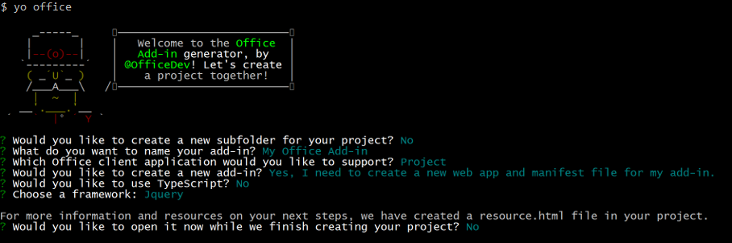
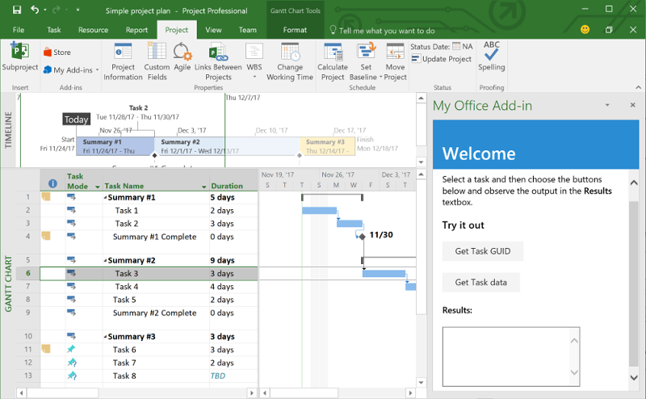
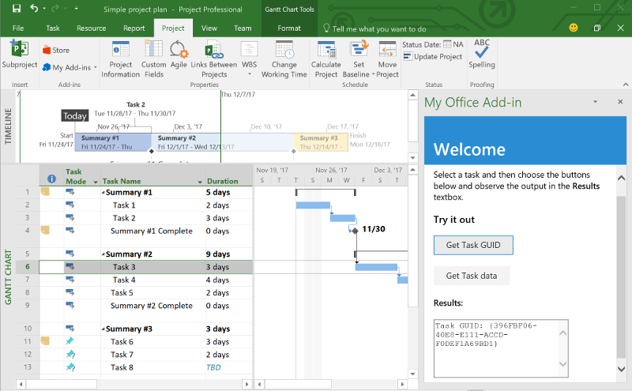
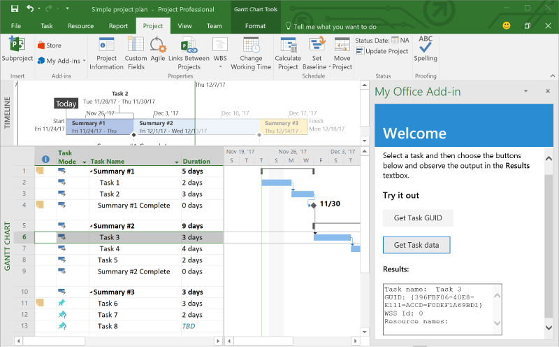

# Build your first Project add-in

In this article, you'll walk through the process of building a Project add-in by using jQuery and the Office JavaScript API.

## Prerequisites

- [Node.js](https://nodejs.org)

- Install the latest version of [Yeoman](https://github.com/yeoman/yo) and the [Yeoman generator for Office Add-ins](https://github.com/OfficeDev/generator-office) globally.

    ```bash
    npm install -g yo generator-office
    ```

## Create the add-in

1. Create a folder on your local drive and name it `my-project-addin`. This is where you'll create the files for your add-in.

2. Navigate to your new folder.

    ```bash
    cd my-project-addin
    ```

3. Use the Yeoman generator to create a Project add-in project. Run the following command and then answer the prompts as follows:

    ```bash
    yo office
    ```

    - **Choose a project type:** `Jquery`
    - **Choose a script type:** `Javascript`
    - **What do you want to name your add-in?:** `My Office Add-in`
    - **Which Office client application would you like to support?:** `Project`

    
    
    After you complete the wizard, the generator will create the project and install supporting Node components.

## Update the code

1. In your code editor, open **index.html** in the root of the project. This file contains the HTML that will be rendered in the add-in's task pane.

2. Replace the `<header>` element inside the `<body>` element with the following markup.

    ```html
    <div id="content-header">
        <div class="padding">
            <h1>Welcome</h1>
        </div>
    </div>
    ```

3. Replace the `<main>` element inside the `<body>` element with the following markup and save the file.

    ```html
    <div id="content-main">
        <div class="padding">
            <p>Select a task and then choose the buttons below and observe the output in the <b>Results</b> textbox.</p>
            <h3>Try it out</h3>
            <button class="ms-Button" id="get-task-guid">Get Task GUID</button>
            <br/><br/>
            <button class="ms-Button" id="get-task">Get Task data</button>
            <br/>
            <h4>Results:</h4>
            <textarea id="result" rows="6" cols="25"></textarea>
        </div>
    </div>
    ```

4. Open the file **app.js** to specify the script for the add-in. Replace the entire contents with the following code and save the file.

    ```js
    'use strict';

    (function () {

        var taskGuid;

        // The initialize function must be run each time a new page is loaded
        Office.initialize = function (reason) {
            $(document).ready(function () {
                $('#get-task-guid').click(getTaskGUID);
                $('#get-task').click(getTask);
            });
        };

        function getTaskGUID() {
            Office.context.document.getSelectedTaskAsync(function (asyncResult) {
                if (asyncResult.status == Office.AsyncResultStatus.Succeeded) {
                    result.value = "Task GUID: " + asyncResult.value;
                    taskGuid = asyncResult.value;
                }
                else {
                    console.log(asyncResult.error.message);
                }
            });
        }

        function getTask() {
            if (taskGuid != undefined) {
                Office.context.document.getTaskAsync(
                    taskGuid,
                    function (asyncResult) {
                        if (asyncResult.status === Office.AsyncResultStatus.Succeeded) {
                            var taskInfo = asyncResult.value;
                            var taskOutput = "Task name: " + taskInfo.taskName +
                                            "\nGUID: " + taskGuid +
                                            "\nWSS Id: " + taskInfo.wssTaskId +
                                            "\nResource names: " + taskInfo.resourceNames;
                            result.value = taskOutput;
                        } else {
                            console.log(asyncResult.error.message);
                        }
                    }
                );
            } else {
                result.value = 'Task GUID not valid:\n' + taskGuid;
            } 
        }
    })();
    ```

4. Open the file **app.css** in the root of the project to specify the custom styles for the add-in. Replace the entire contents with the following and save the file.

    ```css
    #content-header {
        background: #2a8dd4;
        color: #fff;
        position: absolute;
        top: 0;
        left: 0;
        width: 100%;
        height: 80px; 
        overflow: hidden;
    }

    #content-main {
        background: #fff;
        position: fixed;
        top: 80px;
        left: 0;
        right: 0;
        bottom: 0;
        overflow: auto; 
    }

    .padding {
        padding: 15px;
    }
    ```

## Update the manifest

1. Open the file **my-office-add-in-manifest.xml** to define the add-in's settings and capabilities.

2. The `ProviderName` element has a placeholder value. Replace it with your name.

3. The `DefaultValue` attribute of the `Description` element has a placeholder. Replace it with **A task pane add-in for Project**.

4. Save the file.

    ```xml
    ...
    <ProviderName>John Doe</ProviderName>
    <DefaultLocale>en-US</DefaultLocale>
    <!-- The display name of your add-in. Used on the store and various places of the Office UI such as the add-ins dialog. -->
    <DisplayName DefaultValue="My Office Add-in" />
    <Description DefaultValue="A task pane add-in for Project"/>
    ...
    ```

## Start the dev server

[!include[Start server section](../includes/quickstart-yo-start-server.md)] 

## Try it out

1. In Project, create a simple project that has at least one task.

2. Follow the instructions for the platform you'll use to run your add-in to sideload the add-in within Project.

    - Windows: [Sideload Office Add-ins on Windows](../testing/create-a-network-shared-folder-catalog-for-task-pane-and-content-add-ins.md)
    - Project Online: [Sideload Office Add-ins in Office Online](../testing/sideload-office-add-ins-for-testing.md#sideload-an-office-add-in-on-office-online)
    - iPad and Mac: [Sideload Office Add-ins on iPad and Mac](../testing/sideload-an-office-add-in-on-ipad-and-mac.md)

3. In Project, select a task.

    

4. In the task pane, choose the **Get Task GUID** button to write the task GUID to the **Results** textbox.

    

5. In the task pane, choose the **Get Task data** button to write several properties of the selected task to the **Results** textbox.

    

## Next steps

Congratulations, you've successfully created a Project add-in! Next, learn more about the capabilities of a Project add-in and explore common scenarios.

> [!div class="nextstepaction"]
> [Project add-ins](../project/project-add-ins.md)
