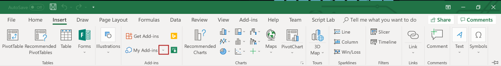

    * If you're using Excel 2016 for Windows:

        1. In Excel, choose the **Insert** tab and then choose the down-arrow located to the right of **My Add-ins**.
            

        2. In the list of available add-ins, find the **Developer Add-ins** section and select the add-in **Excel Custom Function** to register it.
            

    * If you're using Excel Online: 

        1. In Excel Online, choose the **Insert** tab and then choose **Add-ins**.
            
        2. Choose **Manage My Add-ins** and select **Upload My Add-in**. 
        3. Choose **Browse...** and navigate to the root directory of the project that the Yo Office generator created. 
        4. Select the file **manifest.xml** and choose **Open**, then choose **Upload**.