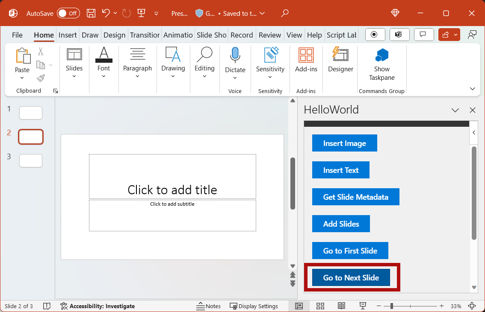
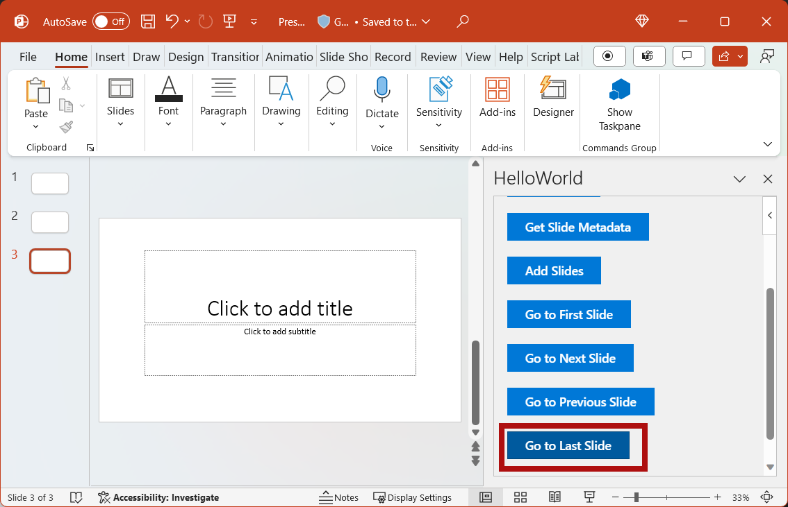

In this step of the tutorial, you'll navigate between the slides of a document.

## Navigate between slides of the document

1. In the **Home.html** file, replace `TODO5` with the following markup. This markup defines the four navigation buttons that will appear within the add-in's task pane.

    ```html
    <br /><br />
    <button class="ms-Button ms-Button--primary" id="go-to-first-slide">
        <span class="ms-Button-icon"><i class="ms-Icon ms-Icon--plus"></i></span>
        <span class="ms-Button-label">Go to First Slide</span>
        <span class="ms-Button-description">Go to the first slide.</span>
    </button>
    <br /><br />
    <button class="ms-Button ms-Button--primary" id="go-to-next-slide">
        <span class="ms-Button-icon"><i class="ms-Icon ms-Icon--plus"></i></span>
        <span class="ms-Button-label">Go to Next Slide</span>
        <span class="ms-Button-description">Go to the next slide.</span>
    </button>
    <br /><br />
    <button class="ms-Button ms-Button--primary" id="go-to-previous-slide">
        <span class="ms-Button-icon"><i class="ms-Icon ms-Icon--plus"></i></span>
        <span class="ms-Button-label">Go to Previous Slide</span>
        <span class="ms-Button-description">Go to the previous slide.</span>
    </button>
    <br /><br />
    <button class="ms-Button ms-Button--primary" id="go-to-last-slide">
        <span class="ms-Button-icon"><i class="ms-Icon ms-Icon--plus"></i></span>
        <span class="ms-Button-label">Go to Last Slide</span>
        <span class="ms-Button-description">Go to the last slide.</span>
    </button>
    ```

2. In the **Home.js** file, replace `TODO8` with the following code to assign the event handlers for the four navigation buttons.

    ```js
    $('#go-to-first-slide').click(goToFirstSlide);
    $('#go-to-next-slide').click(goToNextSlide);
    $('#go-to-previous-slide').click(goToPreviousSlide);
    $('#go-to-last-slide').click(goToLastSlide);
    ```

3. In the **Home.js** file, replace `TODO9` with the following code to define the navigation functions. Each of these functions uses the `goToByIdAsync` function to select a slide based upon its position in the document (first, last, previous, next).

    ```js
    function goToFirstSlide() {
        Office.context.document.goToByIdAsync(Office.Index.First, Office.GoToType.Index,
            function (asyncResult) {
                if (asyncResult.status == "failed") {
                    showNotification("Error", asyncResult.error.message);
                }
            });
    }

    function goToLastSlide() {
        Office.context.document.goToByIdAsync(Office.Index.Last, Office.GoToType.Index,
            function (asyncResult) {
                if (asyncResult.status == "failed") {
                    showNotification("Error", asyncResult.error.message);
                }
            });
    }

    function goToPreviousSlide() {
        Office.context.document.goToByIdAsync(Office.Index.Previous, Office.GoToType.Index,
            function (asyncResult) {
                if (asyncResult.status == "failed") {
                    showNotification("Error", asyncResult.error.message);
                }
            });
    }

    function goToNextSlide() {
        Office.context.document.goToByIdAsync(Office.Index.Next, Office.GoToType.Index,
            function (asyncResult) {
                if (asyncResult.status == "failed") {
                    showNotification("Error", asyncResult.error.message);
                }
            });
    }
    ```

## Test the add-in

1. Using Visual Studio, test the add-in by pressing `F5` or choosing the **Start** button to launch PowerPoint with the **Show Taskpane** add-in button displayed in the ribbon. The add-in will be hosted locally on IIS.

    

2. In PowerPoint, select the **Show Taskpane** button in the ribbon to open the add-in task pane.

    


3. Use the **New Slide** button in the ribbon of the **Home** tab to add two new slides to the document. 

4. In the task pane, choose the **Go to First Slide** button. The first slide in the document is selected and displayed.

    

5. In the task pane, choose the **Go to Next Slide** button. The next slide in the document is selected and displayed.

    

6. In the task pane, choose the **Go to Previous Slide** button. The previous slide in the document is selected and displayed.

    

7. In the task pane, choose the **Go to Last Slide** button. The last slide in the document is selected and displayed.

    

8. In Visual Studio, stop the add-in by pressing `Shift + F5` or choosing the **Stop** button. PowerPoint will automatically close when the add-in is stopped.

    
