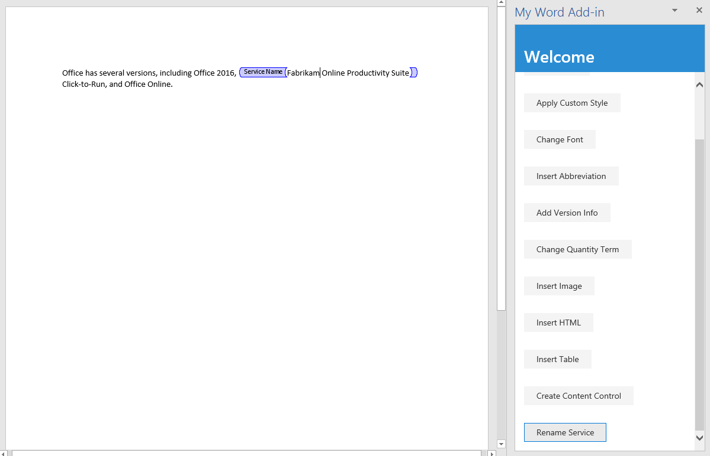

In this step of the tutorial, you'll learn how to create Rich Text content controls in the document, and then how to insert and replace content in the controls. 

> [!NOTE]
> This page describes an individual step of a Word add-in tutorial. If you’ve arrived at this page via search engine results or other direct link, please go to the [Word add-in tutorial](../tutorials/word-tutorial.yml) introduction page to start the tutorial from the beginning.

Before you start this step of the tutorial, we recommend that you create and manipulate Rich Text content controls through the Word UI, so you can be familiar with the controls and their properties. For details, see [Create forms that users complete or print in Word](https://support.office.com/en-us/article/create-forms-that-users-complete-or-print-in-word-040c5cc1-e309-445b-94ac-542f732c8c8b).

> [!NOTE]
> There are several types of content controls that can be added to a Word document through the UI; but currently only Rich Text content controls are supported by Word.js.


## Create a content control

1. Open the project in your code editor. 
2. Open the file index.html.
3. Below the `div` that contains the `replace-text` button, add the following markup:

    ```html
    <div class="padding">            
        <button class="ms-Button" id="create-content-control">Create Content Control</button>            
    </div>
    ```

4. Open the app.js file.

5. Below the line that assigns a click handler to the `insert-table` button, add the following code:

    ```js
    $('#create-content-control').click(createContentControl);
    ```

6. Below the `insertTable` function, add the following function:

    ```js
    function createContentControl() {
        Word.run(function (context) {
            
            // TODO1: Queue commands to create a content control.

            return context.sync();
        })
        .catch(function (error) {
            console.log("Error: " + error);
            if (error instanceof OfficeExtension.Error) {
                console.log("Debug info: " + JSON.stringify(error.debugInfo));
            }
        });
    }
    ``` 

7. Replace `TODO1` with the following code. Note:
   - This code is intended to wrap the phrase "Office 365" in a content control. It makes a simplifying assumption that the string is present and the user has selected it.
   - The `ContentControl.title` property specifies the visible title of the content control. 
   - The `ContentControl.tag` property specifies an tag that can be used to get a reference to a content control using the `ContentControlCollection.getByTag` method, which you'll use in a later function. 
   - The `ContentControl.appearance` property specifies the visual look of the control. Using the value "Tags" means that the control will be wrapped in opening and closing tags, and the opening tag will have the content control's title. Other possible values are "BoundingBox" and "None".
   - The `ContentControl.color` property specifies the color of the tags or the border of the bounding box.

    ```js
    const serviceNameRange = context.document.getSelection();
    const serviceNameContentControl = serviceNameRange.insertContentControl();
    serviceNameContentControl.title = "Service Name";
    serviceNameContentControl.tag = "serviceName";
    serviceNameContentControl.appearance = "Tags";
    serviceNameContentControl.color = "blue";
    ``` 

## Replace the content of the content control

1. Open the file index.html.
2. Below the `div` that contains the `create-content-control` button, add the following markup:

    ```html
    <div class="padding">            
        <button class="ms-Button" id="replace-content-in-control">Rename Service</button>            
    </div>
    ```

3. Open the app.js file.

4. Below the line that assigns a click handler to the `create-content-control` button, add the following code:

    ```js
    $('#replace-content-in-control').click(replaceContentInControl);
    ```

5. Below the `createContentControl` function, add the following function:

    ```js
    function replaceContentInControl() {
        Word.run(function (context) {
            
            // TODO1: Queue commands to replace the text in the Service Name
            //        content control.

            return context.sync();
        })
        .catch(function (error) {
            console.log("Error: " + error);
            if (error instanceof OfficeExtension.Error) {
                console.log("Debug info: " + JSON.stringify(error.debugInfo));
            }
        });
    }
    ``` 

7. Replace `TODO1` with the following code. 
    > [!NOTE]
    > The `ContentControlCollection.getByTag` method returns a `ContentControlCollection` of all content controls of the specified tag. We use `getFirst` to get a reference to the desired control.

    ```js
    const serviceNameContentControl = context.document.contentControls.getByTag("serviceName").getFirst();
    serviceNameContentControl.insertText("Fabrikam Online Productivity Suite", "Replace");
    ``` 

## Test the add-in

1. If the Git bash window, or Node.JS-enabled system prompt, from the previous stage tutorial is still open, enter Ctrl+C twice to stop the running web server. Otherwise, open a Git bash window, or Node.JS-enabled system prompt, and navigate to the **Start** folder of the project.
     > [!NOTE]
     > Although the browser-sync server reloads your add-in in the task pane every time you make a change to any file, including the app.js file, it does not retranspile the JavaScript, so you must repeat the build command in order for your changes to app.js to take effect. In order to do this, you need to kill the server process so that the prompt appears and you can enter the build command. After the build, restart the server. The next few steps carry out this process.
2. Run the command `npm run build` to transpile your ES6 source code to an earlier version of JavaScript that is supported by all the hosts where Office Add-ins can run.
3. Run the command `npm start` to start a web server running on localhost.
4. Reload the task pane by closing it, and then on the **Home** menu, select **Show Taskpane** to reopen the add-in.
5. In the taskpane, choose **Insert Paragraph** to ensure that there is a paragraph with "Office 365" at the top of the document.
6. Select the phrase "Office 365" in the paragraph you just added, and then choose the **Create Content Control** button. Note that the phrase is wrapped in tags labelled "Service Name".
7. Choose the **Rename Service** button and note that the text of the content control changes to "Fabrikam Online Productivity Suite".

    
