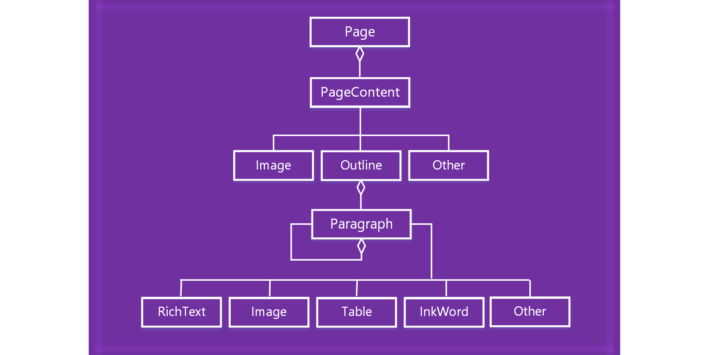

# Work with OneNote page content

In the OneNote add-ins JavaScript API, page content is represented by the following object model.

  

- A Page object contains a collection of PageContent objects.
- A PageContent object contains a content type of Outline, Image, or Other.
- An Outline object contains a collection of Paragraph objects.
- A Paragraph object contains a content type of RichText, Image, Table, or Other.

To create an empty OneNote page, use one of the following methods.

- [Section.addPage](/javascript/api/onenote/onenote.section#onenote-onenote-section-addpage-member(1))
- [Page.insertPageAsSibling](/javascript/api/onenote/onenote.section#onenote-onenote-section-insertsectionassibling-member(1))

Then use methods in the following objects to work with the page content, such as `Page.addOutline` and `Outline.appendHtml`.

- [Page](/javascript/api/onenote/onenote.page)
- [Outline](/javascript/api/onenote/onenote.outline)
- [Paragraph](/javascript/api/onenote/onenote.paragraph)

The content and structure of a OneNote page are represented by HTML. Only a subset of HTML is supported for creating or updating page content, as described below.

## Supported HTML

The OneNote add-in JavaScript API supports the following HTML for creating and updating page content.

- `<html>`, `<body>`, `
`, ``, ` `
- `
`
- ``
- `<a>`
- `<ul>`, `<ol>`, `<li>`
- `<table>`, `<tr>`, `<td>`
- `<h1>` ... `<h6>`
- `<b>`, `<em>`, `<strong>`, `<i>`, `<u>`, `<del>`, ``, ``, `<cite>`

> [!NOTE]
> Importing HTML into OneNote consolidates whitespace. The resulting content is pasted into one outline.

OneNote does its best to translate HTML into page content while ensuring security for users. HTML and CSS standards do not exactly match OneNote's content model, so there will be differences in appearances, particularly with CSS stylings. We recommend using the JavaScript objects if specific formatting is needed.

## Accessing page contents

You are only able to access *Page Content* via `Page#load` for the currently
active page. To change the active  page, invoke `navigateToPage($page)`.

Metadata such as title can still be queried for any page.

## See also

- [OneNote JavaScript API programming overview](onenote-add-ins-programming-overview.md)
- [OneNote JavaScript API reference](../reference/overview/onenote-add-ins-javascript-reference.md)
- [Rubric Grader sample](https://github.com/OfficeDev/OneNote-Add-in-Rubric-Grader)
- [Office Add-ins platform overview](../overview/office-add-ins.md)
