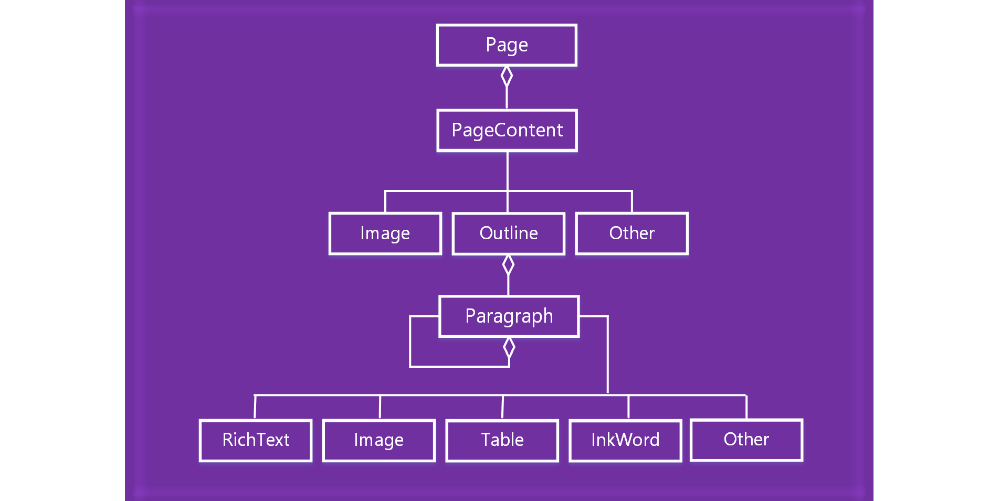

# Work with OneNote page content

Turn OneNote pages into interactive canvases. With the OneNote JavaScript API, you can create, read, and modify page content using familiar HTML—enabling everything from simple text insertion to complex interactive forms and rich media experiences.

## Understanding the OneNote page structure

OneNote organizes content in a logical hierarchy that's easy to work with:



- **Page**: The main container that holds all content
- **PageContent**: Individual content blocks on the page (outlines, images, or other elements)
- **Outline**: Text-based content areas that contain paragraphs
- **Paragraph**: The building blocks within outlines (rich text, images, tables, or other content)

This structure gives you precise control over where and how content appears on the page.

## Creating and working with pages

Start by creating a new page, then add content using the intuitive API methods:

```javascript
// Create a new page in the current section
const newPage = context.application.getActiveSection().pages.add();

// Or insert a page as a sibling to the current page
const siblingPage = context.application.getActivePage().insertPageAsSibling("Before", "My New Page");
```

Once you have a page, you can add rich content using these key objects:

- **[Page](/javascript/api/onenote/onenote.page)** - Add outlines, set titles, manage page-level operations
- **[Outline](/javascript/api/onenote/onenote.outline)** - Create text containers and append HTML content
- **[Paragraph](/javascript/api/onenote/onenote.paragraph)** - Work with individual content blocks within outlines

The content and structure of a OneNote page are represented by HTML. Only a subset of HTML is supported for creating or updating page content, as described below.

## Working with HTML content

OneNote's power comes from its ability to work with HTML, letting you create rich, interactive content. Here's what you can use:

### Supported HTML elements

OneNote supports a comprehensive set of HTML elements for building engaging content:

- **Structure and layout**: `<html>`, `<body>`, `<div>`, `<span>`, `<br/>`, `<p>`
- **Lists and organization**: `<ul>`, `<ol>`, `<li>` for bulleted and numbered lists
- **Tables and data**: `<table>`, `<tr>`, `<td>` for structured information  
- **Headings and hierarchy**: `<h1>` through `<h6>` for document structure
- **Text formatting**: `<b>`, `<em>`, `<strong>`, `<i>`, `<u>`, `<del>`, `<sup>`, `<sub>`, `<cite>`
- **Media and links**: `` for images, `<a>` for hyperlinks

### HTML best practices

When working with HTML in OneNote:

- **OneNote consolidates whitespace** - Extra spaces and line breaks are cleaned up automatically
- **Content gets organized into outlines** - HTML is intelligently grouped into content blocks
- **Use JavaScript objects for precise formatting** - For specific styling needs, the JavaScript API gives you more control than CSS

### Example: Adding rich content

```javascript
async function addRichContent() {
    await OneNote.run(async (context) => {
        const page = context.application.getActivePage();
        
        // Add a title outline
        const titleOutline = page.addOutline(40, 90);
        titleOutline.appendHtml('<h1>Project Status Report</h1>');
        
        // Add content with formatting
        const contentOutline = page.addOutline(40, 130);
        contentOutline.appendHtml(`
            <p><strong>Progress Update:</strong> The project is <em>on track</em> for completion.</p>
            <ul>
                <li>Phase 1: <strong>Complete</strong></li>
                <li>Phase 2: <em>In progress</em> (75% done)</li>
                <li>Phase 3: <em>Planned</em></li>
            </ul>
            <p>Next review: <a href="mailto:team@company.com">Schedule meeting</a></p>
        `);
        
        await context.sync();
    });
}
```

## Reading page content

You can only access page content from the currently active page for security reasons. To work with content from different pages:

```javascript
// Switch to a specific page first
await context.application.navigateToPage(targetPage);

// Then read its content
const page = context.application.getActivePage();
page.load('contents');
await context.sync();

// Now you can work with the page content
page.contents.items.forEach(content => {
    console.log(`Content type: ${content.type}`);
});
```

You can always query metadata like page titles from any page, but content access requires the page to be active.

## Real-world examples

### Creating an interactive checklist

```javascript
async function createChecklist() {
    await OneNote.run(async (context) => {
        const page = context.application.getActivePage();
        
        const outline = page.addOutline(40, 90);
        outline.appendHtml(`
            <h2>Daily Tasks</h2>
            <ul>
                <li>☐ Review project status</li>
                <li>☐ Update team on progress</li>
                <li>☐ Plan tomorrow's priorities</li>
                <li>☐ Send weekly report</li>
            </ul>
        `);
        
        await context.sync();
    });
}
```

### Adding a data table

```javascript
async function addProjectTable() {
    await OneNote.run(async (context) => {
        const page = context.application.getActivePage();
        
        const outline = page.addOutline(40, 90);
        outline.appendHtml(`
            <h3>Project Timeline</h3>
            <table border="1">
                <tr>
                    <th>Phase</th>
                    <th>Start Date</th>
                    <th>Status</th>
                </tr>
                <tr>
                    <td>Planning</td>
                    <td>Jan 1</td>
                    <td>✅ Complete</td>
                </tr>
                <tr>
                    <td>Development</td>
                    <td>Feb 1</td>
                    <td>🔄 In Progress</td>
                </tr>
                <tr>
                    <td>Testing</td>
                    <td>Mar 1</td>
                    <td>⏳ Pending</td>
                </tr>
            </table>
        `);
        
        await context.sync();
    });
}
```

## What's next?

Ready to build more complex OneNote experiences? Explore these resources:

- **[OneNote JavaScript API reference](../reference/overview/onenote-add-ins-javascript-reference.md)** - Complete API documentation
- **[Rubric Grader sample](https://github.com/OfficeDev/Office-Add-in-samples/tree/main/Samples/onenote-add-in-rubric-grader)** - Real-world example of HTML content manipulation
- **[Office Add-ins platform overview](../overview/office-add-ins.md)** - Understanding the broader add-in ecosystem

## See also

- [OneNote JavaScript API programming overview](onenote-add-ins-programming-overview.md)
- [OneNote JavaScript API reference](../reference/overview/onenote-add-ins-javascript-reference.md)
- [Sample: Rubric grader task pane add-in for OneNote on the web](https://github.com/OfficeDev/Office-Add-in-samples/tree/main/Samples/onenote-add-in-rubric-grader)
- [Office Add-ins platform overview](../overview/office-add-ins.md)
